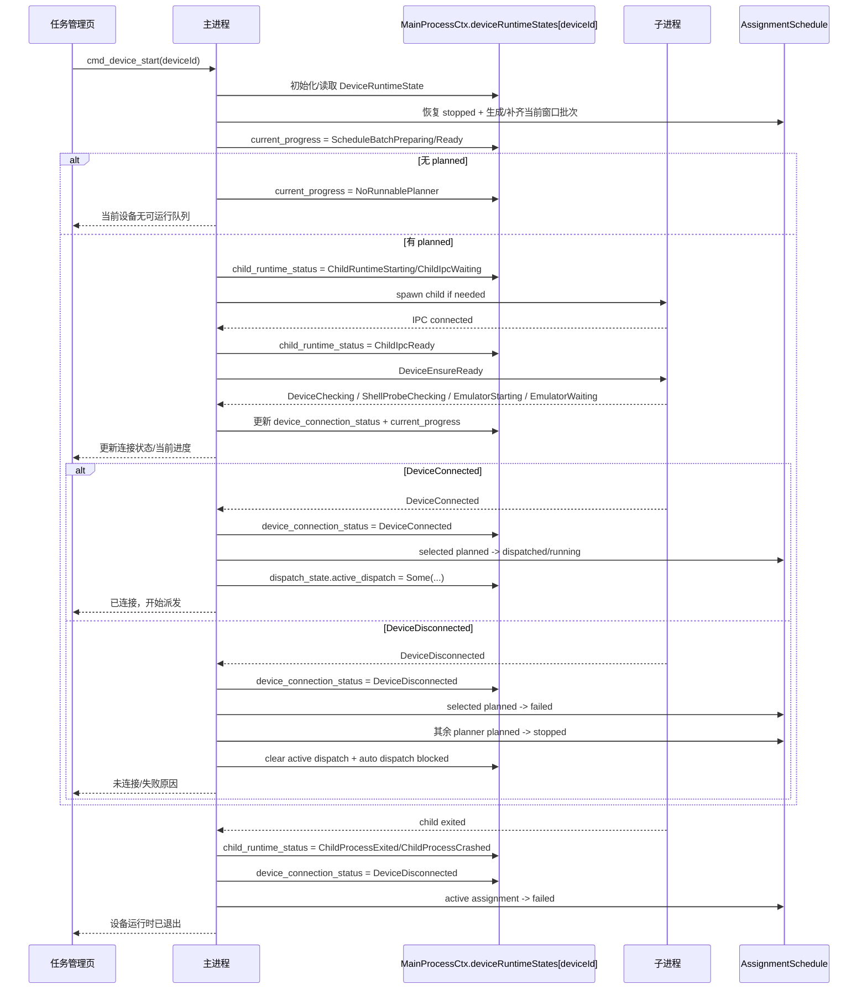

# 子进程管理与日志系统 — 工作记录（已更新）

> 首轮实现日期: 2026-03-03 ~ 2026-03-05
> 本次更新目的: 补充分包拆解后的实际归属，修正文档中过时路径与“前端未接入”描述
> 当前状态: 子进程基础设施、日志链路、前端接入已完成主链路；恢复执行设计目标已删除，执行器继续围绕正式执行与调试运行收口

## 0. 2026-04-17 更新

本轮已明确删除“checkpoint / 恢复执行”设计目标，并同步删除相关代码。后续阅读本文件时，以这条更新为准：

- child 不再处理 `PrepareCheckpoint`
- `SessionControl` 只保留：
  - `LoadSession`
  - `ReloadSession`
  - `ClearSession`
- `ChildRuntimeSession` 只保存 `RuntimeSessionSnapshot + bundle index`
- 主进程不再装填 `ResumeCheckpoint`，也不再维护 `device-recovery` 事件投影
- 任务管理页临时运行改为：
  - 若设备正在执行，先确认并暂停当前运行
  - 然后直接切换到临时 `FullScript / Task`
  - 不再等待 checkpoint 安全点
- “未完成任务”的补跑语义，回到调度记录模型：
  - 没有成功调度记录，就视为后续仍可重新完整执行
- 保留项只有超时策略里的 `RunRecoveryTask`
  - 这里的 `recovery_task_id` 只是脚本级 timeout 落点
  - 不再代表通用的中断后恢复执行能力

---

## 1. 当前结论

这部分能力已经不是单体 `src-tauri/src/*` 结构了，当前真实状态是：

- `src-tauri/` 主 crate 负责：
  - Tauri 应用入口
  - `invoke_handler` 命令注册
  - 将部分 `domain/infrastructure` 重新导出给旧路径使用
- `src-tauri/crates/runtime_engine/` 负责：
  - 主进程运行时基础设施
  - SQLite
  - HTTP client
  - 主进程 IPC 处理
  - 设备/脚本/调度等核心 domain
- `src-tauri/crates/child_support/` 负责：
  - 子进程运行时
  - 子进程 IPC 处理
  - 子进程日志
  - 子进程调度器 / 执行器
  - 子进程上下文初始化
- `src-tauri/crates/runtime_common/` 负责：
  - core / ipc / logging 通用定义
- `src-tauri/crates/vision_core/` 负责：
  - 视觉/OCR/ORT 相关能力

也就是说，这份文档里凡是提到旧的 `src-tauri/src/infrastructure/...` 路径，都应优先理解为：

- 主进程实现多半在 `runtime_engine`
- 子进程实现多半在 `child_support`
- `src-tauri/src/*` 很多只是 re-export 或命令入口

---

## 2. 分包后的实际结构

### 2.1 Workspace

`src-tauri/Cargo.toml` 当前 workspace 成员：

- `.`
- `crates/child_support`
- `crates/runtime_common`
- `crates/vision_core`
- `crates/runtime_engine`

并且保留了独立子进程二进制：

- `[[bin]] name = "child"`
- `path = "src/main_child.rs"`
- `required-features = ["child-bin"]`

### 2.2 主 crate 与 re-export 关系

主 crate 真实职责现在偏薄：

- `src-tauri/src/lib.rs`
  - 注册 Tauri 插件
  - 注册全部 `invoke_handler`
  - 启动时调用 `init_at_start`
- `src-tauri/src/main.rs`
  - 启动主应用
- `src-tauri/src/main_child.rs`
  - 启动子进程
  - 直接依赖 `child_support`

几个关键 re-export：

- `src-tauri/src/infrastructure.rs`
  - 导出 `runtime_engine::infrastructure::*`
- `src-tauri/src/infrastructure/context.rs`
  - 导出 `runtime_engine::infrastructure::context::*`
- `src-tauri/src/domain.rs`
  - 导出主 domain 模块

因此：

- “从旧路径还能访问”不代表“实现还在旧路径”
- 查问题时，优先去 `runtime_engine` / `child_support` 看真实代码

---

## 3. 已完成能力

## 3.1 第一阶段：日志系统优化

已完成：

- 主进程日志级别动态更新
- 子进程日志级别动态更新
- 日志目录可配置
- 日志保留天数可配置
- 启动时 + 定时自动清理日志
- `log_to_file` 支持
- 前端 console/unhandled error 可桥接到 Rust 侧

当前代码归属：

- 主进程日志：
  - `src-tauri/crates/runtime_engine/src/infrastructure/logging/`
- 子进程日志：
  - `src-tauri/crates/child_support/src/infrastructure/logging/`
- 命令入口：
  - `src-tauri/src/api/infrastructure/config/log_api.rs`
- 前端页面：
  - `src/views/Settings.vue`
  - `src/views/Logs.vue`

## 3.2 第二阶段：子进程基础设施

已完成：

- IPC 消息模型收敛
- 主进程 IPC server
- 子进程 IPC client
- 子进程管理器
- 子进程启动/关闭/状态同步
- 主进程向前端转发状态和日志事件
- 前端任务页和日志页已接主链路

### IPC 消息类型

当前核心消息负载仍然是这几类：

| Payload | 用途 |
| --- | --- |
| `ProcessControl` | `Start / Stop / Pause / Shutdown` |
| `ScriptTask` | `Add / Remove / Execute` |
| `ConfigUpdate` | 日志级别、ADB 相关配置更新 |
| `StatusReport` | 子进程状态上报 |
| `Logger` | 子进程日志回传 |
| `Heartbeat` | 心跳 |
| `Error` | 异常上报 |

实际实现分布：

- 公共消息定义：
  - `src-tauri/crates/runtime_common/src/ipc/`
  - 或经 `runtime_engine / child_support` 再导出

### 主进程消息处理

实际文件：

- `src-tauri/crates/runtime_engine/src/infrastructure/ipc/msg_handler_main.rs`

当前行为：

- `Logger`
  - 写主进程接收器
  - emit 前端事件 `child-log`
- `StatusReport`
  - emit 前端事件 `device-status`
- `Error`
  - emit 前端事件 `device-error`

注意：

- 不是旧文档里写的 `child-log-{deviceId}`
- 当前前端统一监听的是 `child-log`

### 子进程消息处理

实际文件：

- `src-tauri/crates/child_support/src/infrastructure/ipc/msg_handler_child.rs`

当前行为：

- `ProcessControl`
  - `Start` -> 状态切到 `Running`
  - `Stop` -> 状态切到 `Idle`
  - `Pause` -> 状态切到 `Paused`
  - `Shutdown` -> 状态切到 `Stopping` 并触发取消
- `SessionControl`
  - `LoadSession` -> 替换当前 `RuntimeSessionSnapshot`，同步 scheduler 队列，并发 `Loaded / Idle`
  - `ReloadSession` -> 热更新当前 session 和 scheduler 队列
  - `ClearSession` -> 清空当前 session 与 scheduler 队列
- `ConfigUpdate`
  - 已接日志级别
  - 已接 ADB 路径 / 服务地址热更新

### 子进程管理器

实际文件：

- `src-tauri/crates/runtime_engine/src/infrastructure/context/child_process_manager.rs`

当前功能：

- `spawn_child(init_data)`
- `stop_child(device_id)`
- `restart_child`
- `is_running`
- `get_running_device_ids`
- `stop_all`

当前实现方式：

- 使用 `std::env::current_exe()` 拉起当前二进制
- 通过 `--child` + 环境变量 `CHILD_CONTEXT_DATA` 区分子进程模式

### 子进程入口

实际文件：

- `src-tauri/src/main_child.rs`

当前逻辑：

1. 读取 `CHILD_CONTEXT_DATA`
2. 反序列化 `ChildProcessInitData`
3. 调 `child_support::...::init_environment`
4. 初始化 `CancellationToken`
5. 初始化 `ScriptScheduler`
6. 进入主循环

这部分已经不再是旧文档里的“单体 crate 内部逻辑”，而是显式依赖 `child_support`。

### 子进程调度器

实际文件：

- `src-tauri/crates/child_support/src/infrastructure/scripts/scheduler.rs`

当前已完成：

- 队列管理
  - `load_session`
  - `clear_session`
- 运行时查询
  - `current_script`
  - `queue_len`
- 主循环调度
  - `tick`
- 正式执行入口
  - `execute_script`
  - 从当前 session bundle 加载脚本定义
  - 通过 `ExecutionPlanAssembler::assemble(...)` 直接装配 `ExecutionPlan`
  - `ExecutionPlan` 当前区分：
    - `DeviceQueue(TaskSelection)`
    - `FullScript(TaskSelection)`
    - `Task(TaskSelection)`
    - `PolicyDebug`
  - `TaskSelection` 内部继续携带 root/linkable/skipped task
  - `ExecutionPlanSummary` 与 `PlannedTask / SkippedTask.record_schedule` 也在装配期生成
  - 逐 task 调用 `ScriptExecutor`
  - `scheduler` 直接消费 plan summary，并使用计划结果里的 `record_schedule`
  - 仅正式 `DeviceQueue` 且 `record_schedule = true` 时写 `ScheduleJournal`
  - `FullScript / Task` 调试运行也走同一条主链，不再依赖独立 `debug_execute`

当前未完成：

- `PolicyGroup / PolicySet / Policy` 已进入 child 的调试运行主链，但仍不属于 `DeviceQueue` 正式执行计划
- 非 `DeviceQueue` 运行目标仍使用临时 `RuntimeQueueItem`，作用域语义弱于正式调度

补充记录：

- 任务管理页开始区分：
  - `运行队列`：正式 `DeviceQueue`
  - `临时运行脚本 / 临时运行任务`：临时 `FullScript / Task`
- 临时运行目标不改 assignment 队列定义。
- 设备运行中切到临时目标时，前端会先确认并暂停当前运行，再直接切换目标。
- 临时运行仍不写正式调度记录，但保留运行日志与 runtime event。

---

## 4. 前端接入现状

旧文档这里已经过时，当前前端不是“尚未调用”，而是已经接入主流程了。

### 4.1 已接入页面

#### `src/views/TaskManagement.vue`

已接：

- `cmd_spawn_device`
- `cmd_device_start`
- `cmd_device_pause`
- `cmd_device_stop`
- `cmd_add_script_to_device`
- `cmd_remove_script_from_device`
- `cmd_get_running_devices`

通过 `deviceStore` 和 `taskStore` 完成：

- 设备启动/暂停/停止
- 设备队列增删
- 在线状态同步

#### `src/views/Logs.vue`

已接：

- `child-log` 实时日志事件
- `update_child_log_level_cmd`

#### `src/App.vue`

已接：

- `deviceStore.initIpcListeners()`
- `logsStore.initListener()`

#### `src/store/device.ts`

已监听：

- `device-status`
- `device-error`

#### `src/store/logs.ts`

已监听：

- `child-log`

### 4.2 仍未接完的前端部分

- `DeviceList.vue` 没有直接暴露“启动/关闭子进程”按钮
- assignment 重排 UI 没接
- 时间模板管理 UI 没接
- 编辑器页没接真实任务图编辑和保存

---

## 5. 本次分包拆解带来的实际变化

这次拆包之后，最大的收益和影响如下。

### 5.1 收益

- 主应用 crate 变薄，Tauri 入口和运行时实现分离更清楚
- 子进程逻辑集中在 `child_support`，不再与主进程逻辑混杂
- 公共定义下沉到 `runtime_common`
- 视觉/OCR 能力独立到 `vision_core`

### 5.2 对阅读代码的影响

后续排查时建议按这个顺序找：

1. 前端页面 / store / service
2. `src-tauri/src/api/*` 命令入口
3. `runtime_engine` 看主进程真实实现
4. `child_support` 看子进程真实实现
5. `runtime_common` 看共享结构

不要再只盯着 `src-tauri/src/infrastructure/*`，很多地方只是转发。

### 5.3 当前模块职责

#### `runtime_engine`

更偏主进程和共享主逻辑：

- app 启动初始化
- SQLite
- HTTP client
- 主进程日志
- 主进程 IPC
- 子进程管理器
- 设备/脚本/调度 domain

#### `child_support`

更偏子进程执行期：

- 子进程上下文
- 子进程日志
- 子进程 IPC 处理
- ADB 执行上下文
- 调度器
- 执行器

#### `runtime_common`

更偏通用基础结构：

- core
- ipc
- logging

#### `vision_core`

更偏视觉与模型：

- 图片处理
- OCR
- detection
- ORT 封装

---

## 6. 仍未完成的工作（当前真实版本）

## 6.1 脚本执行主链剩余边界

位置：

- `src-tauri/crates/child_support/src/infrastructure/scripts/scheduler.rs`
- `src-tauri/crates/child_support/src/infrastructure/scripts/execution_plan.rs`
- `src-tauri/crates/child_support/src/infrastructure/scripts/executor.rs`

当前状态：

- `execute_script()` 已经从 session bundle 读取脚本定义
- `ExecutionPlanAssembler` 已经收口为执行计划装配层：
  - 直接返回 `ExecutionPlan`
  - 统一提供 `ExecutionPlanSummary`
  - 在装配期确定 `record_schedule`
- `ScriptExecutor` 已真实执行动作、流程节点、策略节点的主链能力
- runtime progress / schedule event 已进入正式执行链路
- timeout 前进证据已不再只挂在动作后：
  - 已覆盖 `WaitMs / While / ForEach / HandlePolicySet / HandlePolicy`
  - 策略调试候选扫描也会进入同一条 detector 链

当前仍未收口：

- `PolicyGroup / PolicySet / Policy` 现已进入调试运行主链，但仍不属于 `DeviceQueue` 正式任务计划
- `ColorCompare` 等剩余条件/数据能力还没有接入真实执行
- `ExecutionPlanAssembler` 的剩余工作已经不是“把过滤器变成计划器”，而是继续补：
  - 如后续确实需要，再单独扩展更复杂的补跑/跳过规则
  - 继续把“装配期跳过”和“执行期跳过”边界写清楚
  - 继续统一调试目标与正式运行的装配入口和 scope 读取方式
    - 但不把正式调度记录比对强行带进调试运行

建议继续看：

- `src-tauri/crates/runtime_engine/src/domain/scripts/`
- `src-tauri/crates/child_support/src/infrastructure/scripts/executor.rs`

## 6.2 调试运行作用域仍弱于正式调度

位置：

- `src-tauri/src/api/infrastructure/process_api.rs`
- `build_runtime_session_snapshot()`
- `build_debug_template_values_json()`

当前状态：

- 编辑器调试运行 `FullScript / Task` 已走 `LoadSession -> Start -> scheduler.execute_script`
- 运行时会为当前脚本任务强制注入 `everyRun` 的 task-cycle 覆盖
- 调试运行不写 `device_script_schedules`，但保留运行日志与 runtime event
- `DeviceQueue` 正式运行已经真实消费 `RuntimeQueueItem.template_values_json`：
  - `ExecutionPlanAssembler` 会读取 `taskSettings.enabled / taskSettings.taskCycle`
  - `ScriptExecutor` 会读取 `variables` 并装入 input scope
- `FullScript / Task` 调试运行当前也会回退到开发期输入：
  - 输入变量装配顺序是 `template_values_json.variables -> task.data.variables -> variableCatalog.defaultValue`
- `Policy / PolicyGroup / PolicySet` 调试运行当前不自动装填 task 级 UI 输入值：
  - 当前调用 `hydrate_input_scope(..., task=None)`
  - `owner_task_id != null` 的 input 变量不会进入调试 scope
  - 未取到值时只输出调试日志，不自动补无意义占位值

当前仍未收口：

- 非 `DeviceQueue` 目标仍使用临时 `RuntimeQueueItem`
- `time_template_id / account_id / account_data_json` 仍未补成正式调度语义
- `build_debug_template_values_json()` 当前只补了最小 `everyRun` task-cycle 覆盖，不等于完整模板/账户作用域
- 前端 UI 设置值完整保存到 `script_time_template_values.values_json.variables` 的链路还未补齐
- 这条链补齐后，在线变更也需要继续触发 runtime session reload，让后续任务装填到新变量值

## 6.3 在线 reload 的当前边界

位置：

- `src-tauri/src/api/domain/scripts.rs`
- `src-tauri/src/api/infrastructure/runtime_sync.rs`
- `src-tauri/crates/child_support/src/infrastructure/ipc/msg_handler_child.rs`
- `src-tauri/crates/child_support/src/infrastructure/scripts/scheduler.rs`

当前状态：

- 编辑器最终保存会走 `save_script_cmd -> sync_device_sessions_if_online -> cmd_sync_device_runtime_session -> ReloadSession`
- 模板值保存/删除也会走同一条在线 session reload
- `ReloadSession` 当前会直接替换 child session 和 scheduler queue

当前边界：

- 已经开始执行的当前 task 不会在执行中途被热替换成新定义
- `scheduler.execute_script()` 在开头就把当前 script bundle 解析到本地执行上下文
- 因此 reload 主要影响：
  - 后续 pending queue
  - 下一次 task 选择
  - 下一轮脚本执行
  - 之后重新装填的输入变量
- 当前 running task 仍会按 reload 前已解析的 bundle 跑完

注意：

- 这意味着“新增任务 / 改变量 / 改步骤”在设备在线时，当前并不是对正在跑到一半的 task 做热替换
- 如果后续需要把某类结构变更收口到“当前运行中立刻严格生效”，那应单独走：
  - `Pause`
  - `ReloadSession`
  - 再重新发起运行

## 6.4 运行时持久化还没做

位置：

- `src-tauri/crates/child_support/src/infrastructure/ipc/msg_handler_child.rs`

当前问题：

- `Stop`
- `Shutdown`

这两个分支还只有：

- 改状态
- 触发取消

但没有：

- 保存当前运行进度
- 保存运行时变量
- 补完整调度结果

## 6.5 子进程打包策略仍需最终验证

当前现状：

- workspace 中有独立 `child` bin
- `ChildProcessManager` 实际仍使用 `current_exe()` + `--child`

这代表当前模式是“逻辑上保留独立 child bin，运行上先沿用同一可执行入口区分子模式”。

需要继续确认：

- 打包产物里是否真的需要独立 child 可执行文件
- `--child` 模式是否已经在主二进制入口完整支持
- `child-bin` feature 在开发/打包链路中的真实使用方式

---

## 7. 当前相关文件速查

### 7.1 主入口

- `src-tauri/src/lib.rs`
- `src-tauri/src/main.rs`
- `src-tauri/src/main_child.rs`

### 7.2 命令入口

- `src-tauri/src/api/infrastructure/process_api.rs`
- `src-tauri/src/api/infrastructure/config/log_api.rs`

### 7.3 主进程真实实现

- `src-tauri/crates/runtime_engine/src/infrastructure/context/child_process_manager.rs`
- `src-tauri/crates/runtime_engine/src/infrastructure/ipc/msg_handler_main.rs`
- `src-tauri/crates/runtime_engine/src/infrastructure/db.rs`
- `src-tauri/crates/runtime_engine/src/infrastructure/http_client.rs`

### 7.4 子进程真实实现

- `src-tauri/crates/child_support/src/infrastructure/context/child_process.rs`
- `src-tauri/crates/child_support/src/infrastructure/context/child_process_sec.rs`
- `src-tauri/crates/child_support/src/infrastructure/ipc/msg_handler_child.rs`
- `src-tauri/crates/child_support/src/infrastructure/scripts/scheduler.rs`
- `src-tauri/crates/child_support/src/infrastructure/scripts/executor.rs`

### 7.5 前端接入

- `src/store/device.ts`
- `src/store/logs.ts`
- `src/views/TaskManagement.vue`
- `src/views/Logs.vue`

---

## 8. 对下个 AI 的提醒

- 先接受一个事实：这块代码已经拆包了，不能再按旧文档把所有实现都理解成在 `src-tauri/src/*`。
- 如果要继续做子进程/执行链路，优先看 `child_support`。
- 如果要继续做命令、DB、主进程事件转发，优先看 `runtime_engine`。
- 旧文档里“前端未接入”的说法已经不成立，任务页和日志页都已接主链路。
- 现在最值得继续投入的点，不是再整理框架，而是把 `scheduler -> script_tasks -> executor` 真正打通。

---

## 9. 暂不实现方案：模拟器状态与关闭策略

更新时间：2026-06-05

以下内容目前只作为讨论记录，不进入本轮实现。

### 9.1 目标边界

- 目标不是只管理 AutoDaily 自己拉起的模拟器。
- 未来需要支持“外部已经运行的模拟器”也能被识别，并允许执行关闭程序等操作。
- 但当前设备模型和主进程状态模型还不足以直接安全实现。

### 9.2 当前限制

- 当前主进程运行态只持有“设备子进程是否在线”的状态，不持有模拟器进程 PID。
- 设备配置里只有：
  - `exe_path`
  - `exe_args`
  - 连接配置
- 因此当前无法可靠回答：
  - 某个外部已运行的模拟器对应哪个 OS 进程
  - 这个进程是否就是当前设备配置对应的那个实例
  - 应该结束单个实例，还是会误伤同类其他实例

### 9.3 启动前的判断口径

本节旧口径里“主线程预探测/启动模拟器”的表述已经被后续讨论修正。以第 10 节的目标流程为准：

- 主进程不直接做 ADB/shell 探测。
- 主进程不直接承担模拟器启动细节。
- 主进程只负责调度、子进程生命周期、IPC 命令发送、IPC 状态接收与前端事件转发。
- 模拟器启动、连接探测、shell 探测都应在设备子进程内完成，并由子进程主动报告状态。

仍然保留的判断原则：

- “端口占用”只能作为定位/辅助判断，不能等同于设备可用。
- 是否连接成功，最终应以子进程执行 ADB shell 探测的结果为准。
- 如果 shell 探测失败且没有配置模拟器启动程序，子进程应上报 `DeviceDisconnected`，消息写明未配置启动程序，前端显示未连接。

### 9.4 未来的模拟器关闭策略模型

后续设备模型计划预留“模拟器关闭定位策略”，但本轮不实现实际逻辑。

计划中的策略枚举：

- `byPort`
- `byWindowTitle`
- `byCommandLine`
- `byExecutable`

本轮讨论确认的实现优先级：

- 第一批只实际实现：
  - `byPort`
  - `byWindowTitle`
- 其余两项：
  - `byCommandLine`
  - `byExecutable`
  先只做占位，不落真实逻辑

### 9.5 各策略的预期语义

#### byPort

- 适用于 `EmulatorTcp` 设备。
- 根据设备配置中的连接端口，反查监听该端口的进程。
- 这是识别“外部已运行模拟器”的首选策略。
- 但它仍然只是进程定位手段，不应替代连接可用性判断。

#### byWindowTitle

- 适用于有稳定窗口标题的模拟器。
- 通过窗口标题匹配实例，再关联到进程。
- 适合作为 `byPort` 失效时的补充方案。

#### byCommandLine

- 先预留为占位。
- 后续如某些模拟器实例可通过命令行参数区分，再补实现。

#### byExecutable

- 先预留为占位。
- 这是风险最高的方案，因为只按可执行路径可能误杀同类全部实例。

### 9.6 模拟器状态的前端口径

模拟器状态未来需要单独建模，但要注意几个限制：

- 只更新“设备信息里已启用的设备”的模拟器状态。
- 状态时机不能做成全局高频轮询。
- 需要合并两类来源：
  - 内部启动的模拟器
  - 外部已经运行的模拟器

这里的“合并”指的是：

- 前端看到的是统一的“模拟器状态”
- 不能要求用户区分它是被 AutoDaily 启动的，还是外部先启动的

但当前先不实现这套状态流，因为还缺少：

- 明确的状态字段定义
- 刷新时机定义
- 主进程对模拟器实例身份的稳定识别

### 9.7 未来实现时需要先确认的事项

- 模拟器状态是否单独入 `deviceStore`，还是挂到现有设备连接状态旁路字段
- 状态刷新时机是否限定为：
  - 应用启动后
  - 设备启用状态变化后
  - 手动运行/自动调度前
  - 设备编辑保存后
- `byPort` 在不同模拟器上的可用性
- `byWindowTitle` 是否需要允许用户自定义匹配文本
- 关闭模拟器时是否要求二次确认，以及是否展示“匹配依据”

### 9.8 当前结论

当前阶段先接受以下结论：

- “外部已运行模拟器”未来是支持目标，不是排除项。
- 要安全结束外部模拟器，不能只靠 `exe_path`，也不能只靠“这个模拟器是我启动的”。
- 启动前是否跳过拉起，应以子进程内真实连接探测为准。
- 模拟器关闭策略与模拟器状态流都已形成方向，但本轮不实现。

---

## 10. 目标流程：任务管理页点击运行队列

更新时间：2026-06-05

本节记录后续应实现的目标流程，不代表当前代码已经完全符合。核心原则：

- 主进程只管调度、子进程 IPC、状态账本和前端事件转发。
- 子进程负责设备侧动作：模拟器启动、连接探测、ADB shell 探测、每个阶段的结果上报。
- 前端只根据主进程转发的状态事件更新 UI，不由主进程本地猜测设备连接结果。
- 子进程 IPC 连接和设备连接必须分开建模，不能用“IPC connected”表达“设备已连接”。

### 10.1 总览流程

```mermaid
flowchart TD
  A["任务管理页点击运行队列"] --> B["TaskDevicePanel emit start(deviceId)"]
  B --> C["TaskManagement.handleStartDevice"]
  C --> D["deviceStore.startDevice(deviceId)"]
  D --> E["deviceService.start -> cmd_device_start"]

  E --> F["主进程 cmd_device_start"]
  F --> G["恢复 stopped planner 记录"]
  G --> H["生成/补齐当前窗口 AssignmentSchedule 批次"]
  H --> H0["主进程更新调度准备状态，并 emit 当前进度"]
  H0 --> I{"是否有 planned 调度记录"}

  I -- "否" --> I1["主进程返回无可运行 planner 信息"]
  I1 --> I2["写入当前设备进度 UI/状态提示"]
  I2 --> I3["前端展示：当前设备无可运行队列"]

  I -- "是" --> J["主进程准备派发下一条 dispatch"]
  J --> K["确保设备子进程 IPC 通道就绪"]
  K --> K0["主进程更新 IPC 准备状态，并 emit 当前进度"]

  K0 --> L{"子进程是否已运行并 IPC ready"}
  L -- "否" --> L1["主进程 spawn 子进程"]
  L1 --> L2["等待子进程 IPC ready"]
  L2 --> L3["主进程更新 IPC 已就绪状态，并 emit 当前进度"]
  L -- "是" --> L3

  L3 --> M["主进程通过 IPC 发送 DeviceEnsureReady"]
  M --> N["子进程进入设备准备流程"]
  N --> N0["子进程上报 DeviceChecking，主进程更新内部状态/当前进度/连接状态"]

  N0 --> O{"设备是否 EmulatorTcp"}
  O -- "否" --> P["子进程执行对应连接探测"]
  O -- "是" --> Q["子进程执行 ADB shell 预探测"]
  Q --> Q0["子进程上报 ShellProbeChecking"]
  Q0 --> R{"shell 是否可执行"}

  R -- "是" --> S["子进程上报 DeviceConnected"]
  R -- "否" --> T{"是否配置模拟器启动程序"}
  T -- "否" --> U["子进程上报 DeviceDisconnected: 连接设备失败"]
  T -- "是" --> V["子进程启动模拟器"]
  V --> V0["子进程上报 EmulatorStarting"]
  V0 --> W["等待启动延迟/就绪窗口"]
  W --> W0["子进程上报 EmulatorWaiting"]
  W0 --> X["子进程按间隔执行 ADB shell 探测"]
  X --> X0["子进程每次探测前上报 ShellProbeChecking(attempt, elapsed)"]
  X0 --> Y{"shell 是否可执行"}
  Y -- "是" --> S
  Y -- "否且未超时" --> W0
  Y -- "否且已超时" --> U

  P --> Z{"连接是否可用"}
  Z -- "是" --> S
  Z -- "否" --> U

  S --> AA["主进程接收设备连接成功事件"]
  U --> AB["主进程接收设备连接失败事件"]

  AA --> AC["主进程更新内部设备连接状态/当前进度/连接状态，并 emit 前端事件"]
  AB --> AD["主进程更新内部设备连接状态/当前进度/连接状态，并 emit 前端事件"]

  AC --> AE["主进程 LoadSession + Start dispatch"]
  AD --> AF["主进程将当前 AssignmentSchedule 标记 failed，并清该 deviceId 的 active dispatch"]

  AE --> AG["子进程执行脚本"]
  AF --> AF1["自动派发流程中停止该设备后续派发，其它设备不受影响"]
  AF1 --> AH["前端显示连接失败/未连接"]
```

### 10.2 主进程职责

主进程负责：

- `cmd_device_start` 接收前端运行请求。
- 检查并恢复 `stopped` planner 记录。
- 生成当前窗口的 `AssignmentSchedule` 批次。
- 判断是否有可派发的 `planned` 记录。
- 确保设备子进程存在并已经通过 IPC 连接。
- 通过 IPC 请求子进程准备设备连接。
- 接收子进程主动上报的设备准备阶段状态：
  - `DeviceChecking`
  - `ShellProbeChecking`
  - `EmulatorStarting`
  - `EmulatorWaiting`
  - `DeviceConnected`
  - `DeviceDisconnected`
- 更新主进程内存状态，并转发 `device-connection-status` 给前端。
- 更新当前设备进度 UI 所需的运行提示。
- 连接成功后再派发 `RuntimeSessionSnapshot` 和 `ProcessAction::Start`。
- 设备准备失败时，必须更新已选中的 `AssignmentSchedule` 为 `failed`，写入失败原因和结束时间，并清理该 `deviceId` 的 active dispatch。
- 设备准备失败后，将该设备剩余 planner `planned` 持久化为 `stopped`，不继续为该设备派发；手动运行队列时再恢复。
- 某个设备连接失败不能阻塞其它设备的自动派发；调度器应继续处理其它 `deviceId` 的可运行队列。

主进程不负责：

- 不直接创建 `ADBClient` 去连接设备。
- 不直接执行 ADB shell 探测。
- 不直接根据端口占用判断设备在线（当前阶段）。
- 不直接决定模拟器是否已真正可用。
- 不直接启动模拟器。
- 不把子进程 IPC connected 当作设备 connected。

### 10.3 子进程职责

子进程负责：

- 接收主进程的设备准备 IPC 命令。
- 根据 `DeviceConfig` 判断连接类型。
- 对 `EmulatorTcp` 执行 ADB shell 探测。
- shell 探测开始时主动上报状态。
- 如果 shell 探测成功，上报 `DeviceConnected`。
- 如果 shell 探测失败且配置了启动程序，启动模拟器后继续探测。
- 启动模拟器后等待启动延迟/就绪窗口时，主动上报 `EmulatorStarting / EmulatorWaiting`。
- 启动模拟器后，应按间隔多次执行 ADB shell 探测；每次探测前都上报 `ShellProbeChecking(attempt, elapsed)`，主进程每次都要刷新内部状态、当前进度和连接状态 UI。
- 如果 shell 探测失败且没有配置启动程序，上报 `DeviceDisconnected`，消息应包含“连接设备失败/未配置启动程序”等明确原因。
- 所有设备连接状态都通过 IPC 主动报告给主进程。

### 10.4 UI 状态口径

任务管理页 UI 需要区分两类状态：

- 调度状态：是否有当前窗口可派发的 planner 记录。
- 连接状态：子进程是否报告设备连接成功。
- 子进程 IPC 状态：主进程是否已经和设备子进程建立 IPC 通道。

这三类状态不能混用：

- 子进程 IPC ready 只表示 AutoDaily 运行时通道可用。
- 设备 connected 只表示子进程报告设备连接可用。
- 调度 planned/running 只表示 `AssignmentSchedule` 的运行账本状态。

当主进程生成/补齐当前窗口 `AssignmentSchedule` 批次时：

- 应更新当前设备进度 UI，例如“正在生成当前窗口调度记录”。
- 成功后应更新为“已生成/已补齐当前窗口调度记录”。
- 这类状态属于调度准备进度，不属于设备连接状态。

当主进程等待子进程 IPC 连接时：

- 应更新当前设备进度 UI，例如“正在等待设备运行时 IPC 连接”。
- IPC ready 后更新为“设备运行时 IPC 已连接，准备设备连接”。
- 不得把这一步显示为“设备已连接”。

当主进程返回“当前设备无可运行队列”时：

- 不能只是刷新 UI。
- 应把这条信息写入当前设备的进度/提示区域。
- 前端体感应是“看到为什么没有运行”，而不是“按钮点了以后页面闪了一下”。

当子进程报告连接失败时：

- 主进程内部连接状态应落 `DeviceDisconnected`。
- 前端连接状态显示未连接/连接失败。
- 当前进度区域显示失败原因。
- 如果已经选中本次要派发的 `AssignmentSchedule`，应把这条记录标记为 `failed`，写入失败原因并清理该 `deviceId` 的 active dispatch。
- 该设备在自动派发流程中的本轮派发到此终止，不继续派发该设备的下一条 `planned`，避免连接故障导致下一次派发冲突。
- 这个终止范围只作用于当前 `deviceId`，不能影响其它设备继续派发。
- 用户手动触发的派发不受这条自动派发停用规则限制；运行队列、临时运行里的运行脚本/任务都可以再次显式触发该设备准备和派发。

当子进程上报 `ShellProbeChecking` 时：

- 主进程内部设备连接状态应为 `ShellProbeChecking`。
- 前端连接状态显示检查中。
- 当前进度区域显示“正在执行 ADB shell 探测”；如果事件带有 `attempt/elapsed`，应同步展示当前探测轮次或等待进度。

当子进程上报 `EmulatorStarting` 时：

- 主进程内部设备连接状态应为 `EmulatorStarting`。
- 前端连接状态显示启动中/检查中。
- 当前进度区域显示“正在启动模拟器”。

当子进程上报 `EmulatorWaiting` 时：

- 主进程内部设备连接状态应为 `EmulatorWaiting`。
- 前端连接状态显示启动中/检查中。
- 当前进度区域显示“模拟器启动中，等待连接就绪”。
- 这不是最终状态；后续每一次启动后探测都要继续上报 `ShellProbeChecking` 或最终 `DeviceConnected / DeviceDisconnected`，前端不能卡在“正在准备模拟器连接”。

当子进程最终上报 `DeviceConnected` 时：

- 主进程内部设备连接状态落 `DeviceConnected`。
- 前端连接状态显示已连接。
- 当前进度区域显示“设备连接已就绪，开始派发队列”。

### 10.5 命名修正

当前类似 `ensure_device_connection_ready`、`wait_child_device_ready_report` 的命名容易误导。目标语义应该拆开理解，并尽量用事件驱动状态机表达：

- `ChildIpcReady`：只表示主进程与设备子进程 IPC 通道已连接。
- `DeviceEnsureReadyRequested`：主进程通过 IPC 请求子进程准备设备连接。
- `DeviceChecking / ShellProbeChecking / EmulatorStarting / EmulatorWaiting / DeviceConnected / DeviceDisconnected`：子进程通过 IPC 主动上报的统一设备连接状态。

不要把 `wait_child_device_ready_report` 设计成核心判断函数名。设备是否已连接应由子进程的设备连接事件推动主进程状态变化；主进程可以有超时保护，但超时只是兜底失败事件，不是设备连接真相来源。

不要把“子进程 IPC 已连接”和“设备/模拟器连接已就绪”混成一个概念。

### 10.6 状态事件要求

| 阶段 | 发起方 | Main internal state | AssignmentSchedule | 当前进度 UI | 连接状态 UI |
| --- | --- | --- | --- | --- | --- |
| 生成/补齐 AssignmentSchedule | 主进程 | `ScheduleBatchPreparing` | 生成/补齐 planned/stopped 记录 | 正在生成当前窗口调度记录 | 不改变 |
| 批次生成完成 | 主进程 | `ScheduleBatchReady` | 保持各记录原状态 | 已生成/已补齐当前窗口调度记录 | 不改变 |
| 无 planned 记录 | 主进程 | `NoRunnablePlanner` | 不改变 | 当前设备无可运行队列 | 不改变 |
| spawn 子进程 | 主进程 | `ChildRuntimeStarting` | 保持 selected planned | 正在启动设备运行时 | 不改变 |
| 等待子进程 IPC | 主进程 | `ChildIpcWaiting` | 保持 selected planned | 正在等待设备运行时 IPC 连接 | 不改变 |
| 子进程 IPC ready | 主进程 | `ChildIpcReady` | 保持 selected planned | 设备运行时 IPC 已连接，准备设备连接 | 不改变 |
| 设备准备开始 | 子进程 -> 主进程 | `DeviceChecking` | 保持 selected planned | 正在准备设备连接 | 检查中 |
| ADB shell 预探测开始 | 子进程 -> 主进程 | `ShellProbeChecking` | 保持 selected planned | 正在执行 ADB shell 探测 | 检查中 |
| 模拟器启动开始 | 子进程 -> 主进程 | `EmulatorStarting` | 保持 selected planned | 正在启动模拟器 | 启动中 |
| 模拟器启动等待 | 子进程 -> 主进程 | `EmulatorWaiting` | 保持 selected planned | 模拟器启动中，等待连接就绪 | 启动中 |
| 启动后每轮 ADB shell 探测 | 子进程 -> 主进程 | `ShellProbeChecking` | 保持 selected planned | 正在执行 ADB shell 探测 | 检查中 |
| 设备连接成功 | 子进程 -> 主进程 | `DeviceConnected` | 准备进入 running/dispatch | 设备连接已就绪，开始派发队列 | 已连接 |
| 设备连接失败 | 子进程 -> 主进程 | `DeviceDisconnected` | selected planned -> failed；其余 planner planned -> stopped；清该 deviceId active dispatch | 展示失败原因 | 未连接 |
| 子进程超时未报告 | 主进程 | `DeviceDisconnected` | selected planned -> failed；其余 planner planned -> stopped；清该 deviceId active dispatch | 设备连接准备超时 | 未连接 |
| 子进程正常退出但非用户停止 | 子进程 -> 主进程 | `ChildProcessExited` | active assignment -> failed；清该 deviceId active dispatch | 设备运行时已退出，终止该设备调度 | 已断开 |
| OS 检测子进程异常退出 | 主进程 | `ChildProcessCrashed` | active assignment -> failed；清该 deviceId active dispatch | 设备运行时异常退出，终止该设备调度 | 已断开 |
| 用户停止设备调度 | 前端 -> 主进程 | `DispatchStopped` | active/planned -> stopped | 已停止该设备调度 | 已断开或保持实际连接状态 |

### 10.7 失败路径要求

以下情况必须进入明确失败状态：

- 没有可运行 planner：写入当前进度 UI，说明当前设备无可运行队列。
- 子进程 IPC 未连上：设备运行时未就绪。
- `EmulatorTcp` shell 探测失败且未配置启动程序：连接设备失败，状态 `DeviceDisconnected`，已选中的 `AssignmentSchedule` 标记 `failed`，其余 planner `planned` 标记 `stopped`。
- 启动模拟器后多轮 shell 探测仍失败：连接设备失败，状态 `DeviceDisconnected`，已选中的 `AssignmentSchedule` 标记 `failed`，其余 planner `planned` 标记 `stopped`。
- 子进程在超时时间内没有主动报告结果：主进程兜底落 `DeviceDisconnected`，消息写明连接准备超时；已选中的 `AssignmentSchedule` 标记 `failed`，其余 planner `planned` 标记 `stopped`，不能让 UI 卡在检查中。
- 子进程正常退出但不是用户主动停止：主进程落 `ChildProcessExited`，连接状态改为已断开，active assignment 标记 `failed`，并在自动派发流程中终止该设备后续调度。
- 主进程通过 OS 检测到子进程异常退出：主进程落 `ChildProcessCrashed`，连接状态改为已断开，active assignment 标记 `failed`，并在自动派发流程中终止该设备后续调度。
- 用户明确停止设备调度：使用 `stopped`，保留下次启动仍不派发的持久化语义。
- 上述设备级失败只影响对应 `deviceId`；其它设备的自动派发不能被连带停止。
- 手动触发的派发可以绕过“自动派发中该设备本轮不再派发”的限制，重新尝试设备准备。

这里的账本语义：

- `failed`：本次派发因设备准备、连接、运行时退出等错误失败；清理该 `deviceId` 的 active dispatch，避免同一条记录继续占用本轮调度。
- `stopped`：该设备后续自动派发已停止；来源可以是用户明确停止，也可以是设备连接失败/运行时退出，后续生成/补齐批次时仍保持 stopped，手动运行队列时恢复。
- `cancelled`：仅用于任务/窗口失效、记录不再应运行等取消场景，不用于设备连接失败。

自动派发与手动派发边界：

- 自动派发：设备准备失败、连接失败、子进程退出后，只停止该 `deviceId` 在本轮自动派发中的后续派发；其它设备继续派发。
- 手动派发：运行队列、临时运行里的运行脚本/任务属于用户显式触发，应允许再次尝试该设备，不被自动派发的设备级失败标记拦住。

### 10.8 每设备状态归属模型

上面的流程如果要长期可维护，主进程必须按 `deviceId` 保存单一运行态，而不是把连接状态、派发状态、IPC 状态拆成几套并列 owner。

目标收口：

- `MainProcessCtx` 持有 `device_runtime_states: HashMap<DeviceId, DeviceRuntimeState>`
- `DeviceRuntimeState` 是主进程关于该设备运行事实的唯一内存 owner
- 子进程 IPC 消息、子进程退出事件、主进程调度决策，都只更新这一个设备运行态
- 前端事件也从这一个运行态派生

建议结构：

| 字段 | 含义 | owner | 更新方 |
| --- | --- | --- | --- |
| `child_runtime_status` | 子进程未启动/启动中/等待 IPC/IPC ready/已退出 | `DeviceRuntimeState` | 主进程 |
| `device_connection_status` | `DeviceChecking` / `ShellProbeChecking` / `EmulatorStarting` / `EmulatorWaiting` / `DeviceConnected` / `DeviceDisconnected` | `DeviceRuntimeState` | 子进程上报，主进程落库/转发 |
| `dispatch_state` | 当前 active dispatch、pending planner/user/debug、auto dispatch blocked | `DeviceRuntimeState` | 主进程 |
| `current_progress` | 当前进度展示所需阶段和文案 | `DeviceRuntimeState` | 主进程/子进程事件共同驱动 |
| `last_error` | 最近失败原因 | `DeviceRuntimeState` | 主进程 |

因此，`DispatchPlanner` 不应继续作为脱离 `MainProcessCtx` 的主状态 owner。它可以保留为实现层 helper，但最终运行事实必须汇总到每设备运行态里。

### 10.9 MainProcessCtx 与 DispatchPlanner 的目标关系

当前代码把这些信息拆散了：

- `ipc_servers`
- `device_connections`
- `device_connection_signals`
- `DispatchPlanner.device_states`

这会导致维护者必须横跨多个 map 才能还原某台设备的真实情况。

目标关系应调整为：

1. `MainProcessCtx` 是主进程运行态容器。
2. `DeviceRuntimeState` 是每台设备的唯一状态 owner。
3. `DispatchPlanner` 若继续保留，只能作为 `MainProcessCtx` 内部的调度辅助访问层，不能再成为平级单例真相源。
4. `ConnectionStatusKind` 属于 `DeviceRuntimeState.device_connection_status` 的值域，而不是游离在外的另一套记录。

也就是说，主进程收到子进程 IPC 消息后，不是“只通知 UI”，而是：

1. 更新该 `deviceId` 的 `DeviceRuntimeState`
2. 根据新状态决定是否继续派发、失败收口、终止自动调度或允许手动重试
3. 再把同一份状态翻译成前端事件

### 10.10 推荐事件驱动时序

### 10.11 状态分层口径

内部状态、账本状态、UI 文案必须分层：

#### 内部英文状态

这些用于主进程状态流转和事件判断：

- `ScheduleBatchPreparing`
- `ScheduleBatchReady`
- `NoRunnablePlanner`
- `ChildRuntimeStarting`
- `ChildIpcWaiting`
- `ChildIpcReady`
- `DeviceChecking`
- `ShellProbeChecking`
- `EmulatorStarting`
- `EmulatorWaiting`
- `DeviceConnected`
- `DeviceDisconnected`
- `ChildProcessExited`
- `ChildProcessCrashed`
- `DispatchStopped`

#### 账本状态

这些只用于 `AssignmentSchedule.status`：

- `planned`
- `dispatched`
- `running`
- `success`
- `failed`
- `skipped`
- `cancelled`
- `stopped`

#### UI 中文口径

这些用于用户可见的当前进度和连接状态：

| 内部状态 | 当前进度 UI | 连接状态 UI |
| --- | --- | --- |
| `ScheduleBatchPreparing` | 正在生成当前窗口调度记录 | 不改变 |
| `ScheduleBatchReady` | 已生成/已补齐当前窗口调度记录 | 不改变 |
| `NoRunnablePlanner` | 当前设备无可运行队列 | 不改变 |
| `ChildRuntimeStarting` | 正在启动设备运行时 | 不改变 |
| `ChildIpcWaiting` | 正在等待设备运行时 IPC 连接 | 不改变 |
| `ChildIpcReady` | 设备运行时 IPC 已连接，准备设备连接 | 不改变 |
| `DeviceChecking` | 正在准备设备连接 | 检查中 |
| `ShellProbeChecking` | 正在执行 ADB shell 探测 | 检查中 |
| `EmulatorStarting` | 正在启动模拟器 | 启动中 |
| `EmulatorWaiting` | 模拟器启动中，等待连接就绪 | 启动中 |
| `DeviceConnected` | 设备连接已就绪，开始派发队列 | 已连接 |
| `DeviceDisconnected` | 展示失败原因 | 未连接 |
| `ChildProcessExited` | 设备运行时已退出，终止该设备调度 | 已断开 |
| `ChildProcessCrashed` | 设备运行时异常退出，终止该设备调度 | 已断开 |
| `DispatchStopped` | 已停止该设备调度 | 已断开或保持实际连接状态 |

### 10.12 代码改造入口建议

后续代码改造应按下面顺序进行，不再继续堆局部补丁：

1. 先在 `MainProcessCtx` 收口每设备运行态。
2. 把 `DispatchPlanner` 的每设备运行事实并入 `DeviceRuntimeState`。
3. 子进程 IPC、子进程退出、手动运行、自动派发都只改这一份状态。
4. 前端只消费由这一份状态派生出来的事件和账本。
5. 最后再删掉分散的辅助 map / signal / 单例状态源。
