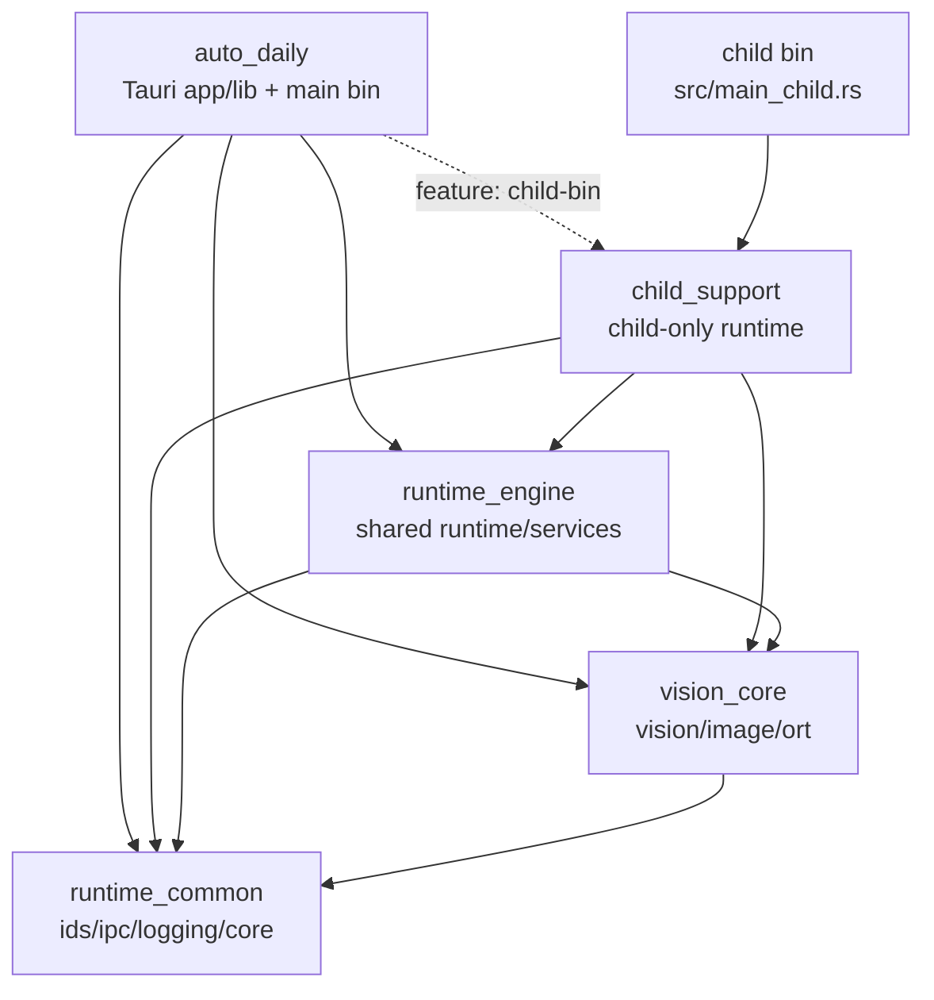

```mermaid
graph TD
    A["auto_daily<br/>Tauri app/lib + main bin"]
    B["child_support<br/>child-only runtime"]
    C["runtime_engine<br/>shared runtime/services"]
    D["vision_core<br/>vision/image/ort"]
    E["runtime_common<br/>ids/ipc/logging/core"]
    F["child bin<br/>src/main_child.rs"]

    A --> C
    A --> D
    A --> E
    A -. "feature: child-bin" .-> B
    F --> B

    B --> C
    B --> D
    B --> E

    C --> D
    C --> E
    D --> E

```