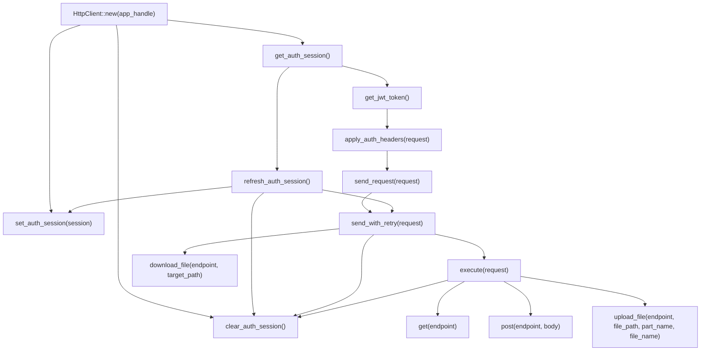

# HttpClient Method Graph

文件对应：
[http_client.rs](D:/Database/Project/VisualStudioCode/AutoDaily/src-tauri/crates/runtime_engine/src/infrastructure/http_client.rs)

## Overview

`HttpClient` 现在只使用 `AUTH_SESSION_KEY` 持久化完整 `AuthRes`。
对外方法分两层：

- 认证会话层：读写本地认证信息
- 请求执行层：附加认证头、自动刷新 token、失败后重试

## Mermaid



## Call Paths

### 1. 普通 GET / POST

```text
get/post
  -> execute
    -> send_with_retry
      -> send_request
        -> apply_auth_headers
          -> get_jwt_token
            -> get_auth_session
      -> 401 时 refresh_auth_session
        -> get_auth_session
        -> set_auth_session / clear_auth_session
```

### 2. 文件上传

```text
upload_file
  -> execute
    -> send_with_retry
      -> send_request
```

### 3. 文件下载

```text
download_file
  -> send_with_retry
    -> send_request
```

## Responsibilities

- `get_auth_session`：从 Tauri store 读取完整 `AuthRes`
- `set_auth_session`：写入完整 `AuthRes`
- `clear_auth_session`：清空认证会话
- `get_jwt_token`：从 `AuthRes` 中取 `accessToken`
- `apply_auth_headers`：统一附加 `Bearer token` 和 `Machine-Code`
- `send_request`：发送一次原始请求
- `refresh_auth_session`：调用 `/auth/refresh` 刷新 token
- `send_with_retry`：首发请求，401 时尝试刷新并重试一次
- `execute`：统一处理 HTTP 状态码和 JSON 反序列化
```
