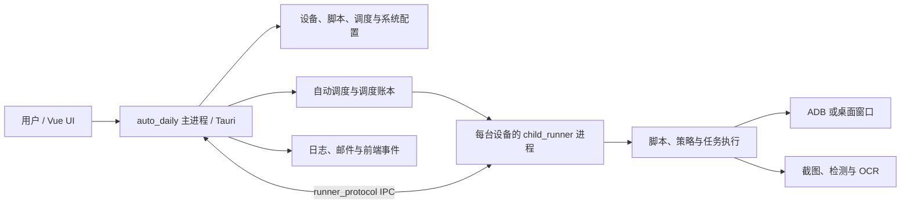
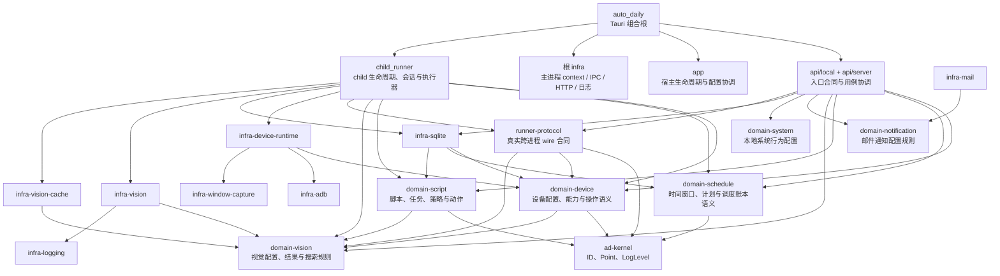

# AutoDaily 当前项目认知模型与边界审查

本文以 `D:\Project\AutoDaily` 当前工作树与 Cargo metadata 为准，用于说明重构后的稳定所有权和依赖方向。公开符号的逐项迁移证据见《Rust工作区重构执行计划》；本文只保留最终认知模型，不重复记录迁移历史。

## 产品运行模型



主进程拥有本地/服务端 API、配置、自动调度和进程生命周期；child 进程拥有单台设备的运行会话、脚本执行和模型推理。`enable` 只决定是否引导设备 child，`auto_start` 决定是否自动派发任务，两者是不同阶段。

## Workspace 所有权模型



图中省略了只为复用 ID 而指向 `ad-kernel` 的部分细线。依赖方向的核心约束是：领域包不依赖 Tauri、SQLite、ADB、窗口或 ONNX Runtime；基础设施包可以依赖其所实现的领域合同，但不得反向拥有领域模型。

## 包职责

| 边界 | 拥有内容 | 不应拥有内容 |
| --- | --- | --- |
| `auto_daily/api` | 本地 Tauri command、UI event payload、服务端 DTO 与用例协调 | 可持久化设备/脚本/调度模型，child 内部状态 |
| `auto_daily/app` | Tauri 启动退出、快捷键、配置 store 与宿主副作用协调 | 稳定领域结构体、基础设施实现 |
| `auto_daily/infra` | 主进程 context、child process manager、IPC server、HTTP、日志与文件适配 | 可复用领域模型、child 执行器状态 |
| `domain-*` | 更换 UI、数据库或运行时后仍成立的业务值、规则和聚合 | Tauri handle、SQLx、ADB client、ORT session |
| `child-runner` | child bootstrap、会话、调度 tick、脚本执行状态与 reporter | 主进程 UI DTO、可持久化领域定义 |
| `runner-protocol` | 主进程与 child 实际发送的 bootstrap、message、session snapshot 与 event | 只在一侧存在的状态、未构造的预留消息 |
| `infra-*` | SQLite、ADB、设备运行时、视觉、缓存、窗口捕获、日志和邮件技术实现 | 仅为目录对称而复制的领域或协议类型 |
| `ad-kernel` | 多领域共享且无产品归属的 ID 基础、坐标和日志级别 | 配置 key、socket 名称、第三方库转售、业务规则 |

## API 模块边界

```text
api.rs
├── local.rs
│   └── local/
│       ├── device.rs
│       ├── schedule.rs
│       ├── execution.rs + execution/
│       ├── script.rs + script/
│       ├── vision.rs + vision/
│       ├── settings.rs + settings/
│       └── debug.rs
├── server.rs
│   └── server/
│       ├── auth.rs
│       ├── script.rs + script/
│       ├── dto.rs
│       └── profile_cache.rs
└── response.rs
```

`local` 是 Vue 通过 Tauri invoke 使用的本地接口；`server` 负责认证、用户资料、市场与脚本/模型传输。Rust 模块统一采用 `foo.rs + foo/`，当前源码不存在 `mod.rs`。

## 当前审查结论

1. 已删除 `app_schedule`、`app_script`、`application-execution`、`domain-execution`、`child_support`、`runtime_common`、`runtime_engine` 与 `vision_core` 等旧所有权链；当前 Cargo workspace 只包含本图列出的新包。
2. `domain-script` 依赖的是 `domain-vision` 的纯配置、结果和搜索规则，不再依赖 `infra-vision`；加载后的 ORT session 只存在于 `infra-vision`。
3. `child-runner` 只对外提供 bootstrap 入口；内部状态不进入 `runner-protocol`。协议包已删除未构造消息和重复 timeout/cache 投影。
4. 根 crate 只对外提供 `auto_daily_lib::run`；根 `api`、`app`、`infra` 与常量均限制在组合根内部。
5. 当前逐符号候选扫描没有未解释的公开函数；17 个无具名 crate 外引用的公开类型均由公开字段、serde/TS 合同或公开函数签名间接使用，保留理由记录在执行计划中。

## 最终验收结论

1. `cargo fmt --all -- --check`、普通 `cargo check --workspace`、全部 workspace 测试目标链接、TS 绑定生成和 `pnpm type-check` 均通过；workspace 检查覆盖 `infra-vision`、`child_runner` 与组合根且为零 warning。
2. 18 个现行包、108 个 Tauri command/handler 已复扫；旧包名、旧模块拼写、`mod.rs`、空目录和未解释公开函数候选均为 0。认知模型与实际 Cargo workspace 一致，不需要再进行一次整体架构重做。
3. ORT 已改用 `tls-rustls`，下载缓存固定在项目 `src-tauri/target/ort-cache`。Windows 当前以 `0xc0000022` 阻止 Tauri/ORT 测试二进制在测试框架前启动；该限制不影响编译、链接及不加载该运行时的 146 项实际测试结果，详细证据见执行计划。
