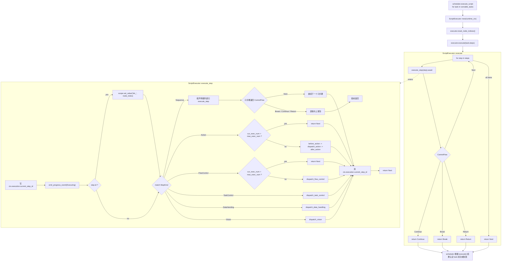

# 执行器内部流程梳理与认知模型图

编写日期：2026-04-10

本文只梳理当前代码里“真正生效的执行器内部流程”，不把大块注释里的旧设计当成已落地事实。

## 分析基线

- 执行器主体：
  - [executor.rs](/D:/Database/Project/VisualStudioCode/AutoDaily/src-tauri/crates/child_support/src/infrastructure/scripts/executor.rs)
- 调用入口：
  - [scheduler.rs](/D:/Database/Project/VisualStudioCode/AutoDaily/src-tauri/crates/child_support/src/infrastructure/scripts/scheduler.rs)
- 步骤模型：
  - [script_decision.rs](/D:/Database/Project/VisualStudioCode/AutoDaily/src-tauri/crates/runtime_engine/src/domain/scripts/script_decision.rs)
- 任务上下文：
  - [runtime_context.rs](/D:/Database/Project/VisualStudioCode/AutoDaily/src-tauri/crates/child_support/src/infrastructure/context/runtime_context.rs)
- 事件上报：
  - [runtime_reporter.rs](/D:/Database/Project/VisualStudioCode/AutoDaily/src-tauri/crates/child_support/src/infrastructure/ipc/runtime_reporter.rs)
- 错误模型：
  - [script_error.rs](/D:/Database/Project/VisualStudioCode/AutoDaily/src-tauri/crates/runtime_engine/src/infrastructure/scripts/script_error.rs)

---

## 当前结论

- 当前执行器已经接入真实调度主链，并完成了第一轮内部重整，但还不是完整设备执行器。
- 当前真正生效的能力已经扩大到：
  - 递归遍历 `Step`
  - 写入 `current_step_id`
  - 上报步骤级进度事件
  - 给 `Scope` 注入 `idx_<step_id>`
  - 维护 `ctx.execution.var_map` 与 `Scope` 的同步
  - 维护 `node_indices`
  - 对 `Sequence` 做递归展开
  - 对 `Action / FlowControl` 做分类 dispatch
  - 执行 `SetVar / GetVar / Filter`
  - 执行 `If / While / For / Continue / Break / WaitMs`
  - 执行 `SetState`
  - 执行基于 `last_snapshot` 的 `VisionSearch`
- 设备动作和策略处理仍然只是显式边界：
  - `Capture`
    - 当前已接入真实截图，并把图像对象写入运行时变量
    - 图像生命周期跟随运行时上下文，不做文件落盘
    - 但尚未在动作后自动重建视觉快照
  - `Click / Swipe`
    - `point / percent` 模式已接入真实 ADB 动作
    - `txt / labelIdx` 仍显式报未接入
  - `LaunchApp / StopApp / Reboot`
    - `StopApp / Reboot` 已接入基础 ADB 动作
    - `LaunchApp` 已改成 `pkg_name + activity_name`，并走 `start_activity`
  - `Link / AddPolicies / HandlePolicySet / HandlePolicy`
    - 当前会直接返回未接入错误
- 文件中确实保留了大量旧执行逻辑，但它们现在在注释块里，不参与编译，不应算作现状。

---

## 图1：当前认知模型图

### 图1解读

- 真正的执行入口不是直接从 `Step` 开始，而是 [scheduler.rs](/D:/Database/Project/VisualStudioCode/AutoDaily/src-tauri/crates/child_support/src/infrastructure/scripts/scheduler.rs) 先完成：
  - 当前 task 写入 `ctx.execution.current_task`
  - 任务级 `Executing` 事件上报
  - `reset_node_indices()`
  - 再调用 `executor.execute(task.data.0.steps.as_slice())`
- [executor.rs](/D:/Database/Project/VisualStudioCode/AutoDaily/src-tauri/crates/child_support/src/infrastructure/scripts/executor.rs) 里的 `execute()` 只是一个顺序遍历壳，真正逻辑全部落在 `execute_step()`。
- `execute_step()` 当前每步都会先写 `current_step_id`，然后发一步 `RuntimeProgressPhase::Executing`。
- 当前 `execute_step()` 已经变成“生命周期包装器 + 分类 handler 分发器”。
- 当前真正有递归执行语义的 `StepKind` 不再只有 `Sequence`，还包括：
  - `If / While / For`
  - `Filter.then_steps`
  - `VisionSearch.then_steps`
- 设备动作已经进入 `dispatch_action()`，其中 `Capture`、点位类 `Click / Swipe`、`LaunchApp / StopApp / Reboot` 已开始执行真实设备动作；文字/标签类动作和策略执行仍未接入。

---

## 当前真实函数链

当前一条任务的真实调用链是：

1. [scheduler.rs](/D:/Database/Project/VisualStudioCode/AutoDaily/src-tauri/crates/child_support/src/infrastructure/scripts/scheduler.rs) 取到一个 `task`
2. 写入：
   - `ctx.execution.current_task = Some(task.clone())`
   - `ctx.execution.current_step_id = None`
3. 发任务级 `Executing` 进度事件
4. `executor.reset_node_indices()`
5. `executor.execute(task.data.0.steps.as_slice())`
6. `execute()` 顺序遍历 `steps`
7. `execute_step()` 对每个 `step`：
   - 写 `current_step_id`
   - 发步骤级 `Executing` 事件
   - 注入 `idx_<step_id>` 到 `Scope`
   - `match StepKind` 分发到分类 handler
   - 恢复上一个 `current_step_id`
   - 返回 `ControlFlow`
8. `execute()` 收到 `ControlFlow` 后决定继续还是向上返回
9. `scheduler` 把整个 task 视作：
   - `Ok(_)` => task 成功
   - `Err(error)` => task 失败

这里有个关键事实：

- 当前 `scheduler` 并不会细分 `Continue / Break / Return` 的业务语义，只要 `execute()` 最终是 `Ok(_)`，就视为该 task 成功。

---

## 当前状态读写点

### 1. RuntimeContext 写点

当前执行器真正写的运行态已经不止步骤游标，主要包括：

- `ctx.execution.current_step_id`
  - 进入 `execute_step()` 时写入
  - 离开 `execute_step()` 时恢复到父步骤 id
- `ctx.execution.var_map`
  - `SetVar / GetVar / Filter / VisionSearch / Capture` 会写入
- `ctx.execution.policy_states`
  - `SetState(policy)` 会写入
- `ctx.execution.task_states`
  - `SetState(task)` 会写入
- `ctx.observation.last_capture_image`
  - `Capture` 会写入
- `ctx.observation.last_hits`
  - `VisionSearch` 会写入

当前仍然没有在执行器 live 路径里形成闭环的状态：

- `ctx.observation.last_snapshot`
  - 只消费，不生产
- `ctx.observation.screen_size`
- OCR cache runtime

### 2. Scope 写点

当前 `Scope` 的 live 写入已经包括：

- `scope.set_value("idx_<step_id>", current_index)`
- 顶层 root 变量同步
  - 例如 `runtime.xxx` 会同步成 `runtime` map
- `filter_item / filter_index / item / item_index`

这意味着 `Scope` 已经开始承担表达式执行容器职责，但：

- 变量命名规范仍需继续收敛
- checkpoint 还没有持久化这部分运行态

### 3. node_indices 写点

当前 `node_indices` 的 live 行为有：

- `reset_node_indices()`
- `get_node_index()`
- `set_node_index()`
- `inc_node_index()`

但在当前 live `StepKind` 里，真正会触发索引变化的步骤还没接上，所以它现在更像“已准备好的辅助能力”。

---

## 当前 ControlFlow 语义

[executor.rs](/D:/Database/Project/VisualStudioCode/AutoDaily/src-tauri/crates/child_support/src/infrastructure/scripts/executor.rs) 里的 `ControlFlow` 有 4 种：

- `Next`
  - 正常继续
- `Continue`
  - 当前实现里更多像“提前结束当前层”
- `Break`
  - 预留给循环/流程控制
- `Return`
  - 预留给任务/策略提前结束

当前 live 代码里，真正会主动返回非 `Next` 的包括：

- `FlowControl::Continue`
- `FlowControl::Break`
- `FlowControl` 分支里的嵌套步骤冒泡
- `VisionSearch.then_steps / Filter.then_steps / Sequence / If / While / For` 的嵌套步骤冒泡
- `Link / AddPolicies / HandlePolicySet / HandlePolicy / GetState(step)` 这类显式未接入错误

因此当前 `ControlFlow` 的“语义集合”大于“已落地行为集合”。  
文档和代码阅读时必须区分这两层，不能把枚举存在等同于行为已完整实现。

---

## 当前生效的 StepKind 与未生效边界

### 当前真实生效

- `Sequence`
  - 递归展开子步骤
- `Action`
  - 已有统一 handler 入口
  - `Capture` 会把真实截图图像写入运行时变量并清空旧视觉缓存
  - `Click / Swipe` 的 `point / percent` 模式会发送真实 ADB 命令
  - `StopApp / Reboot` 会发送真实 ADB 命令
  - `LaunchApp` 已要求 `pkg_name + activity_name`，并通过 `start_activity` 执行
  - `txt / labelIdx` 类动作仍是显式未接入边界
- `DataHanding`
  - `SetVar`
  - `GetVar`
  - `Filter`
- `FlowControl`
  - `If`
  - `While`
  - `For`
  - `Continue`
  - `Break`
  - `WaitMs`
- `TaskControl`
  - `SetState`
- `Vision`
  - `VisionSearch`

### 代码里存在但当前不应算作现状

文件中保留了大量被注释掉的旧执行设计，包括但不限于：

- `TakeScreenshot / Ocr / FindObject / ClickAction`
- `StopPolicy / FinishTask / FilterHits`

这些逻辑当前只是“历史设计残影”，不参与编译，也不参与执行。

---

## 执行器内部的现实问题

### 1. 执行器对外已经在主链上，但对内仍是“基础动作已接通、视觉驱动动作未接通”的骨架

结果是：

- 调度器已经把它当正式执行器使用
- 纯逻辑节点已经开始真实执行
- 但视觉驱动动作和策略执行仍未接入真实适配器

所以现在的真实状态不再是“全空壳”，而是“逻辑执行骨架已成型，基础设备动作已部分接通，视觉驱动动作和策略执行仍缺适配器”。

### 2. 事件上报比真实执行能力更完整

现在步骤级事件已经会发，且一部分步骤行为已经真实生效。  
但前端看到“正在执行步骤”，仍不代表：

- 真实设备动作已经发生
- 视觉快照已经自动刷新
- timeout / checkpoint safe point 已挂进该步骤

### 3. 状态分层已做，但执行器还没吃到收益

[runtime_context.rs](/D:/Database/Project/VisualStudioCode/AutoDaily/src-tauri/crates/child_support/src/infrastructure/context/runtime_context.rs) 已经拆成：

- `ExecutionState`
- `ObservationState`

当前执行器也已经开始消费这两层状态，但还没走到完整闭环，所以：

- timeout detector 仍未挂入
- checkpoint safe point 仍未挂入
- action wait / observe refresh 目前还只是空 hook 位

### 4. “旧代码残影”会干扰后续判断

当前文件最大的认知风险不是 bug，而是：

- 注释中的旧逻辑太多
- 容易让人误判“某个步骤已经支持，只是还没调通”

实际上它们当前根本不在执行路径里。

---

## 建议的阅读顺序

如果后续要继续整理执行器内部，我建议按这个顺序读代码：

1. [scheduler.rs](/D:/Database/Project/VisualStudioCode/AutoDaily/src-tauri/crates/child_support/src/infrastructure/scripts/scheduler.rs)
   - 看 task 级入口怎样调用执行器
2. [executor.rs](/D:/Database/Project/VisualStudioCode/AutoDaily/src-tauri/crates/child_support/src/infrastructure/scripts/executor.rs)
   - 只看 live 分支，不要先看注释块
3. [script_decision.rs](/D:/Database/Project/VisualStudioCode/AutoDaily/src-tauri/crates/runtime_engine/src/domain/scripts/script_decision.rs)
   - 看 `Step / StepKind` 顶层分类
4. `nodes/*.rs`
   - 看每类节点理论上要承载什么数据
5. [runtime_context.rs](/D:/Database/Project/VisualStudioCode/AutoDaily/src-tauri/crates/child_support/src/infrastructure/context/runtime_context.rs)
   - 看后续 timeout / resume 能挂在哪些状态上

---

## 最终判断

当前执行器内部流程可以概括成一句话：

- 外层调度链已经把它当正式执行器使用，而内层已经从“单纯步骤遍历器”进化成了“有分类 handler、可执行纯逻辑节点、但设备动作仍缺适配器”的执行骨架。

因此，后续如果进入执行器阶段，第一优先级不是继续往现有 `match StepKind` 里零散补逻辑，而是先把它重整成稳定的 step 生命周期骨架，再把：

- action 执行
- data handing
- flow control
- vision refresh
- timeout detector
- checkpoint safe point

按统一插槽接进去。
