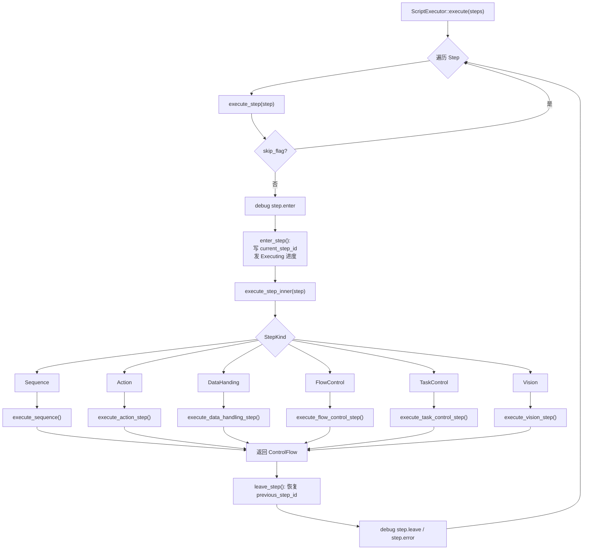
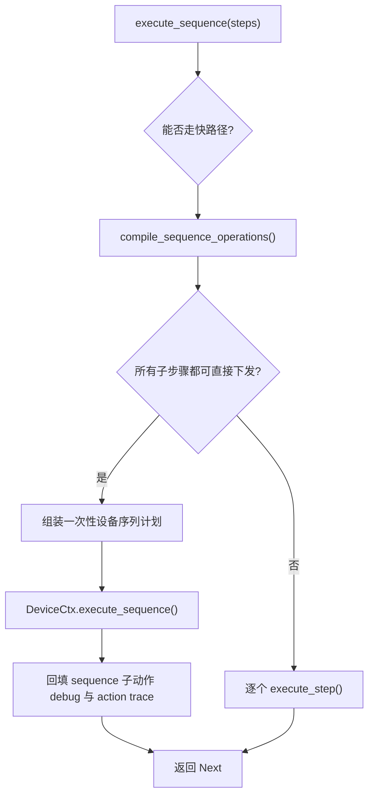
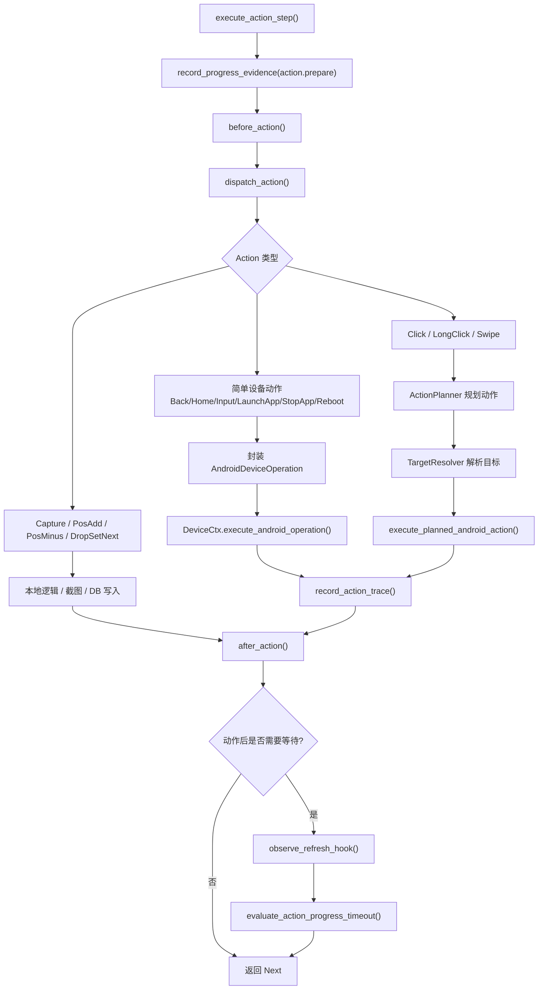
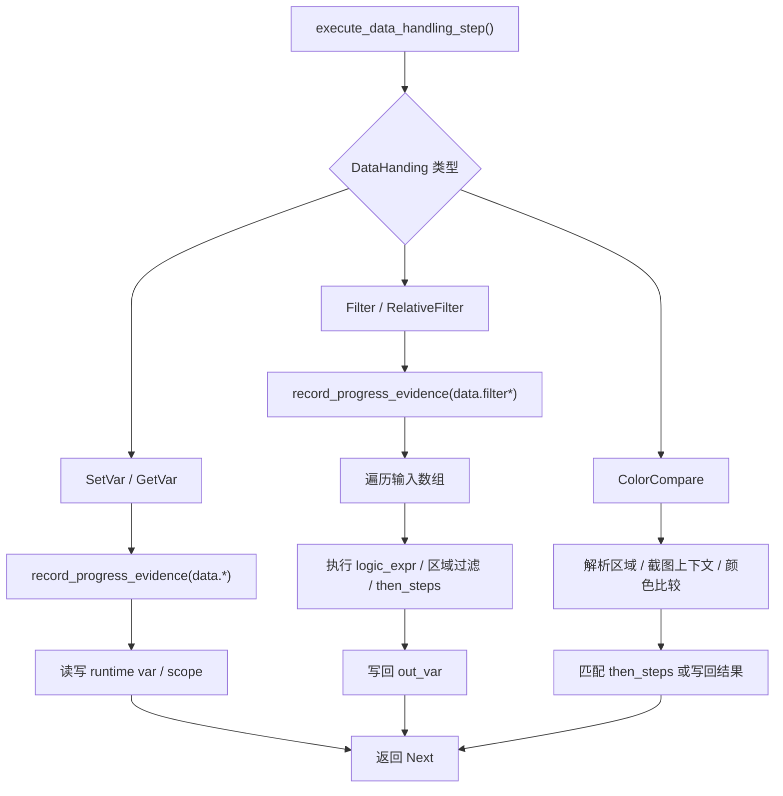
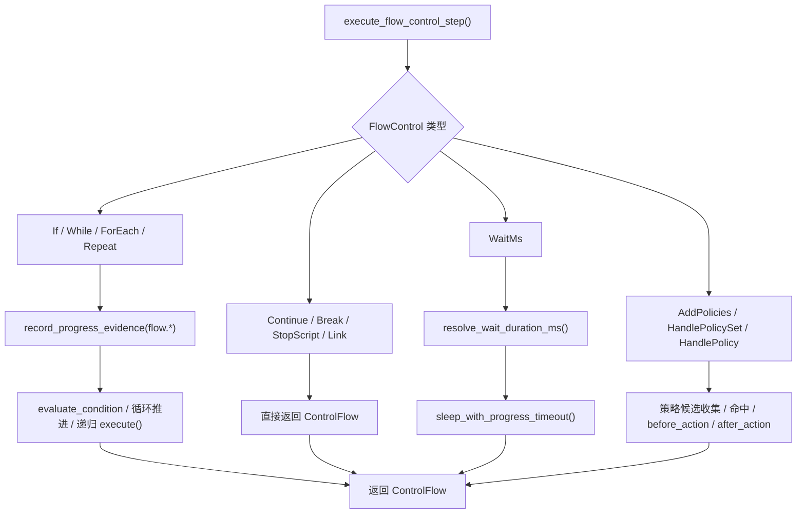
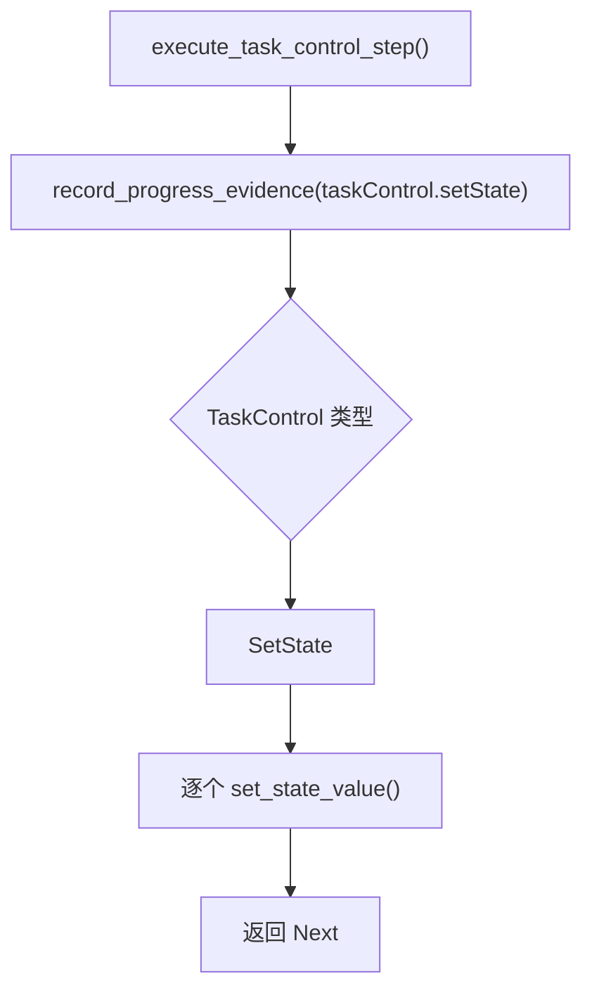
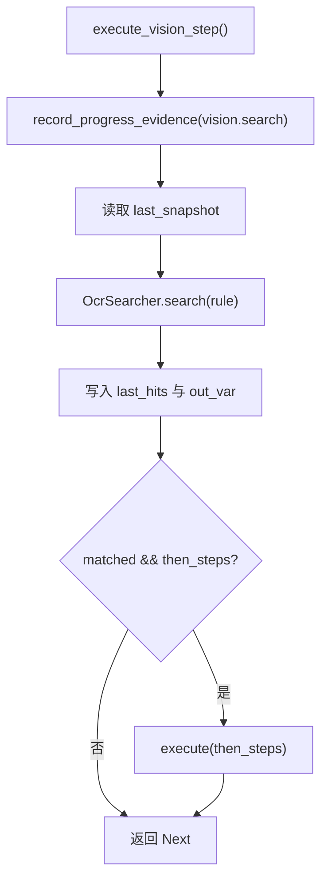
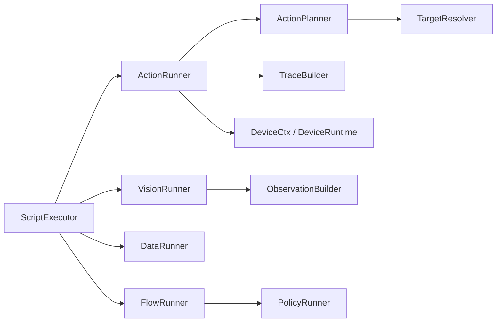

# 脚本执行器流程图与简化方案

## 当前执行主流程

## Sequence 细分流程

当前语义：

- `Sequence` 不是一个新的业务步骤类型，它是“把一组一次性步骤收拢起来执行”的容器。
- 现在的快路径只接受“可直接下发到设备”的子步骤。
- 一旦子步骤里出现运行时求值、视觉依赖、循环、变量等待这类内容，就退回普通递归执行。

## Action 细分流程

## DataHanding 细分流程

特点：

- 这类步骤主要是“运行时数据变换器”。
- 它不应该关心设备执行，只应该关心变量、集合、图像上下文和结果输出。

## FlowControl 细分流程

特点：

- 这里是真正的“编排层”。
- `HandlePolicySet / HandlePolicy` 既是流程控制，也是策略执行入口，所以当前仍然偏重。

## TaskControl 细分流程

特点：

- 这是最接近“状态写入”的步骤。
- 适合后续从 `flow.rs` 再拆成独立的 `task_control_runner`。

## Vision 细分流程

特点：

- `Vision` 本身不做截图，它消费的是已经存在的观察上下文。
- 这也是为什么 `Capture` 仍然属于 `Action`，而不是 `Vision`。

## PolicyActionKind / PolicyActionSource / PolicyActionTargetRole 的作用

### PolicyActionKind

- 表示动作是什么，例如 `Click`、`Swipe`、`StartApp`、`Back`。
- 进入 `PolicyActionTrace.kind`。
- 用于构造动作签名。

### PolicyActionSource

- 表示动作目标从哪里来，例如 `Fixed`、`Ocr`、`Det`、`Custom`。
- 进入 `PolicyActionTrace.source`。
- 参与动作签名与策略调试。

### PolicyActionTargetRole

- 表示一个 target 在动作里的角色，例如 `Primary`、`Start`、`End`。
- 进入 `PolicyActionTarget.role`。
- 用于还原动作结构，而不只是平铺坐标。

## 这些类型是不是必须的

- 对“设备能否执行动作”来说，不是必须的。
- 对“策略调试、结构化 trace、动作签名、防卡死观测”来说，当前仍然有用。
- 更准确地说：必须的不是这三个枚举本身，而是“有一套稳定的结构化动作追踪模型”。

## 当前执行器的主要问题

- `ScriptExecutor` 还同时握着编排、动作入口、trace、超时探针、变量、策略、视觉上下文。
- `include!` 只是把大文件拆碎了，但还没形成清晰的运行边界。
- `Sequence` 快路径之前没有把子动作 trace/debug 回填，调试时会出现黑箱。
- `Capture` 与设备通道强相关，但设备配置层之前没有把“非模拟器不能窗口截图”卡死。

## 当前认可的简化方案

### 1. ScriptExecutor

- 只保留步骤遍历、ControlFlow 编排、enter/leave step、进度与超时总控。

### 2. ActionRunner

- 作为 `Action` 与 `Sequence` 的统一入口。
- 只负责分发，不直接持有 ADB 细节。

### 3. ActionPlanner

- 负责把 `Action` 或 `Sequence` 子步骤编译成“可执行计划”。
- 输出应是运行时友好的计划，而不是执行器直接拼 ADB。

### 4. TargetResolver

- 只解析 OCR / Det / Point / Percent / SwipeTarget。
- 不负责设备发送。

### 5. DeviceCtx + DeviceRuntime

- 继续作为唯一设备执行出口。
- 把 `ADBCommand`、shell 命令、截图方式选择都收在这一层。

### 6. TraceBuilder

- 把 `PolicyActionTrace`、signature、target 构造从 action runner 再剥离出去。

### 7. ObservationBuilder

- 管截图上下文、OCR/Det 结果、页面 fingerprint。

## 推荐拆分顺序

1. 先稳定 `DeviceCtx + DeviceRuntime` 的唯一出口地位。
2. 再把 `ActionRunner` 从 `ScriptExecutor` 主体里抽出来。
3. 然后把 `TraceBuilder` 和 `ObservationBuilder` 分离。
4. 最后再处理 `HandlePolicySet / HandlePolicy` 的重量级逻辑。

## 理想链路

## 结论

- `PolicyActionKind / Source / TargetRole` 不是脚本执行本体必需品，但它们当前仍然属于 trace 层的重要结构。
- `Sequence` 应该继续是“一次性多步设备操作容器”，但快路径只处理可直接下发的子步骤，其余退回普通执行。
- 当前最该继续推进的是把 `ActionRunner` 从 `ScriptExecutor` 主体里压出来，同时保持 `DeviceCtx + DeviceRuntime` 作为唯一设备出口。
