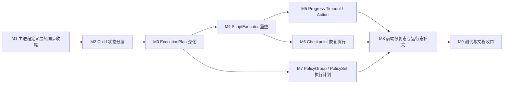

# 脚本执行流后续改造顺序清单（按模块拆分）

编写日期：2026-04-10

本文基于当前代码状态，给出“后续还要做什么”的模块化拆分顺序。目标不是重讲架构，而是明确下一阶段每个模块的改造边界、依赖关系和验收点。

## 当前结论

- 主进程外层主线已经基本收口：
  - `RuntimeSessionSnapshot`
  - assignment/session sync
  - 设备级执行策略
  - 脚本级 `recovery_task_id`
  - checkpoint 落库与 `RestartReady`
  - 在线设备定义层热同步收口
- 当前剩余主工作，已经明显集中在 child 内部：
  - 执行计划深化
  - 执行器重整
  - timeout detector / timeout action 深化与收口
  - checkpoint 驱动的真实恢复执行
  - `PolicyGroup / PolicySet` 进入真正执行计划
- `M1` 已基本关单，`M2` 已完成第一轮状态拆分，`M3` 已落地最小调度跳过闭环：
  - `M1`
    - 已补 `clone_local_script_cmd(overwrite)` 的热同步收口和错误删除路径修正
  - `M2`
    - `RuntimeContext` 已拆出 `ExecutionState` / `ObservationState`
  - `M3`
    - `DeviceQueue` 已会基于模板覆盖值和最近一次成功调度记录决定“是否跳过任务”
- `M4` 已进入第一阶段：
  - 执行器已重整成生命周期包装器 + 分类 handler
  - `ScriptExecutor` 代码组织已从单文件扩成：
    - `executor.rs`
    - `executor/action.rs`
    - `executor/flow.rs`
    - `executor/policy.rs`
    - `executor/runtime.rs`
  - 纯逻辑节点开始真实执行
  - `Capture` 已接入真实截图并写入运行时内存变量
    - 会同步写入 `runtime.latestCapture`
    - 会统一生成 `runtime.detResults / runtime.ocrResults`
    - 会刷新 `last_capture_image / last_snapshot / last_hits`
    - 会按“截图像素 + 模型配置 + signature_grid_size”读写 OCR 缓存
  - `Click / Swipe` 的 `point / percent / txt / labelIdx` 模式已接入真实动作
    - `txt / labelIdx` 当前通过 `input_var` 读取兼容的 `OcrResult[] / DetResult[]`，或过滤后的同构结果集
  - 动作结果输入开始收口到显式 `input_var`
    - `ClickMode::Txt / LabelIdx`
    - `SwipeMode::Txt / LabelIdx`
  - 图像变量输入仍只保留在：
    - `HandlePolicySet`
    - `HandlePolicy`
    - `PolicyCondition`
  - `HandlePolicySet / HandlePolicy`
    - 已可按 `input_var` 读取图像变量、按需解析当前脚本 bundle，并执行首个命中的策略
    - 已可输出 `PolicyExecutionResult`
  - `PolicyCondition`
    - 已支持 `input_var` 显式图像变量，缺省时复用当前 `last_snapshot`
  - `PolicySetResult`
    - 已支持比较 `matched / policySetId / policyGroupId / policyId`
  - `FlowControl::For` 已从模型层替换成 `ForEach(input_var, item_var, index_var, flow)`
  - `LaunchApp / StopApp / Reboot` 已接入基础 ADB 动作
  - `runtime_policy.action_wait_ms` 已开始在真实设备动作后生效
  - 已引入 `DeviceAdapter` 平台分发骨架，Android 已接当前动作链
  - `scheduler` 已会在脚本执行前初始化 `img_det_service / ocr_service`
  - 视觉驱动动作与策略执行已形成最小闭环，但观察证据记录与 hook 链仍未接完

## 本版本明确不实现

- 战斗循环 / 高频操作循环改进
  - 例如 `Sampler -> Vision -> Coordinator -> ADBCommand::Loop` 的分层协同
  - 例如循环内截图、观察态刷新、战斗态异步动作编排
- `DesktopDeviceAdapter`
  - 当前继续保持前后端运行入口显式拒绝
  - 只保留平台建模和后续设计记录，不纳入本版本排期
- 本版本只记录设计方向，不进入实现；当前版本仍以显式截图变量驱动策略执行链消费。

## 传输层补充说明

### 为什么 `ScriptBundleSnapshot` 目前仍保留 `String JSON`

当前它看起来有一层“外面已经走 `bincode`，里面为什么还保留 JSON string”的重复序列化，但这不是无意义保留，当前主要有 3 个原因：

- 共享合同层 `runtime_common` 不直接依赖 `runtime_engine::domain::*`
  - 如果把 `ScriptTable / ScriptTaskTable / PolicyTable / PolicyGroupTable / PolicySetTable` 直接抬进共享合同层，会把领域模型和 IPC 合同重新耦死。
- child 当前只需要“按需解析”
  - 现在 child 在 `scheduler` 里只解析自己当前需要的 bundle 分片，这让主进程装配和 child 消费之间的边界更松。
- 当前实现优先级是“先打通 session 基线主链”
  - 用 `String JSON` 分片可以更快落地，不必先设计整套 transport DTO。

这意味着当前的 `ScriptBundleSnapshot` 应理解为：

- 外层 `IpcMessage`
  - 走 `bincode`
- 内层 `ScriptBundleSnapshot`
  - 暂时是 JSON 分片传输快照

后续更合理的演进方向不是继续长期保留这层 `String JSON`，而是：

- 在 `runtime_common` 定义专用 transport DTO
- 主进程把领域对象映射成 transport DTO
- child 直接消费强类型 transport DTO

也就是说，`String JSON` 目前是“有意保留的过渡实现”，不是最终形态。

---

## 模块顺序总览

---

## M1：主进程定义层热同步收尾

### 当前状态

- 已完成：
  - assignment 变更后在线 session reload
  - 设备执行策略变更后的 reload / restart
  - 模板覆盖值保存/删除后的 reload
  - `save_script_cmd` / `delete_script_cmd` 的在线设备 reload 收口
  - `clone_local_script_cmd(overwrite)` 覆盖旧开发副本后，受影响在线设备也会 reload

### 剩余目标

- 核对所有“会影响 session 基线”的定义层命令是否都已有一致 reload 语义。
- 把“哪些命令立即 reload，哪些命令由最终收口点统一 reload”固化成约束，避免后续再漂移。

### 建议时机

- `M1` 不建议再单独拉成一个完整阶段。
- 更合适的方式是把它当成 `M2` 之前的短收尾 / 进入闸门：
  - 先快速核对一轮命令入口
  - 如果没有新缺口，直接关闭 `M1`
  - 然后进入 `M2 + M3 + M4`
- 只有当后面又新增“会影响 session 基线”的命令入口时，才回到 `M1` 这层补热同步约束。

### 影响模块

- [scripts.rs](/D:/Database/Project/VisualStudioCode/AutoDaily/src-tauri/src/api/domain/scripts.rs)
- [schedule.rs](/D:/Database/Project/VisualStudioCode/AutoDaily/src-tauri/src/api/domain/schedule.rs)
- [runtime_sync.rs](/D:/Database/Project/VisualStudioCode/AutoDaily/src-tauri/src/api/infrastructure/runtime_sync.rs)

### 验收标准

- 在线 child 不会继续持有明显过期的 queue / bundle 基线。
- 不出现“定义层一次保存导致多次重复 reload”的脏行为。

---

## M2：Child 状态分层

### 目标

- 把 child 当前混在一起的状态拆清楚，为后续 timeout / resume / plan 深化做地基。

### 当前状态

- 已完成第一轮拆分：
  - `runtime_session.rs`
    - 继续只负责 `ChildRuntimeSession` 容器，`get_or_init` 只初始化进程级全局 store 一次
  - `runtime_context.rs`
    - 已拆出 `ExecutionState`
    - 已拆出 `ObservationState`
  - `scheduler / executor / recovery_checkpoint_store`
    - 已改为通过 `ctx.execution.* / ctx.observation.*` 访问运行态
- 仍未完成：
  - `ScriptExecutor` 还没有围绕这两层状态重新整理 step 主循环
  - timeout / resume 还没真正消费这层拆分收益

### 推荐拆分

- `ChildRuntimeSession`
  - 继续负责会话镜像
- `ExecutionState`
  - `execution_id`
  - `assignment/script/task/step`
  - task/policy 运行态
- `ObservationState`
  - `last_snapshot`
  - `last_hits`
  - OCR cache runtime
- `RuntimeContext`
  - 从“大杂烩上下文”降级成组合容器

### 影响模块

- [runtime_session.rs](/D:/Database/Project/VisualStudioCode/AutoDaily/src-tauri/crates/child_support/src/infrastructure/session/runtime_session.rs)
- [runtime_context.rs](/D:/Database/Project/VisualStudioCode/AutoDaily/src-tauri/crates/child_support/src/infrastructure/context/runtime_context.rs)
- [scheduler.rs](/D:/Database/Project/VisualStudioCode/AutoDaily/src-tauri/crates/child_support/src/infrastructure/scripts/scheduler.rs)
- [executor.rs](/D:/Database/Project/VisualStudioCode/AutoDaily/src-tauri/crates/child_support/src/infrastructure/scripts/executor.rs)
- [executor/action.rs](/D:/Database/Project/VisualStudioCode/AutoDaily/src-tauri/crates/child_support/src/infrastructure/scripts/executor/action.rs)
- [executor/flow.rs](/D:/Database/Project/VisualStudioCode/AutoDaily/src-tauri/crates/child_support/src/infrastructure/scripts/executor/flow.rs)
- [executor/policy.rs](/D:/Database/Project/VisualStudioCode/AutoDaily/src-tauri/crates/child_support/src/infrastructure/scripts/executor/policy.rs)
- [executor/runtime.rs](/D:/Database/Project/VisualStudioCode/AutoDaily/src-tauri/crates/child_support/src/infrastructure/scripts/executor/runtime.rs)

### 验收标准

- 执行态和观察态不再依赖隐式共享字段。
- timeout detector 和 checkpoint resume 不需要直接操作整块 `RuntimeContext`。

---

## M3：ExecutionPlan 深化

### 当前状态

- 已落地的最小能力：
  - `Task` 过滤
  - `RunTarget` 基础选择
  - 模板覆盖值里的 `taskSettings.enabled / taskSettings.taskCycle`
  - `DeviceQueue` 下按最近一次 `Success` 调度记录做跳过判定
  - 跳过任务会写 `RuntimeScheduleStatus::Skipped`
  - 跳过任务会追加 `device_script_schedules.status = Skipped`
- 当前判定边界：
  - `EveryRun`
    - 不跳过
  - `Daily`
    - 当天成功过就跳过
  - `Weekly`
    - 距离最近一次成功未满 7 天就跳过
  - `Monthly`
    - 本月成功过就跳过
  - `WeekDay(day)`
    - 非指定周几直接跳过；指定日当天若已成功过也跳过
  - `MonthDay(day)`
    - 非指定日期直接跳过；指定日当天若已成功过也跳过
- 当前仍未完成：
  - 恢复任务插入
  - `PolicyGroup / PolicySet` 展开
  - 更复杂的“补跑 / 错过执行日补偿”规则
  - 调试运行目标 `FullScript / Task` 当前会强制注入 `everyRun` 的 task-cycle 覆盖
    - 调试运行不吃 `DeviceQueue` 这套正式调度跳过逻辑
    - 调试运行也不会写调度记录，只保留运行日志与 runtime event

### 目标

- 让 `ExecutionPlanAssembler` 真正成为“运行前决策层”，而不是单纯的 task 过滤器。

### 推荐新增能力

- `should_skip_by_schedule(...)`
- `resolve_task_cycle(...)`
- `inject_recovery_task_if_needed(...)`
- `expand_policy_group(...)`
- `expand_policy_set(...)`

### 影响模块

- [execution_plan.rs](/D:/Database/Project/VisualStudioCode/AutoDaily/src-tauri/crates/child_support/src/infrastructure/scripts/execution_plan.rs)
- [schedule_journal.rs](/D:/Database/Project/VisualStudioCode/AutoDaily/src-tauri/crates/child_support/src/infrastructure/scripts/schedule_journal.rs)
- [device_schedule.rs](/D:/Database/Project/VisualStudioCode/AutoDaily/src-tauri/crates/runtime_engine/src/domain/devices/device_schedule.rs)

### 验收标准

- 任务是否执行，不再只看 `default_enabled`。
- 调度记录和 task cycle 会真实参与是否跳过的判定。

---

## M4：ScriptExecutor 重整

### 目标

- 先把执行器从“占位步调度”整理成稳定的 step 执行骨架，再接 timeout / resume。

### 当前状态

- M4 已关闭，当前只保留后续阶段的增强项。
- 已完成第一阶段：
  - `ScriptExecutor` 已从单文件拆成主文件 + `executor/` 子文件夹分模块实现
  - `execute_step`
    - 已改成 before / dispatch / after 的生命周期包装器
  - 已拆出分类 handler：
    - `dispatch_action`
    - `execute_flow_control_step`
    - `execute_data_handling_step`
    - `execute_task_control_step`
    - `execute_vision_step`
  - 已落地的纯逻辑能力：
    - `SetVar / GetVar / Filter`
    - `If / While / ForEach / Continue / Break / WaitMs`
    - `SetState`
    - `VisionSearch` 基于 `last_snapshot` 的搜索与 then 分支
  - `var_map` 与 `Scope` 已开始同步
- M4 不再单独背负以下余项：
  - `ColorCompare` 仍未定稿
    - 当前仍停在条件节点占位报错
    - 更合适的归属仍是数据处理/过滤能力
  - action 的 `exec_max` 运行时限制已经接入，但编辑器里还没有单独配置入口
  - 这些改入后续执行能力增强，不再阻塞执行器骨架收口

### 当前建议顺序

1. 保持 `Link` 走调度器 task 切换，不再回退到执行器内硬跳转
2. `AddPolicies` 已按“运行时策略集合 overlay”落地
   - 当前只影响 session 内 `policy_set` 运行态，不改数据库关系
   - 后续重点转成验证 overlay 叠加、去重和执行计划边界，而不是继续讨论要不要空操作
3. `RestartApp` 已按脚本级 `pkg_name + activity_name` 落地为 `stop_app -> start_activity`
   - 但它只负责“安全重启应用并中断当前执行”
   - 自动回目标页 / 登录 / 恢复任务仍由脚本编排承担
4. `GetState(step)` 已删除，状态匹配统一走 `ConditionNode::TaskStatus`
5. `ExecNumCompare` 已接成 `ExecNumCompare { target, op }`
   - 当前只比较 `Task / Policy` 的运行时 `exec_cur` 和定义层 `exec_max`
   - `exec_max = 0` 视为无限次
   - step 级计数已删除；当前只保留 `Policy / Action / Task` 三级计数
6. 调试运行已统一走 session 主链
   - `cmd_run_script_target -> LoadSession -> Start -> scheduler.execute_script`
   - 当前与 `DeviceQueue` 的差异只保留在 session 装配层，而不是再走独立执行分支
7. `ColorCompare` 不建议继续停在条件节点里，应后续转去数据处理/过滤模型
8. `DesktopDeviceAdapter` 不属于本版本范围，不计入当前阶段收口

### 重点工作

- 清理注释掉或过期的旧逻辑。
- 明确 step 生命周期：
  - before execute
  - execute
  - after execute
  - action wait
  - observe refresh
- 明确可插入的 hook 位点：
  - timeout detector
  - 前进证据采集
  - checkpoint safe point

### 当前已落地

- `Link` 已接入 scheduler pending queue，并区分 root task / linkable task
- `AddPolicies` 已接入运行时策略集合 overlay，只改 session 内存态
- `GetState(step)` 已从步骤执行模型删除，状态匹配统一走条件节点
- `ExecNumCompare` 已接入：
  - 当前结构为 `ExecNumCompare { target, op }`
  - 当前支持 `Eq / Ne / Lt / Le / Gt / Ge`
  - 当前只比较 `Task / Policy` 的运行时 `exec_cur` 与定义层 `exec_max`
- 执行次数模型已收口：
  - step 级计数已删除
  - `Action` 执行成功且最终返回 `ControlFlow::Next` 时才累加运行时计数
  - `Task` 在调度层认定成功且未 skip 时累加运行时计数
  - `Policy` 在命中成功时累加运行时计数
- 调试运行已进入正式主链：
  - 不再依赖 `debug_execute()` 旁路
  - `DeviceQueue` 是任务管理页上的正式运行目标
  - `FullScript / Task / PolicyGroup / PolicySet / Policy` 都归 `cmd_run_script_target` 的调试运行目标
  - 非 `DeviceQueue` 运行目标会注入 `everyRun` 的 task-cycle 覆盖
  - 非 `DeviceQueue` 运行目标不写调度记录，只保留运行日志与 runtime event
- 策略调试目标已接入：
  - `PolicyGroup / PolicySet / Policy` 不再前置拒绝
  - child 会在同一条 session 主链内执行策略调试分支
  - 调试内容会输出到控制台日志：
    - 截图后 DET / OCR 摘要
    - 候选策略与命中情况
    - 每轮命中后的 action trace / page fingerprint
- `PolicyExecutionResult.rounds[*].pageFingerprints / actionSignatures / actions` 已真实记录
- observe refresh / timeout detector / checkpoint safe point 已挂入动作后 hook

### 影响模块

- [executor.rs](/D:/Database/Project/VisualStudioCode/AutoDaily/src-tauri/crates/child_support/src/infrastructure/scripts/executor.rs)
- [executor/action.rs](/D:/Database/Project/VisualStudioCode/AutoDaily/src-tauri/crates/child_support/src/infrastructure/scripts/executor/action.rs)
- [executor/flow.rs](/D:/Database/Project/VisualStudioCode/AutoDaily/src-tauri/crates/child_support/src/infrastructure/scripts/executor/flow.rs)
- [executor/policy.rs](/D:/Database/Project/VisualStudioCode/AutoDaily/src-tauri/crates/child_support/src/infrastructure/scripts/executor/policy.rs)
- [executor/runtime.rs](/D:/Database/Project/VisualStudioCode/AutoDaily/src-tauri/crates/child_support/src/infrastructure/scripts/executor/runtime.rs)
- [scheduler.rs](/D:/Database/Project/VisualStudioCode/AutoDaily/src-tauri/crates/child_support/src/infrastructure/scripts/scheduler.rs)

### 验收标准

- `ScriptExecutor` 不再需要“先能跑再说”的临时分支。
- 后续 timeout / resume 接入时，不需要大面积返工 step 主循环。
- 调试运行目标与正式 `DeviceQueue` 的差异只保留在 session 装配和记录策略层，不再分叉出独立执行旁路。

---

## M5：Progress Timeout / Action

### 目标

- 把已经接进 child 运行循环的 timeout 模型继续补齐和收口，而不是重新从零接入。

### 当前状态

- M5 已收口，当前只保留后续增强与验证项。
- 已完成：
  - timeout 检测已经挂在 `ScriptExecutor.after_action()` 之后的动作后链路
  - 当前检测信号已经包含：
    - 页面指纹
    - 动作签名
    - `task / step` 游标
  - 当前已接行为：
    - `NotifyOnly`
    - `SkipCurrentTask`
    - `RunRecoveryTask`
    - `PauseExecution`
    - `StopExecution`
    - `RestartApp`
  - `SystemNotification / Email` 通知链已接通：
    - child 在 timeout 时发 `[timeout_notify] / [timeout_email]` 进度事件
    - main 进程会分别触发桌面通知和后台邮件发送
  - timeout 后会追加 timeout 进度事件记录
  - `PauseExecution / StopExecution / RestartApp` 会先尝试写 checkpoint
- 后续增强项：
  - 当前 detector 主要挂在“动作后观测点”，还没有扩展到更完整的前进证据采集
  - 前端对 timeout 结果的展示还比较粗
  - 仍需要继续验证“避免重复通知”和“长链路卡死”场景
  - 当前还没有充分覆盖的场景包括：
    - 卡在长时间条件求值、数据处理、循环判断，但期间没有新的 action
    - 卡在 `WaitMs` 或其他非动作步骤里
    - 卡在动作前准备阶段，例如恢复装填、观测准备、首次分析前
    - 策略调试里长时间停留在匹配/分析阶段，而不是立即产生命中 action
    - 进入新 `task / step`、循环迭代推进、checkpoint safe point 到达等非动作型推进信号还没有统一纳入 detector

### 关键点

- 检测对象是“无有效进展”，不是“单 step 耗时”。
- 检测信号应至少支持：
  - 页面指纹变化
  - 操作指纹变化
  - OCR 关键文本变化
  - task / step 游标推进
  - 以及后续应补充的：
    - 循环迭代推进
    - `WaitMs` 开始/结束
    - 策略候选轮次推进
    - checkpoint safe point 到达
- 行为执行走：
  - `NotifyOnly`
  - `PauseExecution`
  - `StopExecution`
  - `RestartApp`
  - `RunRecoveryTask`
  - `SkipCurrentTask`

### 影响模块

- [message.rs](/D:/Database/Project/VisualStudioCode/AutoDaily/src-tauri/crates/runtime_common/src/ipc/message.rs)
- [scheduler.rs](/D:/Database/Project/VisualStudioCode/AutoDaily/src-tauri/crates/child_support/src/infrastructure/scripts/scheduler.rs)
- [executor.rs](/D:/Database/Project/VisualStudioCode/AutoDaily/src-tauri/crates/child_support/src/infrastructure/scripts/executor.rs)
- [executor/action.rs](/D:/Database/Project/VisualStudioCode/AutoDaily/src-tauri/crates/child_support/src/infrastructure/scripts/executor/action.rs)
- 未来新增 timeout detector 模块

### 验收标准

- timeout 不依赖前端判断。
- 同一次 execution 不会因为持续卡死而无限重复通知。
- `RunRecoveryTask` 会正确读取当前脚本的 `recovery_task_id`。
- `RestartApp` 会正确读取当前脚本的全局 `pkg_name + activity_name`，执行应用重启，但不自动恢复业务流程。
- `SystemNotification / Email` 通知链真实可用，并且不会把通知能力挂在前端本地逻辑上。

---

## M6：Checkpoint 恢复执行

### 当前状态

- 已完成：
  - `PrepareCheckpoint`
  - checkpoint 落库
  - `RestartReady`
  - `LoadSession(snapshot, checkpoint)`
  - child 已开始按 checkpoint 恢复 task / step 安全点执行
    - `DeviceQueue / FullScript / Task` 会真正消费已加载 checkpoint
    - 会按 checkpoint 裁剪待执行任务队列，并支持 `FromTaskStart / FromStepStart / FromNextStep`
    - 定义指纹或运行目标不兼容时会明确降级，不做伪恢复
    - 恢复成功后会清理旧 checkpoint，避免下一次重启重复恢复
- 未完成：
  - 分支/循环内部的精确恢复仍未做
    - 当前 `step_id` 只对任务顶层步骤游标生效
    - 命中嵌套 step 时会降级为 `FromTaskStart`

### 目标

- 先做“安全点恢复”，不做精确恢复。

### 推荐范围

- `ResumeMode::FromTaskStart`
- `ResumeMode::FromStepStart`
- `ResumeMode::FromNextStep`

### 影响模块

- [runtime_session.rs](/D:/Database/Project/VisualStudioCode/AutoDaily/src-tauri/crates/child_support/src/infrastructure/session/runtime_session.rs)
- [recovery_checkpoint_store.rs](/D:/Database/Project/VisualStudioCode/AutoDaily/src-tauri/crates/child_support/src/infrastructure/session/recovery_checkpoint_store.rs)
- [scheduler.rs](/D:/Database/Project/VisualStudioCode/AutoDaily/src-tauri/crates/child_support/src/infrastructure/scripts/scheduler.rs)
- [executor.rs](/D:/Database/Project/VisualStudioCode/AutoDaily/src-tauri/crates/child_support/src/infrastructure/scripts/executor.rs)
- [executor/action.rs](/D:/Database/Project/VisualStudioCode/AutoDaily/src-tauri/crates/child_support/src/infrastructure/scripts/executor/action.rs)

### 验收标准

- child 重启后能从安全点恢复，而不是只把 checkpoint 当展示态。
- 定义指纹不兼容时，能明确降级，不做伪恢复。
- 旧 checkpoint 在恢复成功后不会被重复消费。

---

## M7：PolicyGroup / PolicySet 执行计划

### 当前状态

- `PolicyGroup / PolicySet / Policy` 已进入调试运行主链。
- 当前剩余问题不是“能不能运行”，而是“是否还要把它们建成正式 task planner 节点”。

### 目标

- 重新确认语义边界：
  - 如果它们继续只做调试目标，就不再推进成 `DeviceQueue` 的正式计划节点；
  - 如果后续要进入正式调度，再单独设计 plan 语义和记录策略。

### 推荐顺序

1. `PolicyGroup` 先接
2. `PolicySet` 再接

### 影响模块

- [process_api.rs](/D:/Database/Project/VisualStudioCode/AutoDaily/src-tauri/src/api/infrastructure/process_api.rs)
- [execution_plan.rs](/D:/Database/Project/VisualStudioCode/AutoDaily/src-tauri/crates/child_support/src/infrastructure/scripts/execution_plan.rs)
- [scheduler.rs](/D:/Database/Project/VisualStudioCode/AutoDaily/src-tauri/crates/child_support/src/infrastructure/scripts/scheduler.rs)
- [ScriptEditor.vue](/D:/Database/Project/VisualStudioCode/AutoDaily/src/views/ScriptEditor.vue)

### 验收标准

- 文档和代码对齐：`PolicyGroup / PolicySet / Policy` 是调试目标，不再误写成“当前仍被拒绝”。
- 如果后续继续推进正式计划节点，需要先补单独设计，而不是直接复用当前调试分支。

---

## M8：前端恢复态与运行态补完

### 目标

- 前端继续保持“消费投影态”，不参与 runtime 判定，但补足展示和交互闭环。

### 建议补充

- 当前恢复点展示
- 恢复失败原因展示
- timeout 动作触发后的状态展示
- `RunRecoveryTask` 启动前与运行中提示

### 影响模块

- [runtime.ts](/D:/Database/Project/VisualStudioCode/AutoDaily/src/store/runtime.ts)
- [TaskManagement.vue](/D:/Database/Project/VisualStudioCode/AutoDaily/src/views/TaskManagement.vue)
- [TaskDevicePanel.vue](/D:/Database/Project/VisualStudioCode/AutoDaily/src/views/task-management/TaskDevicePanel.vue)
- [ScriptEditor.vue](/D:/Database/Project/VisualStudioCode/AutoDaily/src/views/ScriptEditor.vue)

### 验收标准

- 前端不再只有“可恢复执行”这一层粗提示。
- 用户能看到恢复阶段、失败原因和 timeout 行为结果。

---

## M9：测试与文档收口

### 目标

- 在执行器内层变动完成后，把 mock、测试和文档重新对齐。

### 重点

- browser mock 与真实命令保持一致
- runtime event 投影测试
- checkpoint 重启恢复测试
- timeout 行为测试
- `PolicyGroup / PolicySet` 运行测试

### 影响模块

- [mockTauri.ts](/D:/Database/Project/VisualStudioCode/AutoDaily/src/mockTauri.ts)
- `tests/*.spec.ts`
- `doc/*.md`

### 验收标准

- 文档中的“当前状态”不再和代码漂移。
- mock、前端、后端对同一条运行链的认知一致。

---

## 直接建议

- `M1` 的位置，不建议放到 `M2 + M3 + M4` 全部做完之后。
  - 更合理的是现在先做一轮短核对，把它当成进入 child 内部改造前的前置闸门。
- 如果只选一个当前最该做的模块，优先做 `M2 + M3 + M4`。
- 如果要尽快让“恢复”和“超时”进入可用态，顺序应是：
  - 先整理执行器
  - 再接 timeout
  - 再接 checkpoint 恢复执行
- 如果要尽快扩展运行目标，优先做 `PolicyGroup`，不要一开始就同时吞 `PolicySet`。
