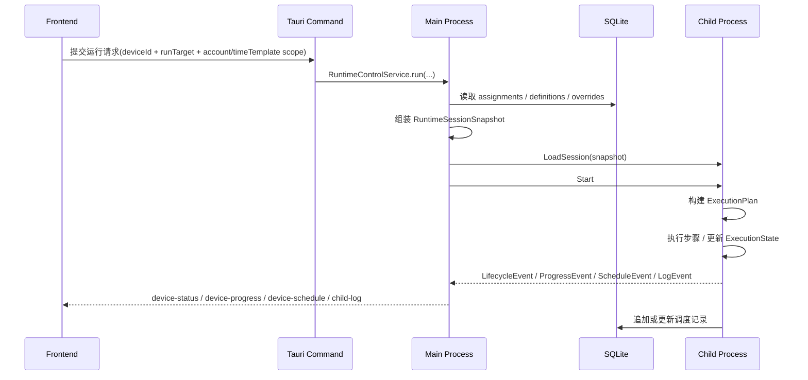
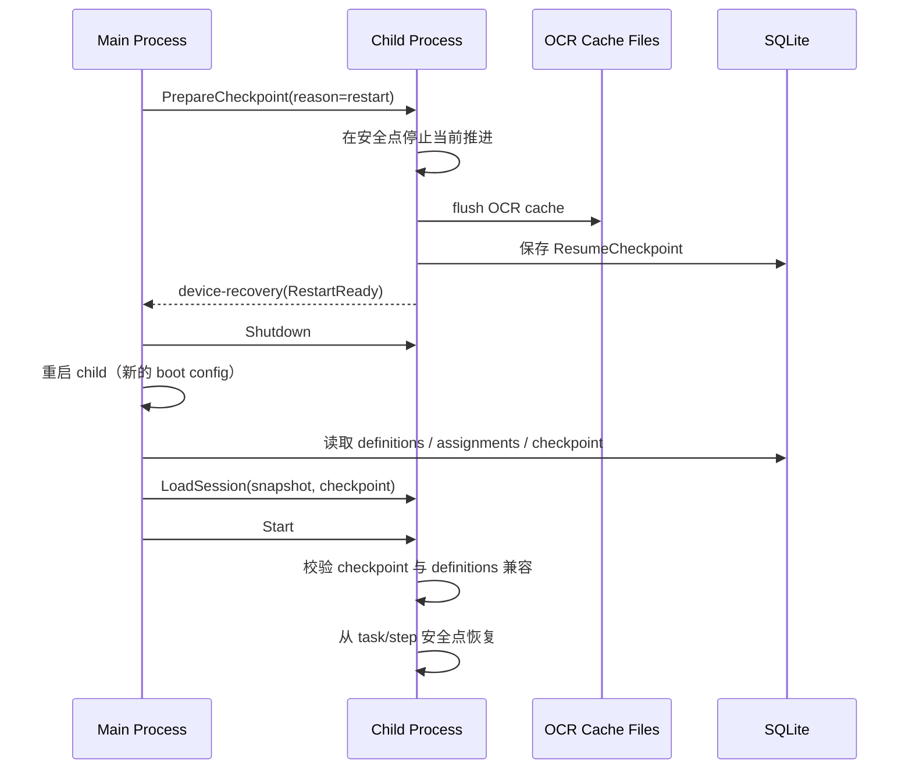

# 脚本执行流接口清单与重构里程碑

编写日期：2026-04-08

本文是 [脚本执行流架构分析与重构建议](D:\Database\Project\VisualStudioCode\AutoDaily\doc\脚本执行流架构分析与重构建议.md) 的落地版补充，目标是把“目标架构”拆成可执行接口和分阶段改造计划。

## 1. 文档目标

- 明确哪些现有接口可以保留。
- 明确哪些现有接口需要降级为兼容层或逐步废弃。
- 明确需要新增哪些 Tauri 命令、IPC 消息、前端 service/store、运行时快照结构。
- 给出分阶段实施顺序、影响文件范围和验收标准。

## 2. 标准执行序列

推荐统一成下面这条链路，任务页运行和编辑器调试运行都走同一条主线，只是 `RunTarget` 和模板值作用域不同。



---

## 3. 接口总览

### 3.1 现有接口处理策略

| 分类 | 当前接口 | 处理建议 | 说明 |
| --- | --- | --- | --- |
| 脚本定义保存 | `save_script_cmd` / `save_script_tasks_cmd` / policy 相关命令 | 保留 | 这些已经是定义层稳定接口；当前编辑器整体验证保存以 `save_script_cmd` 作为在线 session reload 收口点 |
| assignment 管理 | `get_assignments_by_device_cmd` / `save_assignment_cmd` / `delete_assignment_cmd` / `reorder_assignments_cmd` | 保留 | 仍作为持久编排态接口 |
| 时间模板管理 | `get_all_time_templates_cmd` / `save_time_template_cmd` / `delete_time_template_cmd` | 保留 | 不需要推翻 |
| 设备启动控制 | `cmd_spawn_device` / `cmd_device_start` / `cmd_device_pause` / `cmd_device_stop` / `cmd_device_shutdown` | 保留但改语义 | 以后由主进程先确保 session 已同步，再下发运行控制 |
| 队列增删 | `cmd_add_script_to_device` / `cmd_remove_script_from_device` | 直接替换 | 当前整条流程本来未闭环，不值得继续保留双轨 |
| 编辑器运行入口 | `cmd_run_script_target` + 前端入口已落地 | 继续扩展 | 当前 `FullScript / Task / Policy / PolicyGroup / PolicySet` 已进入统一调试主链 |
| 模板值 | `script_time_template_values` 已有命令与 session 装配 | 保留并扩维 | 已补到 `device_id + script_id + time_template_id + account_id` 维度，并会在保存后同步在线 session |
| 状态事件 | `device-status` / `device-progress` / `device-schedule` / `device-recovery` / `device-error` / `child-log` | 保留并扩展 | 当前结构化 runtime event 已落地，后续补执行器内部细节 |

### 3.2 当前最重要的接口差距

| 差距 | 当前状态 | 目标状态 |
| --- | --- | --- |
| 运行会话快照 | 不存在 | 主进程组装 `RuntimeSessionSnapshot`，child 只消费快照 |
| 模板值 CRUD | 已有 Tauri 命令 + service + mock | 继续补 UI 与更多联动，并保持设备/账号维度 |
| 队列同步 | 靠 `cmd_add/remove_script_to_device` 增量同步 | 改为 `cmd_sync_device_runtime_session` 全量同步 |
| 编辑器调试运行 | 按钮占位 | 正式 `cmd_run_script_target` |
| 生命周期/进度事件 | 仅日志与零散状态事件 | 结构化 runtime event 投影 |
| 调度记录写回 | 表已存在，但 child 未真正写入运行闭环 | 运行期统一 journal 写入 |
| 目标对象定义 | `ExecuteTarget` 与外层运行语义分裂 | 统一为 `RunTarget`，main/child 只保留一套概念 |

---

## 4. 目标接口清单

## 4.1 新增持久层查询与保存命令

这组接口最初用于解决“模板值层未接入”的问题；当前命令与主进程装配已落地，后续主要是补 UI 和更多联动场景。

### 推荐新增命令

| 命令 | 说明 | 前端调用方 |
| --- | --- | --- |
| `get_script_time_template_values_cmd(device_id, script_id, time_template_id, account_id)` | 查询某设备某脚本在某模板和某账号下的覆盖值 | 未来脚本设置页 / 运行装配 |
| `save_script_time_template_values_cmd(record)` | 保存模板覆盖值 | 未来脚本设置页 |
| `delete_script_time_template_values_cmd(device_id, script_id, time_template_id, account_id)` | 删除模板覆盖值 | 可选，但建议补齐 |

当前已落地补充：

- 模板值保存/删除后，在线设备会自动触发 session reload。
- 时间模板删除如果导致 assignment 级联删除，主进程也会同步受影响设备的 session。

### 推荐 DTO

```rust
pub struct ScriptTimeTemplateValuesDto {
    pub id: ScriptTemplateValueId,
    pub device_id: Option<DeviceId>,
    pub script_id: ScriptId,
    pub time_template_id: TemplateId,
    pub account_id: Option<AccountId>,
    pub values_json: Json<serde_json::Value>,
    pub created_at: String,
    pub updated_at: String,
}
```

推荐唯一键：

```sql
CREATE UNIQUE INDEX idx_script_time_template_values_scope
ON script_time_template_values (
  ifnull(device_id, ''),
  script_id,
  time_template_id,
  ifnull(account_id, '')
)
```

当前代码骨架里这样实现有两个原因：

- 要兼容旧库里只有 `script_id + time_template_id` 维度的历史记录
- 允许主进程装配 session 时做“设备内精确命中 -> 设备内账号通配 -> 历史全局回退”的查找顺序

因此当前实现语义是：

- 新写入记录应带真实 `device_id`
- `account_id` 可为空
- 迁移出来的历史记录允许 `device_id/account_id` 为空，作为 legacy fallback

### `values_json` 推荐形态

```json
{
  "variables": {
    "var_pkg_name": "官服",
    "var_sweep_count": 5
  },
  "taskSettings": {
    "task_sign_in": {
      "enabled": true,
      "taskCycle": "daily"
    }
  }
}
```

---

## 4.2 新增运行控制命令

这组接口解决“任务页正式运行”和“编辑器调试运行”需要统一进入同一条执行链路的问题。

### 推荐新增命令

| 命令 | 说明 | 是否前端直接调用 |
| --- | --- | --- |
| `cmd_sync_device_runtime_session(device_id)` | 重新装配并推送当前设备的完整运行会话 | 是 |
| `cmd_run_script_target(device_id, script_id, target)` | 编辑器调试运行指定脚本目标 | 是 |
| `cmd_get_device_runtime_projection(device_id)` | 查询当前设备的主进程投影视图 | 建议增加 |

### 与现有命令的配合

- `cmd_spawn_device`
  - 启动 child 后应立即触发一次 `cmd_sync_device_runtime_session` 的内部逻辑。
- `cmd_device_start`
  - 从“直接开始跑当前 child queue”调整为“确保 session 最新后开始运行”。
- 当前版本补充约束：
  - 前端任务页/编辑器会先拒绝 `desktop` 设备进入运行入口。
  - 后端 `cmd_spawn_device / cmd_device_start / cmd_run_script_target / cmd_sync_device_runtime_session` 继续保留最终兜底校验。
- `save_assignment_cmd` / `delete_assignment_cmd` / `reorder_assignments_cmd`
  - 如果设备在线，统一调用 `cmd_sync_device_runtime_session(device_id)`。
  - 不再保留 add/remove 单条队列命令。

### 推荐 `RunTarget`

```rust
pub enum RunTarget {
    DeviceQueue,
    FullScript { script_id: ScriptId },
    Task { script_id: ScriptId, task_id: TaskId },
    PolicyGroup { script_id: ScriptId, policy_group_id: PolicyGroupId },
    PolicySet { script_id: ScriptId, policy_set_id: PolicySetId },
}
```

说明：

- `RunTarget` 直接替换 `ExecuteTarget`。
- main / child / 前端 / IPC 统一只保留一套目标对象语义，避免后续转换层继续制造分叉。

---

## 4.3 新增主进程内部装配接口

这组接口不一定直接暴露给前端，但必须明确职责边界。

### 推荐核心结构

```rust
pub type SessionId = UuidV7;

pub struct RuntimeSessionSnapshot {
    pub session_id: SessionId,
    pub device_id: DeviceId,
    pub run_target: RunTarget,
    pub runtime_policy: RuntimeExecutionPolicy,
    pub queue: Vec<RuntimeQueueItem>,
    pub script_bundles: Vec<ScriptBundleSnapshot>,
    pub issued_at: String,
}

pub struct RuntimeExecutionPolicy {
    pub ocr_text_cache: VisionTextCacheRuntimeConfig,
    pub action_wait_ms: u64,
    pub progress_timeout_enabled: bool,
    pub progress_timeout_ms: u64,
    pub timeout_action: TimeoutAction,
    pub timeout_notify_channels: Vec<TimeoutNotifyChannel>,
}

pub struct RuntimeQueueItem {
    pub assignment_id: ScheduleId,
    pub script_id: ScriptId,
    pub time_template_id: Option<TemplateId>,
    pub account_id: Option<AccountId>,
    pub account_data_json: Option<String>,
    pub order_index: u32,
    pub template_values_json: Option<String>,
}

pub struct ScriptBundleSnapshot {
    pub script_id: ScriptId,
    pub script_json: String,
    pub tasks_json: String,
    pub policies_json: String,
    pub policy_groups_json: String,
    pub policy_sets_json: String,
    pub group_policies_json: String,
    pub set_groups_json: String,
}
```

这里需要明确区分“共享合同已落地”和“运行时执行器尚未接入”的边界：

- 当前代码里，`RuntimeExecutionPolicy` 已切到：
  - `progress_timeout_enabled`
  - `progress_timeout_ms`
  - `timeout_action`
  - `timeout_notify_channels`
- 当前代码里的 `TimeoutAction` 已替换为：
  - `NotifyOnly`
  - `PauseExecution`
  - `StopExecution`
  - `RestartApp`
  - `RunRecoveryTask`
  - `SkipCurrentTask`
- 当前代码里的通知渠道也已切为多选：
  - `SystemNotification`
  - `Email`
- 仍然留在后续阶段的是：
  - child 执行循环中的 timeout detector
  - timeout action 的真正运行时生效

这里要明确区分两层语义：

- 上面这组是当前已落地的“IPC / session 传输 DTO”
- 不是 child 内部最终执行态

也就是说：

- 文档原先把 `ScriptBundleSnapshot` 写成强类型聚合对象，那个更接近“概念模型”
- 当前代码里它被落成 JSON string 分片，是“传输快照”

这么做的原因是：

- `runtime_common` 负责 IPC 合同，不适合直接依赖一整套 `runtime_engine::domain::*` 表结构类型
- 如果把 `ScriptTable / ScriptTaskTable / PolicyTable ...` 全部抬进共享合同层，会把领域模型和 IPC 层重新耦死
- 先按 JSON 分片传输，可以保证主进程一次装配、child 按需反序列化，避免 child 再回旧数据库链路

所以当前实际分层应理解为：

- `ScriptBundleSnapshot`
  - session 传输层快照
- `ChildRuntimeSession`
  - child 持有的会话事实源
- `ExecutionPlanAssembler`
  - 后续把 bundle 解析成真正可执行 plan 的层

后续如果你要进一步收紧类型安全，正确方向不是把领域表结构直接塞进 `runtime_common`，而是：

- 在 `runtime_common` 定义专用 transport DTO
- 由主进程把领域对象映射为 transport DTO
- child 只消费 transport DTO / execution plan

这里的 `ocr_text_cache` 应直接沿用当前已经存在的运行时配置结构，不要重新发明一套字段：

```rust
pub struct VisionTextCacheRuntimeConfig {
    pub enabled: bool,
    pub dir: Option<PathBuf>,
    pub signature_grid_size: u16,
}
```

当前仓库已落地的真实含义：

- `enabled`
  - 是否启用 OCR 文字缓存
- `dir`
  - 缓存目录
  - 当设置页留空时，主进程会回退到应用数据目录下的默认 OCR 缓存目录
- `signature_grid_size`
  - 视觉签名网格大小
  - 用于稳定坐标离散化、布局排序、相对位置判断、动作签名与重复性判定

这一点很重要：

- OCR 缓存配置不是单纯“存文件位置”
- `signature_grid_size` 已经参与后端 `VisionSnapshot` 的签名离散化和稳定布局计算
- 后续如果做重复页面识别、动作去重、策略执行证据比对，都要继续依赖这个配置

`RuntimeExecutionPolicy` 的建议归属：

- 放进 `RuntimeSessionSnapshot`
  - `ocr_text_cache`
  - `action_wait_ms`
  - `progress_timeout_enabled`
  - `progress_timeout_ms`
  - `timeout_action`
  - `timeout_notify_channels`
- 不放进热重载 session，而由主进程先判断是否需要重启 child
  - `cpu_cores`
  - ORT / 推理线程绑定

原因：

- 前一组影响“本次会话如何执行”，适合随 session 一起下发。
- 后一组影响“进程如何启动和绑核”，不能安全热更新，必须重启 child。

### 超时与恢复策略的最新决议

这里的超时，不再定义为“单个 step 执行超时”，而定义为：

- 本次执行长时间没有“有效进展”

推荐的有效进展信号：

- 页面指纹发生有效变化
- 操作指纹发生变化
- OCR 关键文本发生变化
- `current_task / current_step` 游标推进
- 其他能证明“执行仍在向前走”的运行时证据

这样才能覆盖：

- 下载更新
  - 页面可能长时间停留在同一任务里，但文本或指纹仍在变化
- 战斗场景
  - 不一定持续产生新 action，但页面内容仍在推进

### 推荐目标合同

```rust
pub struct RuntimeExecutionPolicy {
    pub ocr_text_cache: VisionTextCacheRuntimeConfig,
    pub action_wait_ms: u64,
    pub progress_timeout_enabled: bool,
    pub progress_timeout_ms: u64,
    pub timeout_action: TimeoutAction,
    pub timeout_notify_channels: Vec<TimeoutNotifyChannel>,
}

pub enum TimeoutAction {
    NotifyOnly,
    PauseExecution,
    StopExecution,
    RestartApp,
    RunRecoveryTask,
    SkipCurrentTask,
}

pub enum TimeoutNotifyChannel {
    SystemNotification,
    Email,
}
```

说明：

- `timeout_action` 是单选行为。
- `timeout_notify_channels` 是多选通知渠道。
- 因此应允许同时：
  - 系统通知
  - 邮件通知
- Windows 下的 `SystemNotification`，就是右下角通知中心消息提醒。

### 配置归属

- 设备级执行策略
  - `progress_timeout_enabled`
  - `progress_timeout_ms`
  - `timeout_action`
  - `timeout_notify_channels`
  - `action_wait_ms`
- 脚本级恢复入口
  - `recovery_task_id: Option<TaskId>`

这里要特别避免混淆：

- `timeout_action` 不是每个脚本单独配置
- `timeout_action` 是设备运行策略的一部分，作用于这台设备当前会话
- `recovery_task_id` 才是脚本元数据的一部分

### `RunRecoveryTask` 的约束

- 恢复任务本身仍然就是普通 `Task`
- 不要求所有脚本都必须配置 `recovery_task_id`
- 只有当 `timeout_action == RunRecoveryTask` 时，当前运行脚本才必须提供恢复任务

建议校验规则：

- `FullScript / Task`
  - 当前脚本没有 `recovery_task_id` 时，不允许以 `RunRecoveryTask` 策略启动
- `DeviceQueue`
  - 队列里只要存在脚本未配置 `recovery_task_id`，就不允许以 `RunRecoveryTask` 策略启动

建议行为：

- 启动前校验并报错，或在 UI 上禁用该选项
- 不做静默降级

### 超时检测与动作生效位置

超时检测并不是“脱离 step 执行流程的独立后台逻辑”，也不是前端参与判断。

更准确的落点是：

- 检测逻辑属于 child/runtime
- 生效位置挂在执行循环里
- 主要挂点包括：
  - action 执行前后
  - action 后等待阶段
  - 观察刷新阶段
  - 长轮询 / 等待页面变化阶段

这意味着：

- 它和 step 执行并不分家
- 但它也不是“每个 step 自己单独定义一套 timeout 规则”

推荐理解为：

- step / action 执行负责产生活动与观察信号
- runtime timeout detector 统一消费这些信号，判断是否进入“长时间无有效进展”
- 一旦确认超时，再由统一的 `timeout_action` 执行行为

因此下一阶段真正落代码时，应接在：

- `scheduler`
- `executor`
- `action_wait`
- `observation refresh`

而不是放到：

- 前端
- 单个 step 表单配置
- 脚本定义层 DSL 本身

当前状态补充：

- 共享合同、设备级配置入口、脚本级恢复任务入口、主进程启动前校验已经落地。
- 你确认延后的部分，是 child 执行循环里的：
  - timeout detector
  - timeout action 执行
  - 运行中通知去重与静默恢复
- 原因是当前执行器旧代码已有较多注释和未更新逻辑，这部分应在执行器重整后再接。

### `recovery_task_id` 的挂载位置与 UI 入口

推荐把恢复任务配置放到脚本元数据里，例如：

```ts
scriptInfo.data.runtimeSettings.recoveryTaskId?: string | null
```

配置入口建议：

- 组件层面
  - 继续复用现有 [ScriptInfoDialog](D:\Database\Project\VisualStudioCode\AutoDaily\src\views\script-list\ScriptInfoDialog.vue)
- 页面入口
  - [ScriptEditor.vue](D:\Database\Project\VisualStudioCode\AutoDaily\src\views\ScriptEditor.vue) 和 [ScriptList.vue](D:\Database\Project\VisualStudioCode\AutoDaily\src\views\ScriptList.vue) 当前都在打开同一个 `ScriptInfoDialog`
  - 下一阶段只是在这个共享弹窗里新增“运行 / 恢复”配置页签

优先从编辑器上下文配置更合理，因为：

- 当前脚本的 task 列表在编辑器里已经完整加载
- 用户可以直接从“本脚本已有普通 Task”里选择一个作为恢复任务
- 不需要额外构造跨页任务选择上下文

说明：

- 当前 OCR 缓存配置来源已经在主进程里实现：
  - 从设置 store 读取
  - 转成 `VisionTextCacheRuntimeConfig`
  - 随 child 初始化数据下发
- 重构时不应把这块能力写回“待设计”，而应迁移为 session/runtime policy 的正式组成部分。
- M0 代码骨架里，`device_config` 继续沿用 child 启动时的 `ChildProcessInitData.device_config`。
- 因此当前 `RuntimeSessionSnapshot` 先不重复携带 `device_config`，避免 boot config 和 session baseline 维护两份事实源。

### 推荐主进程服务

| 服务 | 职责 |
| --- | --- |
| `RuntimeSessionAssembler` | 从 DB 装配 `RuntimeSessionSnapshot` |
| `RuntimeControlService` | 协调设备启动、session 同步、运行控制 |
| `RuntimeProjectionService` | 维护主进程侧投影态，供前端读和事件推送 |

### 建议新增文件

| 建议文件 | 说明 |
| --- | --- |
| `src-tauri/crates/runtime_engine/src/app/runtime_session_service.rs` | session 装配服务 |
| `src-tauri/crates/runtime_engine/src/app/runtime_control_service.rs` | 运行控制服务 |
| `src-tauri/crates/runtime_engine/src/app/runtime_projection_service.rs` | 前端投影视图 |

### child 收到 `RuntimeSessionSnapshot` 后如何处理

这里不要把 `RuntimeSessionSnapshot` 理解成“全部上下文序列化”，否则会把会话基线和瞬时执行态混在一起。

推荐 child 内部分成两层：

```rust
pub struct ChildRuntimeSession {
    pub session_id: SessionId,
    pub snapshot: RuntimeSessionSnapshot,
}

pub struct EphemeralExecutionState {
    pub current_assignment_id: Option<ScheduleId>,
    pub current_script_id: Option<ScriptId>,
    pub current_task_id: Option<TaskId>,
    pub current_step_id: Option<StepId>,
    pub scope: rhai::Scope<'static>,
    pub task_states: HashMap<TaskId, TaskState>,
    pub policy_states: HashMap<PolicyId, PolicyState>,
    pub last_snapshot: Option<VisionSnapshot>,
    pub last_hits: Vec<SearchHit>,
}
```

处理原则：

- `LoadSession`
  - 用于 child 刚启动或明确清空后重新加载。
  - 替换 `ChildRuntimeSession`。
  - 重置 `EphemeralExecutionState`。
- `ReloadSession`
  - 用于 assignment、模板值、运行策略变更后的热更新。
  - 默认替换 `ChildRuntimeSession`。
  - 是否保留 `EphemeralExecutionState`，由兼容性检查决定。

推荐兼容性检查：

- 如果当前正在执行的 `assignment/script/task` 仍存在，且其定义结构没有发生破坏性变化：
  - 可保留当前 `scope`、`task_states`、`policy_states`
  - 执行完当前步骤后切换到新 session
- 如果目标脚本、任务结构、模板值作用域已改变：
  - 取消当前执行
  - 重建 `EphemeralExecutionState`

重要说明：

- 真正需要跨重启保留的不是 `EphemeralExecutionState` 全量内存，而是“可恢复的检查点”。
- OCR 文字缓存本身已经是可落盘的，不应依赖 session reload 才能保留。
- 第一阶段只做“安全点恢复”，不做“精确恢复”。
- 安全点恢复建议限定在：
  - `task` 起点恢复
  - `step` 起点恢复
  - `next step` 恢复
- 不尝试恢复：
  - 任意中间表达式求值现场
  - 临时 Rhai 运行栈
  - 任意步骤执行到一半的外设交互现场
- 因此最小恢复信息应写进 `ScheduleJournal / Checkpoint`，而不是要求 `RuntimeSessionSnapshot` 携带全部运行态。

### 推荐最小恢复信息

```rust
pub struct ResumeCheckpoint {
    pub execution_id: ExecutionId,
    pub source_session_id: SessionId,
    pub device_id: DeviceId,
    pub run_target: RunTarget,

    pub assignment_id: Option<ScheduleId>,
    pub script_id: ScriptId,
    pub time_template_id: Option<TemplateId>,
    pub account_id: Option<AccountId>,

    pub task_id: Option<TaskId>,
    pub step_id: Option<StepId>,
    pub resume_mode: ResumeMode, // FromTaskStart | FromStepStart | FromNextStep

    pub definition_fingerprint: String,
    pub updated_at: String,
}
```

说明：

- `current_assignment_id/current_script_id/current_task_id/current_step_id` 是恢复锚点核心。
- 但为了安全恢复，仍建议补：
  - `execution_id`
  - `run_target`
  - `time_template_id`
  - `account_id`
  - `definition_fingerprint`
- `session_id` 只代表生成该 checkpoint 时的 session，不应充当跨重启的唯一恢复主键。

### 推荐重启恢复时序



时序说明：

- 应由主进程发起重启流程，不建议由 child 自行要求主进程“立刻杀掉我”。
- child 的职责是：
  - 尽快到达安全点
  - 将 OCR 文字缓存写回配置目录下的缓存文件
  - 写 checkpoint
  - 发 `device-recovery(RestartReady)`
- 主进程的职责是：
  - 等 child checkpoint 完成
  - 再关闭并重启 child
  - 重新装配 `RuntimeSessionSnapshot + ResumeCheckpoint`

这里要特别区分两类持久化：

- OCR 文字缓存：
  - 写入设置页指定的缓存目录
  - 目录为空时回退到应用默认缓存目录
  - 当前实现是 JSON 文件，不是 SQLite
- ResumeCheckpoint / 调度记录：
  - 写入 SQLite

### 删除执行记录时的处理

执行记录与 checkpoint 默认应级联删除。

建议约束：

- 一个 `execution_id` 对应：
  - 一组 `device_script_schedules`
  - 一个 `ResumeCheckpoint`
- 删除某次执行记录时，应同步删除该 `execution_id` 对应的 checkpoint。
- `clear_schedules(device_id)` 这类“清空执行记录”操作，也应同步清空该设备下所有 checkpoint。

原因：

- 否则会出现“历史记录被删了，但 child 还能从幽灵 checkpoint 恢复”的脏状态。
- 第一阶段既然不做高级恢复管理，就不应该保留脱离执行记录的 checkpoint。

---

## 4.4 IPC 合同调整

当前 IPC `MessagePayload` 已经收口到 `ProcessControl / SessionControl / RuntimeEvent / ConfigUpdate / Logger / Heartbeat / Error`。旧的 `ScriptTaskAction + ExecuteTarget` 路径已删除，不再作为兼容层保留。

### 推荐新增消息

```rust
pub enum MessagePayload {
    ProcessControl(ProcessControlMessage),
    SessionControl(SessionControlMessage),
    RuntimeEvent(RuntimeEventMessage),
    ConfigUpdate(ConfigUpdateMessage),
    Logger(LogMessage),
    Heartbeat(HeartbeatMessage),
    Error(ErrorMessage),
}

pub enum SessionControlMessage {
    LoadSession { session: RuntimeSessionSnapshot, checkpoint: Option<ResumeCheckpoint> },
    ReloadSession { session: RuntimeSessionSnapshot, checkpoint: Option<ResumeCheckpoint> },
    PrepareCheckpoint { reason: SessionCheckpointReason },
    ClearSession,
}

pub enum RuntimeEventMessage {
    Lifecycle(RuntimeLifecycleEvent),
    Progress(RuntimeProgressEvent),
    Schedule(RuntimeScheduleEvent),
    Recovery(RuntimeRecoveryEvent),
}
```

### 消息处理建议

| 方向 | 推荐动作 |
| --- | --- |
| main -> child | 以 `SessionControl` 管理会话，以 `ProcessControl` 管理运行开关 |
| child -> main | 以 `RuntimeEvent` 上报结构化执行进展与恢复相位 |
| 日志 | 保持 `Logger` 独立，不与业务事件混用 |
| 配置更新 | `ConfigUpdate` 只保留真正的 live config，例如日志级别、ADB 地址等 |

额外建议：

- 如果主进程准备因 `ChildBootConfig` 变化而重启 child，应先发 `PrepareCheckpoint`。
- child 返回 `RestartReady` 后，主进程再发送 `Shutdown` 或直接 stop child。
- 当前代码已先落一版保守实现：
  - 在线设备保存配置时，如果只改了 `execution_policy`，主进程会直接 `sync session`
  - 如果改了 `cores`，主进程会走统一的 `cmd_restart_device_runtime`，先发 `PrepareCheckpoint`、等待 checkpoint 刷新，再重启 child 并重新装填 session
  - `delete_device` 时也会先停掉在线 child，避免留下悬空进程

### 配置分层建议

| 配置类型 | 建议通道 | 是否需要重启 child |
| --- | --- | --- |
| CPU 核心绑定 / ORT 绑核 | `ChildBootConfig`，由主进程比较后决定重启 | 是 |
| OCR 缓存配置 | `RuntimeSessionSnapshot.runtime_policy` | 否 |
| 执行动作后等待时间 | `RuntimeSessionSnapshot.runtime_policy` | 否 |
| 无有效进展超时开关与超时时间 | `RuntimeSessionSnapshot.runtime_policy` | 否 |
| 超时后的行为（仅通知 / 暂停 / 停止 / 重启应用 / 恢复任务 / 跳过当前任务） | `RuntimeSessionSnapshot.runtime_policy` | 否 |
| 超时通知渠道（系统通知 / 邮件，可多选） | `RuntimeSessionSnapshot.runtime_policy` | 否 |
| 日志级别 | `ConfigUpdate` | 否 |
| ADB 路径 / ADB server 地址 | `ConfigUpdate` | 否 |

补充说明：

- OCR 缓存目录不是固定写死路径，应该继续尊重设置页里的目录配置和“留空则使用默认目录”的现有行为。
- `signature_grid_size` 不是纯视觉参数，而是缓存命中、稳定排序和重复性判定参数，因此必须与 `ocr_text_cache` 一起传递。
- 超时判定逻辑不放前端，也不放单个 step UI 配置里。
- 超时检测由 child/runtime 统一负责。
- 设备级策略决定超时后做什么。
- 脚本级 `recovery_task_id` 只为 `RunRecoveryTask` 提供落点，不替代设备级 `timeout_action`。

---

## 4.5 前端 service / store 清单

### 推荐新增前端 service

| 文件 | 职责 |
| --- | --- |
| `src/services/runtimeService.ts` | 统一封装 session 同步、目标运行、投影视图查询 |
| `src/services/scriptTemplateValueService.ts` | 模板值查询与保存 |

### 推荐新增或调整 store

| 文件 | 职责 |
| --- | --- |
| `src/store/runtime.ts` | 维护设备运行投影、当前进度、当前 assignment / script / task |
| `src/store/task.ts` | assignment 变更后调用 `runtimeService.syncDeviceSession` |
| `src/store/device.ts` | 继续管设备进程生命周期，不再猜测业务进度 |
| `src/store/logs.ts` | 保持只处理日志流 |

前端无需做视觉重画，只需补恢复相关状态展示：

- 当前设备是否存在可恢复 checkpoint
- 正在准备重启 checkpoint
- 已按 task/step 安全点恢复
- 因定义不兼容而放弃恢复

### 推荐新增事件

| 事件名 | 载荷 | 用途 |
| --- | --- | --- |
| `device-status` | `RuntimeLifecycleEvent` | 生命周期态 |
| `device-progress` | `RuntimeProgressEvent` | 当前脚本/任务/步骤进度 |
| `device-schedule` | `RuntimeScheduleEvent` | 调度记录变更 |
| `device-recovery` | `RuntimeRecoveryEvent` | 当前已落地的恢复事件，承载 checkpoint preparing / ready / restartReady / loaded |
| `device-error` | `{ deviceId, code, message, details }` | 当前已落地的设备错误事件 |
| `child-log` | `DeviceLogEntry` | 日志流 |

### 建议 `RuntimeProgressEvent` 形态

```ts
interface RuntimeProgressEvent {
  deviceId: string;
  sessionId: string;
  assignmentId?: string | null;
  scriptId?: string | null;
  taskId?: string | null;
  stepId?: string | null;
  phase: 'idle' | 'loading' | 'planning' | 'executing' | 'paused' | 'completed' | 'failed';
  message?: string | null;
  at: string;
}
```

---

## 4.6 child 侧运行时接口清单

### 推荐拆分

| 模块 | 当前问题 | 目标职责 |
| --- | --- | --- |
| `ScriptScheduler` | 既管 queue，又管脚本加载，又负责调用执行器 | 简化为“选择下一个运行项 + 触发执行” |
| `RuntimeContext` | 变量、任务状态、策略状态、快照、OCR cache 全堆在一起 | 拆成 `ExecutionState + ObservationContext + DeviceExecutionContext` |
| `ScriptExecutor` | 只有步骤骨架，没有正式 plan 输入 | 消费 `ExecutionPlan` 执行 |

### 推荐新增 child 模块

| 建议文件 | 说明 |
| --- | --- |
| `src-tauri/crates/child_support/src/infrastructure/session/runtime_session.rs` | 当前已落地的 child 会话快照与 bundle 索引 |
| `src-tauri/crates/child_support/src/infrastructure/scripts/execution_plan.rs` | 把 tasks/policies 组装成 plan |
| `src-tauri/crates/child_support/src/infrastructure/scripts/schedule_journal.rs` | 运行记录写回 |
| `src-tauri/crates/child_support/src/infrastructure/ipc/runtime_reporter.rs` | 当前已落地的结构化事件上报 |

### 推荐 child 最小会话结构

```rust
pub struct ChildRuntimeSession {
    pub session_id: SessionId,
    pub queue: VecDeque<RuntimeQueueItem>,
    pub bundles: HashMap<ScriptId, ScriptBundleSnapshot>,
}
```

---

## 4.7 mock 与测试清单

这部分不能漏，否则前端浏览器 mock 会马上和真实接口脱节。

### 需要同步更新

| 文件 | 需要补的内容 |
| --- | --- |
| `src/mockTauri.ts` | 新增模板值命令、runtime 命令、runtime projection 返回 |
| `tests/script-editor.spec.ts` | 调试运行按钮、保存后运行入口 |
| `tests/script-create.spec.ts` | 如涉及模板值或 assignment 变更联动，也要补 |

### 最小测试覆盖

| 场景 | 验收点 |
| --- | --- |
| 在线设备新增 assignment | 不再走 add/remove 单条队列命令，而是同步整份 session |
| child 重启后恢复 | 自动从 assignment + definitions 重建运行会话 |
| 安全点恢复 | 仅支持 task/step 边界恢复，不尝试精确恢复任意中间态 |
| 编辑器运行目标选择 | `Task / Policy / PolicyGroup / PolicySet` 已进入统一运行接口，并能看到 child 调试日志 |
| 模板值读取 | 运行前能按 device/script/template/account 装载到 session snapshot |
| CPU 核心变更 | 主进程识别后重启 child，而不是热更新绑核 |
| 清空执行记录 | 关联的 checkpoint 一并删除 |

---

## 5. 建议里程碑

## M0：合同冻结与骨架建立

### 目标

- 先把命名、消息结构、DTO 定下来。
- 暂不追求闭环执行。

### 交付物

- `RuntimeSessionSnapshot`
- `RunTarget`
- `SessionId`
- `RuntimeLifecycleEvent`
- `RuntimeProgressEvent`
- `RuntimeScheduleEvent`
- `ResumeCheckpoint`
- 移除 `ExecuteTarget` / `ScriptTaskAction`
- 新命令签名与前端 service 空壳

### 影响文件

- `src-tauri/crates/runtime_common/src/ipc/message.rs`
- `src-tauri/src/api/*`
- `src/services/*`
- `src/types/app/domain.ts`
- `src/mockTauri.ts`

### 当前已落地

- `RuntimeExecutionPolicy` 已切到：
  - `progress_timeout_enabled`
  - `progress_timeout_ms`
  - `timeout_action`
  - `timeout_notify_channels`
- `TimeoutAction` 已替换为：
  - `NotifyOnly`
  - `PauseExecution`
  - `StopExecution`
  - `RestartApp`
  - `RunRecoveryTask`
  - `SkipCurrentTask`
- 设备配置已新增 `execution_policy`。
- 脚本元数据已新增 `runtime_settings.recovery_task_id`。
- 前端已新增：
  - 设备编辑器里的“执行策略”入口
  - 共享 `ScriptInfoDialog` 里的“运行恢复”页签
- `cmd_device_start / cmd_sync_device_runtime_session / cmd_run_script_target` 已会在 `RunRecoveryTask` 策略下做启动前校验。
- `cmd_device_start / cmd_sync_device_runtime_session / cmd_run_script_target / cmd_restart_device_runtime` 在 `RestartApp` 策略下，也会校验脚本是否已配置全局 `pkg_name + activity_name`。
- 前端已补最小前置校验：
  - 编辑器运行前会先检查当前设备策略与脚本恢复任务是否匹配
  - 任务页启动设备队列前会先检查 assignment 对应脚本是否缺少恢复任务
- browser mock 已同步 `RunRecoveryTask / RestartApp` 启动前校验，避免本地 mock 与真实后端行为漂移。

说明：

- 这一阶段当前已经覆盖到“合同 + 配置入口 + 主进程校验”。
- child 侧 `RestartApp` 已接入真实 `stop_app -> start_activity`，但不会自动登录或切到恢复任务。
- child 侧 `SkipCurrentTask` 已收口到调度层：
  - 当前任务一旦在执行过程中被标记为 skip，`scheduler` 会写 `RuntimeScheduleStatus::Skipped`
  - 对应的 `device_script_schedules` 也会写 `RunStatus::Skipped`
- child 侧 timeout detector 已额外纳入 `current_task / current_step` 游标：
  - 同页、同动作但已推进到其他 step 时，会重置超时链而不是继续累计
- child 侧 timeout detector 已按“无进展链”累计时间：
  - 同一条 `page + action + task + step` 链会累计停滞时长
  - `NotifyOnly` 这类不打断执行的分支，也不会在同一条链上无限重复通知
- 尚未完全接完的是 child 执行循环里的其余 timeout detector、行为深化与恢复编排。

### 验收标准

- 前后端都能编译通过。
- mock 环境不报未处理命令。
- 代码中不再保留 `ExecuteTarget` / `ScriptTaskAction` 的调用路径。
- 断点恢复合同限定为安全点恢复，不实现精确恢复。

---

## M1：模板值层接通

### 目标

- 把 `script_time_template_values` 从“只有表”变成“可查询、可保存、可被装配”，并扩展到设备/账号维度。

### 交付物

- 模板值 CRUD 命令
- TS service
- 基本 store / 查询逻辑
- `RuntimeSessionAssembler` 能把模板值带进 queue item

### 影响文件

- `src-tauri/src/api/domain/schedule.rs` 或新增独立 `template_values.rs`
- `src-tauri/crates/runtime_engine/src/domain/schedule/script_time_template_values.rs`
- `src/services/scriptTemplateValueService.ts`
- `src/mockTauri.ts`

### 验收标准

- 可按 `device_id + script_id + time_template_id + account_id` 取到值。
- 装配出的 queue item 中能看到模板覆盖值。

### 当前已落地补充

- 模板值作用域已扩展到 `device_id + script_id + time_template_id + account_id`，并保留 legacy fallback。
- 主进程装配 queue item 时，已经会把模板覆盖值写进 `RuntimeQueueItem.template_values_json`。
- 模板值保存/删除会自动同步对应在线设备的 session。
- 删除时间模板如果触发 assignment 级联删除，也会同步受影响在线设备的 queue session。

---

## M2：主进程 session 装配与同步

### 目标

- 把 assignment、definitions、template overrides 统一装配成 session。
- 在线设备的 assignment 变化统一改为“整份 session 同步”。

### 交付物

- `cmd_sync_device_runtime_session`
- `RuntimeSessionAssembler`
- `RuntimeControlService`
- `taskStore.createAssignment/removeAssignment` 改为调用 session sync

### 影响文件

- `src-tauri/src/api/infrastructure/process_api.rs`
- `src-tauri/crates/runtime_engine/src/app/*`
- `src/store/task.ts`
- `src/services/runtimeService.ts`

### 验收标准

- 在线设备新增、删除、重排 assignment 后，child queue 被完整替换。
- 不再存在 `cmd_add_script_to_device` / `cmd_remove_script_from_device` 这类增量队列接口依赖。

### 当前已落地补充

- 主进程装配 session 时，已经会把设备级 `execution_policy` 映射成 `RuntimeExecutionPolicy`。
- `RunRecoveryTask` 已在 session 下发前校验：
  - `Task / FullScript` 校验当前脚本
  - `DeviceQueue` 校验整队脚本
- 目前这层只做“能不能启动”的静态校验，不进入 child 执行循环。
- `save_script_cmd` 现在会在最终定义保存后，自动同步所有引用该脚本的在线设备 session。
- `delete_script_cmd` 现在会在脚本级联删除 assignment 后，自动 reload 受影响在线设备的队列 session。
- 这样可以避免把编辑器的并行保存拆成多次 definition-level reload；真正的收口点仍放在 `save_script_cmd`。
- `GetState(step)` 已不再作为独立步骤模板保留，状态匹配统一收敛到 `ConditionNode::TaskStatus`。
- 当前收口方向是定义层清理旧数据，而不是再为“步骤状态输出”保留额外兼容语义。
- 设备定义已新增 `platform`，脚本元数据已新增 `platform`，当前默认都是 `android`。
- 任务页脚本分配会先按平台过滤；后端 `save_assignment_cmd` 也会拒绝平台不匹配的 assignment。
- 这一步当前只完成“建模 + 分配约束”；桌面端执行适配器仍未接入。
- 当前版本的运行控制入口也会显式拒绝 `desktop` 设备：
  - `cmd_spawn_device`
  - `cmd_device_start`
  - `cmd_sync_device_runtime_session`
  - `cmd_run_script_target`
  - `cmd_restart_device_runtime`
- 这样可以保证当前版本的边界清晰：
  - 可以先做平台建模、脚本归类、分配约束
  - 但不会把 desktop 设备放进一个“看起来能运行、实际只会在 child 内部失败”的半状态

---

## M3：child 会话加载与状态上报

### 目标

- child 具备加载 session、替换 queue、上报生命周期和进度事件的能力。

### 交付物

- `SessionControl` 消息处理
- `ChildRuntimeSession`
- `ResumeCheckpoint`
- `runtime_reporter`
- 主进程 event projector

### 当前已落地

- child 已持有 `ChildRuntimeSession`，内部保存 `RuntimeSessionSnapshot + checkpoint + script bundle index`。
- child 入站消息已改为顺序处理，避免 `LoadSession` 与紧随其后的 `Start` 发生竞态。
- `scheduler.execute_script()` 已开始从 session bundle 读取 definitions，不再回退到旧的数据库直读路径。
- 已开始向前端稳定投递 `device-status / device-progress / device-schedule / device-recovery`，前端 `runtime` store 已接收 `progress/schedule/recovery`，并会拉取设备级 checkpoint 投影。
- `PrepareCheckpoint` 已能写入最小 `ResumeCheckpoint`，并在保存前写回 OCR 文字缓存文件。
- 主进程下发 `LoadSession / ReloadSession` 时，已会装填当前设备上与 `RunTarget` 兼容的 checkpoint。
- `clear_schedules(device_id)` / `clear_schedules_by_script(script_id)` 已同步删除对应 checkpoint，避免幽灵恢复。
- `PrepareCheckpoint` 成功后，child 已会显式投递 `device-recovery(RestartReady)`。
- 主进程已新增统一的 `cmd_restart_device_runtime`，在线设备保存配置时，`cores` 变更会复用这条命令执行“优先等待 `device-recovery(RestartReady)` -> 重启 child -> reload session”，`execution_policy` 变更会触发 session 热更新。
- 当前主进程已经优先基于 `RestartReady` 事件等待，数据库里的 checkpoint 更新时间轮询只保留为兜底。
- child 已开始真正消费 `ResumeCheckpoint`：
  - `DeviceQueue / FullScript / Task` 会按 checkpoint 裁剪待执行任务，并支持 `FromTaskStart / FromStepStart / FromNextStep`
  - 定义指纹或运行目标不兼容时会明确降级，不做伪恢复
  - 恢复成功后会清理旧 checkpoint，避免重复恢复
- 仍未完成的是更精细的 checkpoint 恢复执行，以及把这条统一重启编排扩展到更多入口。

### 影响文件

- `src-tauri/crates/child_support/src/infrastructure/ipc/msg_handler_child.rs`
- `src-tauri/crates/child_support/src/infrastructure/session/*`
- `src-tauri/crates/runtime_engine/src/infrastructure/ipc/msg_handler_main.rs`
- `src/store/device.ts`
- `src/store/runtime.ts`

### 验收标准

- child 启动后收到 session 能进入 `loaded/idle`。
- start / pause / stop / shutdown 的生命周期事件能稳定到前端。
- 前端不再仅靠 `onlineDeviceIds + 本地推断` 判断运行状态。
- child 收到 `PrepareCheckpoint` 后，能在安全点写 checkpoint，并投递 `device-recovery(RestartReady)`。
- 主进程重新同步 session 时，能把兼容 checkpoint 再次装填给 child。

---

## M4：执行计划与调度记录闭环

### 目标

- 打通 `DeviceQueue` 正式运行与编辑器调试运行的主链边界：
  - `DeviceQueue` 走正式任务执行与调度记录闭环；
  - `FullScript / Task / PolicyGroup / PolicySet / Policy` 走调试运行主链。

### 交付物

- `ExecutionPlanAssembler`
- `ScheduleJournal`
- `scheduler.execute_script()` 改为真正读取 bundle 和 queue item
- 至少支持：
  - `DeviceQueue`
  - `FullScript`
  - `Task`
  - `PolicyGroup`
  - `PolicySet`
  - `Policy`

### 当前已落地

- `ExecutionPlanAssembler` 已接入：
  - `DeviceQueue` 继续负责正式任务计划、跳过判定和调度记录闭环
  - `FullScript / Task` 走同一条 session + scheduler + executor 主链
- `PolicyGroup / PolicySet / Policy` 已接到调试运行主链：
  - 不进入 task planner
  - 改走 child 内的策略调试执行分支
  - 运行时会做截图、目标检测、文字识别、策略匹配和命中 action trace 输出
- `scheduler.execute_script()` 已改为：
  - 从 session bundle 读 definitions
  - `DeviceQueue / FullScript / Task` 组装任务列表并逐 task 调用 `ScriptExecutor`
  - `PolicyGroup / PolicySet / Policy` 直接走策略调试分支
  - 向 `device-progress` 上报 `current_task/current_step`
- `ScheduleJournal` 已开始把 `DeviceQueue` task 结果 append 到 `device_script_schedules`。
- 调试运行已经统一走 `LoadSession -> Start -> scheduler.execute_script`。
  - `DeviceQueue` 之外的调试目标包括：
    - `FullScript`
    - `Task`
    - `PolicyGroup`
    - `PolicySet`
    - `Policy`
  - 非 `DeviceQueue` 目标会注入 `everyRun` 的 task-cycle 覆盖
  - 非 `DeviceQueue` 目标不写 `device_script_schedules`，只保留运行日志与 runtime event
  - 编辑器控制台现在会吃所选设备的 child log，因此策略调试日志会直接显示在调试控制台里

### 影响文件

- `src-tauri/crates/child_support/src/infrastructure/scripts/scheduler.rs`
- `src-tauri/crates/child_support/src/infrastructure/scripts/executor.rs`
- `src-tauri/crates/child_support/src/infrastructure/scripts/schedule_journal.rs`
- `src-tauri/crates/child_support/src/infrastructure/scripts/execution_plan.rs`
- `src-tauri/crates/child_support/src/infrastructure/context/runtime_context.rs`

### 验收标准

- `DeviceQueue` 运行脚本时，能写入 `device_script_schedules`。
- `DeviceQueue` 的 stop / failed / success 都有明确记录。
- `DeviceQueue / FullScript / Task` 的 `current_script/current_task/current_step` 能通过进度事件看到。
- `PolicyGroup / PolicySet / Policy` 调试运行能真实进入 child，并输出策略调试日志，而不是前置拒绝。
- 删除某次执行记录时，关联 checkpoint 会被级联删除。

---

## M5：编辑器运行入口并轨

### 目标

- 把 `ScriptEditor.vue` 顶部“运行”按钮接入正式运行链路。

### 交付物

- `cmd_run_script_target`
- `runtimeService.runTarget(...)`
- 编辑器运行反馈面板

### 影响文件

- `src/views/ScriptEditor.vue`
- `src/services/runtimeService.ts`
- `src/store/runtime.ts`
- `src/mockTauri.ts`

### 当前已落地

- M5 已完成。
- 编辑器顶部运行按钮已接到 `runtimeService.runScriptTarget(...)`。
- 运行前如果存在未保存草稿，会先触发保存；保存失败时取消本次运行。
- 主进程会在 `cmd_run_script_target / cmd_device_start / cmd_sync_device_runtime_session` 前自动确保 child 已启动并完成 IPC 注册。
- 当前编辑器真实可用的运行目标：
  - `FullScript`
  - `Task`
  - `Policy`
  - `PolicyGroup`
  - `PolicySet`
- 编辑器控制台已开始接收所选设备的 child log。

### 验收标准

- 编辑器可以选择 `FullScript / Task / Policy / PolicyGroup / PolicySet` 运行，并且目标真正下发到 child 主链。
- 跑的是和任务页同一套 session + planner + executor。
- 不再是 toast 占位提示。
- 编辑器控制台能看到所选设备的 child 调试日志，策略调试日志不再丢在独立页面之外。

---

## 6. 推荐实施顺序结论

- 先做 `M0 + M1`，把合同和模板值层补齐。
- 再做 `M2 + M3`，把“状态事实源”统一起来。
- `M4 + M5` 当前已完成，后续重点转到恢复执行、scope 语义补齐和 timeout 增强。

## 7. 当前最值得立即动手的代码入口

如果下一步开始真正改代码，建议从这里切入：

- `src-tauri/src/api/infrastructure/process_api.rs`
- `src-tauri/src/api/domain/schedule.rs`
- `src-tauri/crates/runtime_common/src/ipc/message.rs`
- `src-tauri/crates/runtime_engine/src/infrastructure/db.rs`
- `src-tauri/crates/child_support/src/infrastructure/ipc/msg_handler_child.rs`
- `src-tauri/crates/child_support/src/infrastructure/scripts/scheduler.rs`
- `src/store/task.ts`
- `src/views/ScriptEditor.vue`
- `src/mockTauri.ts`

## 8. 决策建议

- 不建议先做 UI 重画。
- 不建议先重写 `ScriptExecutor` 全部步骤。
- UI 当前主要是接服务、store 和事件，不是视觉重做。
- 最稳的路径是：先统一 session 和状态模型，再推进执行闭环。

## 9. 最新讨论后的下一步工作计划

1. 已完成：共享合同与文档口径收敛。
   - `progress_timeout_*`
   - 多选通知渠道
   - 新版 `TimeoutAction`

2. 已完成：设备级执行策略配置入口。
   - 已落在 [DeviceEditorDialog.vue](D:\Database\Project\VisualStudioCode\AutoDaily\src\views\device-list\DeviceEditorDialog.vue)

3. 已完成：脚本级恢复任务配置入口。
   - 已继续复用 [ScriptInfoDialog.vue](D:\Database\Project\VisualStudioCode\AutoDaily\src\views\script-list\ScriptInfoDialog.vue)
   - 当前编辑器入口可从本脚本普通 Task 中选择 `recovery_task_id`

4. 已完成：主进程启动前校验。
   - `RunRecoveryTask` 会在 session 下发前校验恢复任务是否存在

5. 明确延后：child 执行循环里的 timeout detector 与行为执行。
   - 记录在后续阶段
   - 原因是当前执行器旧代码已被部分注释，尚未完成新执行循环整理

6. 当前优先级最高的后续工作。
   - 继续完成 child 执行循环外的剩余清理：
     - 将统一重启编排扩展到更多入口，而不只是在保存设备时复用
     - `PolicyGroup / PolicySet / Policy` 的调试组织与正式运行语义继续收口，而不是再混成 task planner 的一部分
   - 等执行器结构重新稳定后，再接：
     - timeout detector
     - timeout action
     - 运行中通知策略
