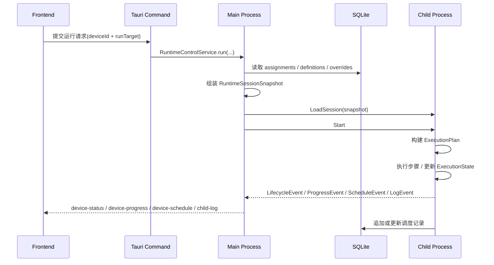

# 脚本执行流接口清单与重构里程碑

编写日期：2026-04-08

本文是 [脚本执行流架构分析与重构建议](D:\Database\Project\VisualStudioCode\AutoDaily\doc\脚本执行流架构分析与重构建议.md) 的落地版补充，目标是把“目标架构”拆成可执行接口和分阶段改造计划。

## 1. 文档目标

- 明确哪些现有接口可以保留。
- 明确哪些现有接口需要降级为兼容层或逐步废弃。
- 明确需要新增哪些 Tauri 命令、IPC 消息、前端 service/store、运行时快照结构。
- 给出分阶段实施顺序、影响文件范围和验收标准。

## 2. 标准执行序列

推荐统一成下面这条链路，任务页运行和编辑器调试运行都走同一条主线，只是 `RunTarget` 不同。



---

## 3. 接口总览

### 3.1 现有接口处理策略

| 分类 | 当前接口 | 处理建议 | 说明 |
| --- | --- | --- | --- |
| 脚本定义保存 | `save_script_cmd` / `save_script_tasks_cmd` / policy 相关命令 | 保留 | 这些已经是定义层稳定接口 |
| assignment 管理 | `get_assignments_by_device_cmd` / `save_assignment_cmd` / `delete_assignment_cmd` / `reorder_assignments_cmd` | 保留 | 仍作为持久编排态接口 |
| 时间模板管理 | `get_all_time_templates_cmd` / `save_time_template_cmd` / `delete_time_template_cmd` | 保留 | 不需要推翻 |
| 设备启动控制 | `cmd_spawn_device` / `cmd_device_start` / `cmd_device_pause` / `cmd_device_stop` / `cmd_device_shutdown` | 保留但改语义 | 以后由主进程先确保 session 已同步，再下发运行控制 |
| 队列增删 | `cmd_add_script_to_device` / `cmd_remove_script_from_device` | 过渡期保留，目标废弃 | 最终不再把 child queue 作为外部可直接操作对象 |
| 编辑器运行入口 | 当前仅前端占位按钮 | 新增正式接口 | 需要统一接入 RuntimeControlService |
| 模板值 | `script_time_template_values` 只有表，没有命令 | 新增 | 这是当前明显缺口 |
| 状态事件 | `device-status` / `device-error` / `child-log` | 保留并扩展 | 新增 `device-progress` / `device-schedule` 更合理 |

### 3.2 当前最重要的接口差距

| 差距 | 当前状态 | 目标状态 |
| --- | --- | --- |
| 运行会话快照 | 不存在 | 主进程组装 `RuntimeSessionSnapshot`，child 只消费快照 |
| 模板值 CRUD | 只有 DB 表 | 完整 Tauri 命令 + service + store |
| 队列同步 | 靠 `cmd_add/remove_script_to_device` 增量同步 | 改为 `cmd_sync_device_runtime_session` 全量同步 |
| 编辑器调试运行 | 按钮占位 | 正式 `cmd_run_script_target` |
| 生命周期/进度事件 | 仅日志与零散状态事件 | 结构化 runtime event 投影 |
| 调度记录写回 | 表已存在，但 child 未真正写入运行闭环 | 运行期统一 journal 写入 |

---

## 4. 目标接口清单

## 4.1 新增持久层查询与保存命令

这组接口解决“模板值层未接入”的问题。

### 推荐新增命令

| 命令 | 说明 | 前端调用方 |
| --- | --- | --- |
| `get_script_time_template_values_cmd(script_id, time_template_id)` | 查询某脚本在某模板下的覆盖值 | 未来脚本设置页 / 运行装配 |
| `save_script_time_template_values_cmd(record)` | 保存模板覆盖值 | 未来脚本设置页 |
| `delete_script_time_template_values_cmd(script_id, time_template_id)` | 删除模板覆盖值 | 可选，但建议补齐 |

### 推荐 DTO

```rust
pub struct ScriptTimeTemplateValuesDto {
    pub id: ScriptTemplateValueId,
    pub script_id: ScriptId,
    pub time_template_id: TemplateId,
    pub values_json: Json<serde_json::Value>,
    pub created_at: String,
    pub updated_at: String,
}
```

### `values_json` 推荐形态

```json
{
  "variables": {
    "var_pkg_name": "官服",
    "var_sweep_count": 5
  },
  "taskSettings": {
    "task_sign_in": {
      "enabled": true,
      "taskCycle": "daily"
    }
  }
}
```

---

## 4.2 新增运行控制命令

这组接口解决“任务页正式运行”和“编辑器调试运行”需要统一进入同一条执行链路的问题。

### 推荐新增命令

| 命令 | 说明 | 是否前端直接调用 |
| --- | --- | --- |
| `cmd_sync_device_runtime_session(device_id)` | 重新装配并推送当前设备的完整运行会话 | 是 |
| `cmd_run_script_target(device_id, script_id, target)` | 编辑器调试运行指定脚本目标 | 是 |
| `cmd_get_device_runtime_projection(device_id)` | 查询当前设备的主进程投影视图 | 建议增加 |

### 与现有命令的配合

- `cmd_spawn_device`
  - 启动 child 后应立即触发一次 `cmd_sync_device_runtime_session` 的内部逻辑。
- `cmd_device_start`
  - 从“直接开始跑当前 child queue”调整为“确保 session 最新后开始运行”。
- `save_assignment_cmd` / `delete_assignment_cmd` / `reorder_assignments_cmd`
  - 如果设备在线，不再直接调用 `cmd_add/remove_script_to_device`。
  - 改为统一调用 `cmd_sync_device_runtime_session(device_id)`。

### 推荐 `RunTarget`

```rust
pub enum RunTarget {
    DeviceQueue,
    FullScript { script_id: ScriptId },
    Task { script_id: ScriptId, task_id: TaskId },
    PolicyGroup { script_id: ScriptId, policy_group_id: PolicyGroupId },
    PolicySet { script_id: ScriptId, policy_set_id: PolicySetId },
}
```

说明：

- 现有 `ExecuteTarget` 可以继续保留在 child 内部使用。
- 但对外层命令，建议携带 `script_id + target`，避免 child 再猜上下文。

---

## 4.3 新增主进程内部装配接口

这组接口不一定直接暴露给前端，但必须明确职责边界。

### 推荐核心结构

```rust
pub struct RuntimeSessionSnapshot {
    pub session_id: uuid::Uuid,
    pub device_id: DeviceId,
    pub device_config: DeviceConfig,
    pub queue: Vec<RuntimeQueueItem>,
    pub script_bundles: Vec<ScriptBundleSnapshot>,
    pub issued_at: String,
}

pub struct RuntimeQueueItem {
    pub assignment_id: ScheduleId,
    pub script_id: ScriptId,
    pub time_template_id: Option<TemplateId>,
    pub account_data: Json<serde_json::Value>,
    pub order_index: u32,
    pub template_values: Option<Json<serde_json::Value>>,
}

pub struct ScriptBundleSnapshot {
    pub script: ScriptTable,
    pub tasks: Vec<ScriptTaskTable>,
    pub policies: Vec<PolicyTable>,
    pub policy_groups: Vec<PolicyGroupTable>,
    pub policy_sets: Vec<PolicySetTable>,
    pub group_policies: Vec<GroupPolicyRelation>,
    pub set_groups: Vec<SetGroupRelation>,
}
```

### 推荐主进程服务

| 服务 | 职责 |
| --- | --- |
| `RuntimeSessionAssembler` | 从 DB 装配 `RuntimeSessionSnapshot` |
| `RuntimeControlService` | 协调设备启动、session 同步、运行控制 |
| `RuntimeProjectionService` | 维护主进程侧投影态，供前端读和事件推送 |

### 建议新增文件

| 建议文件 | 说明 |
| --- | --- |
| `src-tauri/crates/runtime_engine/src/app/runtime_session_service.rs` | session 装配服务 |
| `src-tauri/crates/runtime_engine/src/app/runtime_control_service.rs` | 运行控制服务 |
| `src-tauri/crates/runtime_engine/src/app/runtime_projection_service.rs` | 前端投影视图 |

---

## 4.4 IPC 合同调整

当前 IPC `MessagePayload` 已有 `ProcessControl / ScriptTask / ConfigUpdate / StatusReport / Logger / Heartbeat / Error`。建议保留兼容，但补一层真正可支撑 session 化执行的消息。

### 推荐新增消息

```rust
pub enum MessagePayload {
    // 现有
    ProcessControl(ProcessControlMessage),
    ScriptTask(ScriptTaskMessage),
    ConfigUpdate(ConfigUpdateMessage),
    StatusReport(StatusReportMessage),
    Logger(LogMessage),
    Heartbeat(HeartbeatMessage),
    Error(ErrorMessage),

    // 新增
    SessionControl(SessionControlMessage),
    RuntimeEvent(RuntimeEventMessage),
}

pub enum SessionControlMessage {
    LoadSession { session: RuntimeSessionSnapshot },
    ReloadSession { session: RuntimeSessionSnapshot },
    ClearSession,
}

pub enum RuntimeEventMessage {
    Lifecycle(RuntimeLifecycleEvent),
    Progress(RuntimeProgressEvent),
    Schedule(RuntimeScheduleEvent),
}
```

### 消息处理建议

| 方向 | 推荐动作 |
| --- | --- |
| main -> child | 以 `SessionControl` 管理会话，以 `ProcessControl` 管理运行开关 |
| child -> main | 以 `RuntimeEvent` 上报结构化执行进展 |
| 日志 | 保持 `Logger` 独立，不与业务事件混用 |

### 对现有 `ScriptTaskAction` 的建议

- `Add` / `Remove`
  - 仅用于兼容期。
- `Execute`
  - 可以继续复用给调试执行，但推荐中期改为“先 LoadSession，再 Start 指定 target”。

---

## 4.5 前端 service / store 清单

### 推荐新增前端 service

| 文件 | 职责 |
| --- | --- |
| `src/services/runtimeService.ts` | 统一封装 session 同步、目标运行、投影视图查询 |
| `src/services/scriptTemplateValueService.ts` | 模板值查询与保存 |

### 推荐新增或调整 store

| 文件 | 职责 |
| --- | --- |
| `src/store/runtime.ts` | 维护设备运行投影、当前进度、当前 assignment / script / task |
| `src/store/task.ts` | assignment 变更后调用 `runtimeService.syncDeviceSession` |
| `src/store/device.ts` | 继续管设备进程生命周期，不再猜测业务进度 |
| `src/store/logs.ts` | 保持只处理日志流 |

### 推荐新增事件

| 事件名 | 载荷 | 用途 |
| --- | --- | --- |
| `device-status` | `RuntimeLifecycleEvent` | 生命周期态 |
| `device-progress` | `RuntimeProgressEvent` | 当前脚本/任务/步骤进度 |
| `device-schedule` | `RuntimeScheduleEvent` | 调度记录变更 |
| `device-error` | `RuntimeErrorEvent` | 执行错误 |
| `child-log` | `DeviceLogEntry` | 日志流 |

### 建议 `RuntimeProgressEvent` 形态

```ts
interface RuntimeProgressEvent {
  deviceId: string;
  sessionId: string;
  assignmentId?: string | null;
  scriptId?: string | null;
  taskId?: string | null;
  stepId?: string | null;
  phase: 'idle' | 'loading' | 'planning' | 'executing' | 'paused' | 'completed' | 'failed';
  message?: string | null;
  at: string;
}
```

---

## 4.6 child 侧运行时接口清单

### 推荐拆分

| 模块 | 当前问题 | 目标职责 |
| --- | --- | --- |
| `ScriptScheduler` | 既管 queue，又管脚本加载，又负责调用执行器 | 简化为“选择下一个运行项 + 触发执行” |
| `RuntimeContext` | 变量、任务状态、策略状态、快照、OCR cache 全堆在一起 | 拆成 `ExecutionState + ObservationContext + DeviceExecutionContext` |
| `ScriptExecutor` | 只有步骤骨架，没有正式 plan 输入 | 消费 `ExecutionPlan` 执行 |

### 推荐新增 child 模块

| 建议文件 | 说明 |
| --- | --- |
| `src-tauri/crates/child_support/src/infrastructure/session/session_state.rs` | 会话快照与当前运行项 |
| `src-tauri/crates/child_support/src/infrastructure/session/session_loader.rs` | 从 snapshot 初始化 child 会话 |
| `src-tauri/crates/child_support/src/infrastructure/scripts/execution_plan.rs` | 把 tasks/policies 组装成 plan |
| `src-tauri/crates/child_support/src/infrastructure/scripts/schedule_journal.rs` | 运行记录写回 |
| `src-tauri/crates/child_support/src/infrastructure/events/runtime_reporter.rs` | 结构化事件上报 |

### 推荐 child 最小会话结构

```rust
pub struct ChildRuntimeSession {
    pub session_id: uuid::Uuid,
    pub queue: VecDeque<RuntimeQueueItem>,
    pub bundles: HashMap<ScriptId, ScriptBundleSnapshot>,
}
```

---

## 4.7 mock 与测试清单

这部分不能漏，否则前端浏览器 mock 会马上和真实接口脱节。

### 需要同步更新

| 文件 | 需要补的内容 |
| --- | --- |
| `src/mockTauri.ts` | 新增模板值命令、runtime 命令、runtime projection 返回 |
| `tests/script-editor.spec.ts` | 调试运行按钮、保存后运行入口 |
| `tests/script-create.spec.ts` | 如涉及模板值或 assignment 变更联动，也要补 |

### 最小测试覆盖

| 场景 | 验收点 |
| --- | --- |
| 在线设备新增 assignment | 不再走 add/remove 单条队列命令，而是同步整份 session |
| child 重启后恢复 | 自动从 assignment + definitions 重建运行会话 |
| 编辑器运行 task/policyGroup/policySet | 进入统一运行接口 |
| 模板值读取 | 运行前能装载到 session snapshot |

---

## 5. 建议里程碑

## M0：合同冻结与骨架建立

### 目标

- 先把命名、消息结构、DTO 定下来。
- 暂不追求闭环执行。

### 交付物

- `RuntimeSessionSnapshot`
- `RunTarget`
- `RuntimeLifecycleEvent`
- `RuntimeProgressEvent`
- `RuntimeScheduleEvent`
- 新命令签名与前端 service 空壳

### 影响文件

- `src-tauri/crates/runtime_common/src/ipc/message.rs`
- `src-tauri/src/api/*`
- `src/services/*`
- `src/types/app/domain.ts`
- `src/mockTauri.ts`

### 验收标准

- 前后端都能编译通过。
- mock 环境不报未处理命令。
- 新旧命令可并行存在。

---

## M1：模板值层接通

### 目标

- 把 `script_time_template_values` 从“只有表”变成“可查询、可保存、可被装配”。

### 交付物

- 模板值 CRUD 命令
- TS service
- 基本 store / 查询逻辑
- `RuntimeSessionAssembler` 能把模板值带进 queue item

### 影响文件

- `src-tauri/src/api/domain/schedule.rs` 或新增独立 `template_values.rs`
- `src-tauri/crates/runtime_engine/src/domain/schedule/script_time_template_values.rs`
- `src/services/scriptTemplateValueService.ts`
- `src/mockTauri.ts`

### 验收标准

- 可按 `script_id + time_template_id` 取到值。
- 装配出的 queue item 中能看到模板覆盖值。

---

## M2：主进程 session 装配与同步

### 目标

- 把 assignment、definitions、template overrides 统一装配成 session。
- 在线设备的 assignment 变化统一改为“整份 session 同步”。

### 交付物

- `cmd_sync_device_runtime_session`
- `RuntimeSessionAssembler`
- `RuntimeControlService`
- `taskStore.createAssignment/removeAssignment` 改为调用 session sync

### 影响文件

- `src-tauri/src/api/infrastructure/process_api.rs`
- `src-tauri/crates/runtime_engine/src/app/*`
- `src/store/task.ts`
- `src/services/runtimeService.ts`

### 验收标准

- 在线设备新增、删除、重排 assignment 后，child queue 被完整替换。
- 不再依赖单条 `cmd_add_script_to_device` / `cmd_remove_script_from_device` 维持一致性。

---

## M3：child 会话加载与状态上报

### 目标

- child 具备加载 session、替换 queue、上报生命周期和进度事件的能力。

### 交付物

- `SessionControl` 消息处理
- `ChildRuntimeSession`
- `runtime_reporter`
- 主进程 event projector

### 影响文件

- `src-tauri/crates/child_support/src/infrastructure/ipc/msg_handler_child.rs`
- `src-tauri/crates/child_support/src/infrastructure/session/*`
- `src-tauri/crates/runtime_engine/src/infrastructure/ipc/msg_handler_main.rs`
- `src/store/device.ts`
- `src/store/runtime.ts`

### 验收标准

- child 启动后收到 session 能进入 `loaded/idle`。
- start / pause / stop / shutdown 的生命周期事件能稳定到前端。
- 前端不再仅靠 `onlineDeviceIds + 本地推断` 判断运行状态。

---

## M4：执行计划与调度记录闭环

### 目标

- 打通 `script_tasks -> execution plan -> step executor -> device_script_schedules`。

### 交付物

- `ExecutionPlanAssembler`
- `ScheduleJournal`
- `scheduler.execute_script()` 改为真正读取 bundle 和 queue item
- 至少支持：
  - `FullScript`
  - `Task`
  - `PolicyGroup`
  - `PolicySet`

### 影响文件

- `src-tauri/crates/child_support/src/infrastructure/scripts/scheduler.rs`
- `src-tauri/crates/child_support/src/infrastructure/scripts/executor.rs`
- `src-tauri/crates/child_support/src/infrastructure/scripts/schedule_journal.rs`
- `src-tauri/src/api/domain/schedule.rs`

### 验收标准

- 运行一个脚本时，能写入或更新 `device_script_schedules`。
- stop / failed / success 都有明确记录。
- `current_script/current_task/current_step` 能通过进度事件看到。

---

## M5：编辑器运行入口并轨

### 目标

- 把 `ScriptEditor.vue` 顶部“运行”按钮接入正式运行链路。

### 交付物

- `cmd_run_script_target`
- `runtimeService.runTarget(...)`
- 编辑器运行反馈面板

### 影响文件

- `src/views/ScriptEditor.vue`
- `src/services/runtimeService.ts`
- `src/store/runtime.ts`
- `src/mockTauri.ts`

### 验收标准

- 编辑器可以选择 `script / task / policyGroup / policySet` 运行。
- 跑的是和任务页同一套 session + planner + executor。
- 不再是 toast 占位提示。

---

## M6：兼容层收口

### 目标

- 清理已不再合理的旧增量队列接口，收口到 session 化运行。

### 交付物

- `cmd_add_script_to_device` / `cmd_remove_script_from_device` 标记废弃
- 前端不再使用这两个接口
- 文档更新

### 验收标准

- 搜索前端代码不再直接依赖增量队列命令。
- 在线设备 queue 唯一同步方式是 session sync。

---

## 6. 推荐实施顺序结论

- 先做 `M0 + M1`，把合同和模板值层补齐。
- 再做 `M2 + M3`，把“状态事实源”统一起来。
- 最后做 `M4 + M5`，把真正执行闭环和编辑器运行入口打通。
- `M6` 只在前面稳定后再清理，不要一开始就删旧接口。

## 7. 当前最值得立即动手的代码入口

如果下一步开始真正改代码，建议从这里切入：

- `src-tauri/src/api/infrastructure/process_api.rs`
- `src-tauri/src/api/domain/schedule.rs`
- `src-tauri/crates/runtime_common/src/ipc/message.rs`
- `src-tauri/crates/runtime_engine/src/infrastructure/db.rs`
- `src-tauri/crates/child_support/src/infrastructure/ipc/msg_handler_child.rs`
- `src-tauri/crates/child_support/src/infrastructure/scripts/scheduler.rs`
- `src/store/task.ts`
- `src/views/ScriptEditor.vue`
- `src/mockTauri.ts`

## 8. 决策建议

- 不建议先做 UI。
- 不建议先重写 `ScriptExecutor` 全部步骤。
- 不建议先删除旧接口。
- 最稳的路径是：先统一 session 和状态模型，再推进执行闭环。
