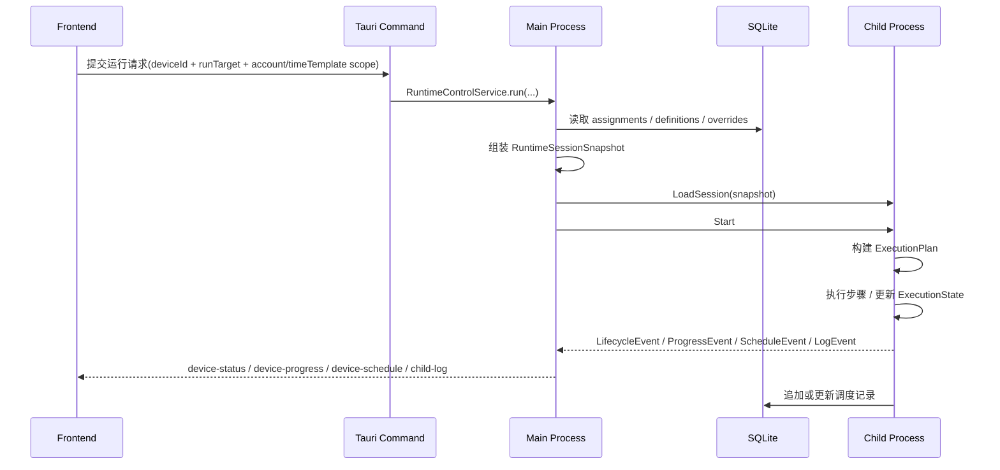
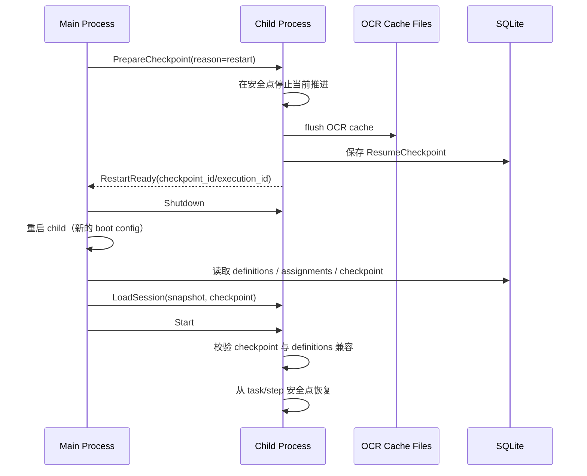

# 脚本执行流接口清单与重构里程碑

编写日期：2026-04-08

本文是 [脚本执行流架构分析与重构建议](D:\Database\Project\VisualStudioCode\AutoDaily\doc\脚本执行流架构分析与重构建议.md) 的落地版补充，目标是把“目标架构”拆成可执行接口和分阶段改造计划。

## 1. 文档目标

- 明确哪些现有接口可以保留。
- 明确哪些现有接口需要降级为兼容层或逐步废弃。
- 明确需要新增哪些 Tauri 命令、IPC 消息、前端 service/store、运行时快照结构。
- 给出分阶段实施顺序、影响文件范围和验收标准。

## 2. 标准执行序列

推荐统一成下面这条链路，任务页运行和编辑器调试运行都走同一条主线，只是 `RunTarget` 和模板值作用域不同。



---

## 3. 接口总览

### 3.1 现有接口处理策略

| 分类 | 当前接口 | 处理建议 | 说明 |
| --- | --- | --- | --- |
| 脚本定义保存 | `save_script_cmd` / `save_script_tasks_cmd` / policy 相关命令 | 保留 | 这些已经是定义层稳定接口 |
| assignment 管理 | `get_assignments_by_device_cmd` / `save_assignment_cmd` / `delete_assignment_cmd` / `reorder_assignments_cmd` | 保留 | 仍作为持久编排态接口 |
| 时间模板管理 | `get_all_time_templates_cmd` / `save_time_template_cmd` / `delete_time_template_cmd` | 保留 | 不需要推翻 |
| 设备启动控制 | `cmd_spawn_device` / `cmd_device_start` / `cmd_device_pause` / `cmd_device_stop` / `cmd_device_shutdown` | 保留但改语义 | 以后由主进程先确保 session 已同步，再下发运行控制 |
| 队列增删 | `cmd_add_script_to_device` / `cmd_remove_script_from_device` | 直接替换 | 当前整条流程本来未闭环，不值得继续保留双轨 |
| 编辑器运行入口 | 当前仅前端占位按钮 | 新增正式接口 | 需要统一接入 RuntimeControlService |
| 模板值 | `script_time_template_values` 只有表，没有命令 | 新增并扩维 | 需要补到 `device_id + script_id + time_template_id + account_id` 维度 |
| 状态事件 | `device-status` / `device-error` / `child-log` | 保留并扩展 | 新增 `device-progress` / `device-schedule` 更合理 |

### 3.2 当前最重要的接口差距

| 差距 | 当前状态 | 目标状态 |
| --- | --- | --- |
| 运行会话快照 | 不存在 | 主进程组装 `RuntimeSessionSnapshot`，child 只消费快照 |
| 模板值 CRUD | 只有 DB 表 | 完整 Tauri 命令 + service + store，且支持设备/账号维度 |
| 队列同步 | 靠 `cmd_add/remove_script_to_device` 增量同步 | 改为 `cmd_sync_device_runtime_session` 全量同步 |
| 编辑器调试运行 | 按钮占位 | 正式 `cmd_run_script_target` |
| 生命周期/进度事件 | 仅日志与零散状态事件 | 结构化 runtime event 投影 |
| 调度记录写回 | 表已存在，但 child 未真正写入运行闭环 | 运行期统一 journal 写入 |
| 目标对象定义 | `ExecuteTarget` 与外层运行语义分裂 | 统一为 `RunTarget`，main/child 只保留一套概念 |

---

## 4. 目标接口清单

## 4.1 新增持久层查询与保存命令

这组接口解决“模板值层未接入”的问题。

### 推荐新增命令

| 命令 | 说明 | 前端调用方 |
| --- | --- | --- |
| `get_script_time_template_values_cmd(device_id, script_id, time_template_id, account_id)` | 查询某设备某脚本在某模板和某账号下的覆盖值 | 未来脚本设置页 / 运行装配 |
| `save_script_time_template_values_cmd(record)` | 保存模板覆盖值 | 未来脚本设置页 |
| `delete_script_time_template_values_cmd(device_id, script_id, time_template_id, account_id)` | 删除模板覆盖值 | 可选，但建议补齐 |

### 推荐 DTO

```rust
pub struct ScriptTimeTemplateValuesDto {
    pub id: ScriptTemplateValueId,
    pub device_id: Option<DeviceId>,
    pub script_id: ScriptId,
    pub time_template_id: TemplateId,
    pub account_id: Option<AccountId>,
    pub values_json: Json<serde_json::Value>,
    pub created_at: String,
    pub updated_at: String,
}
```

推荐唯一键：

```sql
CREATE UNIQUE INDEX idx_script_time_template_values_scope
ON script_time_template_values (
  ifnull(device_id, ''),
  script_id,
  time_template_id,
  ifnull(account_id, '')
)
```

当前代码骨架里这样实现有两个原因：

- 要兼容旧库里只有 `script_id + time_template_id` 维度的历史记录
- 允许主进程装配 session 时做“设备内精确命中 -> 设备内账号通配 -> 历史全局回退”的查找顺序

因此当前实现语义是：

- 新写入记录应带真实 `device_id`
- `account_id` 可为空
- 迁移出来的历史记录允许 `device_id/account_id` 为空，作为 legacy fallback

### `values_json` 推荐形态

```json
{
  "variables": {
    "var_pkg_name": "官服",
    "var_sweep_count": 5
  },
  "taskSettings": {
    "task_sign_in": {
      "enabled": true,
      "taskCycle": "daily"
    }
  }
}
```

---

## 4.2 新增运行控制命令

这组接口解决“任务页正式运行”和“编辑器调试运行”需要统一进入同一条执行链路的问题。

### 推荐新增命令

| 命令 | 说明 | 是否前端直接调用 |
| --- | --- | --- |
| `cmd_sync_device_runtime_session(device_id)` | 重新装配并推送当前设备的完整运行会话 | 是 |
| `cmd_run_script_target(device_id, script_id, target)` | 编辑器调试运行指定脚本目标 | 是 |
| `cmd_get_device_runtime_projection(device_id)` | 查询当前设备的主进程投影视图 | 建议增加 |

### 与现有命令的配合

- `cmd_spawn_device`
  - 启动 child 后应立即触发一次 `cmd_sync_device_runtime_session` 的内部逻辑。
- `cmd_device_start`
  - 从“直接开始跑当前 child queue”调整为“确保 session 最新后开始运行”。
- `save_assignment_cmd` / `delete_assignment_cmd` / `reorder_assignments_cmd`
  - 如果设备在线，统一调用 `cmd_sync_device_runtime_session(device_id)`。
  - 不再保留 add/remove 单条队列命令。

### 推荐 `RunTarget`

```rust
pub enum RunTarget {
    DeviceQueue,
    FullScript { script_id: ScriptId },
    Task { script_id: ScriptId, task_id: TaskId },
    PolicyGroup { script_id: ScriptId, policy_group_id: PolicyGroupId },
    PolicySet { script_id: ScriptId, policy_set_id: PolicySetId },
}
```

说明：

- `RunTarget` 直接替换 `ExecuteTarget`。
- main / child / 前端 / IPC 统一只保留一套目标对象语义，避免后续转换层继续制造分叉。

---

## 4.3 新增主进程内部装配接口

这组接口不一定直接暴露给前端，但必须明确职责边界。

### 推荐核心结构

```rust
pub type SessionId = UuidV7;

pub struct RuntimeSessionSnapshot {
    pub session_id: SessionId,
    pub device_id: DeviceId,
    pub run_target: RunTarget,
    pub runtime_policy: RuntimeExecutionPolicy,
    pub queue: Vec<RuntimeQueueItem>,
    pub script_bundles: Vec<ScriptBundleSnapshot>,
    pub issued_at: String,
}

pub struct RuntimeExecutionPolicy {
    pub ocr_text_cache: VisionTextCacheRuntimeConfig,
    pub action_wait_ms: u64,
    pub step_timeout_ms: u64,
    pub timeout_action: TimeoutAction,
    pub timeout_notify: TimeoutNotifyPolicy,
}

pub struct RuntimeQueueItem {
    pub assignment_id: ScheduleId,
    pub script_id: ScriptId,
    pub time_template_id: Option<TemplateId>,
    pub account_id: Option<AccountId>,
    pub account_data_json: Option<String>,
    pub order_index: u32,
    pub template_values_json: Option<String>,
}

pub struct ScriptBundleSnapshot {
    pub script_id: ScriptId,
    pub script_json: String,
    pub tasks_json: String,
    pub policies_json: String,
    pub policy_groups_json: String,
    pub policy_sets_json: String,
    pub group_policies_json: String,
    pub set_groups_json: String,
}
```

这里要明确区分两层语义：

- 上面这组是当前已落地的“IPC / session 传输 DTO”
- 不是 child 内部最终执行态

也就是说：

- 文档原先把 `ScriptBundleSnapshot` 写成强类型聚合对象，那个更接近“概念模型”
- 当前代码里它被落成 JSON string 分片，是“传输快照”

这么做的原因是：

- `runtime_common` 负责 IPC 合同，不适合直接依赖一整套 `runtime_engine::domain::*` 表结构类型
- 如果把 `ScriptTable / ScriptTaskTable / PolicyTable ...` 全部抬进共享合同层，会把领域模型和 IPC 层重新耦死
- 先按 JSON 分片传输，可以保证主进程一次装配、child 按需反序列化，避免 child 再回旧数据库链路

所以当前实际分层应理解为：

- `ScriptBundleSnapshot`
  - session 传输层快照
- `ChildRuntimeSession`
  - child 持有的会话事实源
- `ExecutionPlanAssembler`
  - 后续把 bundle 解析成真正可执行 plan 的层

后续如果你要进一步收紧类型安全，正确方向不是把领域表结构直接塞进 `runtime_common`，而是：

- 在 `runtime_common` 定义专用 transport DTO
- 由主进程把领域对象映射为 transport DTO
- child 只消费 transport DTO / execution plan

这里的 `ocr_text_cache` 应直接沿用当前已经存在的运行时配置结构，不要重新发明一套字段：

```rust
pub struct VisionTextCacheRuntimeConfig {
    pub enabled: bool,
    pub dir: Option<PathBuf>,
    pub signature_grid_size: u16,
}
```

当前仓库已落地的真实含义：

- `enabled`
  - 是否启用 OCR 文字缓存
- `dir`
  - 缓存目录
  - 当设置页留空时，主进程会回退到应用数据目录下的默认 OCR 缓存目录
- `signature_grid_size`
  - 视觉签名网格大小
  - 用于稳定坐标离散化、布局排序、相对位置判断、动作签名与重复性判定

这一点很重要：

- OCR 缓存配置不是单纯“存文件位置”
- `signature_grid_size` 已经参与后端 `VisionSnapshot` 的签名离散化和稳定布局计算
- 后续如果做重复页面识别、动作去重、策略执行证据比对，都要继续依赖这个配置

`RuntimeExecutionPolicy` 的建议归属：

- 放进 `RuntimeSessionSnapshot`
  - `ocr_text_cache`
  - `action_wait_ms`
  - `step_timeout_ms`
  - `timeout_action`
  - `timeout_notify`
- 不放进热重载 session，而由主进程先判断是否需要重启 child
  - `cpu_cores`
  - ORT / 推理线程绑定

原因：

- 前一组影响“本次会话如何执行”，适合随 session 一起下发。
- 后一组影响“进程如何启动和绑核”，不能安全热更新，必须重启 child。

`TimeoutNotifyPolicy` 现阶段建议语义：

- `None`
  - 不通知
- `Email`
  - 邮件通知
- `SystemNotification`
  - 系统原生通知
  - Windows 下就是右下角通知中心消息提醒

说明：

- 当前 OCR 缓存配置来源已经在主进程里实现：
  - 从设置 store 读取
  - 转成 `VisionTextCacheRuntimeConfig`
  - 随 child 初始化数据下发
- 重构时不应把这块能力写回“待设计”，而应迁移为 session/runtime policy 的正式组成部分。
- M0 代码骨架里，`device_config` 继续沿用 child 启动时的 `ChildProcessInitData.device_config`。
- 因此当前 `RuntimeSessionSnapshot` 先不重复携带 `device_config`，避免 boot config 和 session baseline 维护两份事实源。

### 推荐主进程服务

| 服务 | 职责 |
| --- | --- |
| `RuntimeSessionAssembler` | 从 DB 装配 `RuntimeSessionSnapshot` |
| `RuntimeControlService` | 协调设备启动、session 同步、运行控制 |
| `RuntimeProjectionService` | 维护主进程侧投影态，供前端读和事件推送 |

### 建议新增文件

| 建议文件 | 说明 |
| --- | --- |
| `src-tauri/crates/runtime_engine/src/app/runtime_session_service.rs` | session 装配服务 |
| `src-tauri/crates/runtime_engine/src/app/runtime_control_service.rs` | 运行控制服务 |
| `src-tauri/crates/runtime_engine/src/app/runtime_projection_service.rs` | 前端投影视图 |

### child 收到 `RuntimeSessionSnapshot` 后如何处理

这里不要把 `RuntimeSessionSnapshot` 理解成“全部上下文序列化”，否则会把会话基线和瞬时执行态混在一起。

推荐 child 内部分成两层：

```rust
pub struct ChildRuntimeSession {
    pub session_id: SessionId,
    pub snapshot: RuntimeSessionSnapshot,
}

pub struct EphemeralExecutionState {
    pub current_assignment_id: Option<ScheduleId>,
    pub current_script_id: Option<ScriptId>,
    pub current_task_id: Option<TaskId>,
    pub current_step_id: Option<StepId>,
    pub scope: rhai::Scope<'static>,
    pub task_states: HashMap<TaskId, TaskState>,
    pub policy_states: HashMap<PolicyId, PolicyState>,
    pub last_snapshot: Option<VisionSnapshot>,
    pub last_hits: Vec<SearchHit>,
}
```

处理原则：

- `LoadSession`
  - 用于 child 刚启动或明确清空后重新加载。
  - 替换 `ChildRuntimeSession`。
  - 重置 `EphemeralExecutionState`。
- `ReloadSession`
  - 用于 assignment、模板值、运行策略变更后的热更新。
  - 默认替换 `ChildRuntimeSession`。
  - 是否保留 `EphemeralExecutionState`，由兼容性检查决定。

推荐兼容性检查：

- 如果当前正在执行的 `assignment/script/task` 仍存在，且其定义结构没有发生破坏性变化：
  - 可保留当前 `scope`、`task_states`、`policy_states`
  - 执行完当前步骤后切换到新 session
- 如果目标脚本、任务结构、模板值作用域已改变：
  - 取消当前执行
  - 重建 `EphemeralExecutionState`

重要说明：

- 真正需要跨重启保留的不是 `EphemeralExecutionState` 全量内存，而是“可恢复的检查点”。
- OCR 文字缓存本身已经是可落盘的，不应依赖 session reload 才能保留。
- 第一阶段只做“安全点恢复”，不做“精确恢复”。
- 安全点恢复建议限定在：
  - `task` 起点恢复
  - `step` 起点恢复
  - `next step` 恢复
- 不尝试恢复：
  - 任意中间表达式求值现场
  - 临时 Rhai 运行栈
  - 任意步骤执行到一半的外设交互现场
- 因此最小恢复信息应写进 `ScheduleJournal / Checkpoint`，而不是要求 `RuntimeSessionSnapshot` 携带全部运行态。

### 推荐最小恢复信息

```rust
pub struct ResumeCheckpoint {
    pub execution_id: ExecutionId,
    pub source_session_id: SessionId,
    pub device_id: DeviceId,
    pub run_target: RunTarget,

    pub assignment_id: Option<ScheduleId>,
    pub script_id: ScriptId,
    pub time_template_id: Option<TemplateId>,
    pub account_id: Option<AccountId>,

    pub task_id: Option<TaskId>,
    pub step_id: Option<StepId>,
    pub resume_mode: ResumeMode, // FromTaskStart | FromStepStart | FromNextStep

    pub definition_fingerprint: String,
    pub updated_at: String,
}
```

说明：

- `current_assignment_id/current_script_id/current_task_id/current_step_id` 是恢复锚点核心。
- 但为了安全恢复，仍建议补：
  - `execution_id`
  - `run_target`
  - `time_template_id`
  - `account_id`
  - `definition_fingerprint`
- `session_id` 只代表生成该 checkpoint 时的 session，不应充当跨重启的唯一恢复主键。

### 推荐重启恢复时序



时序说明：

- 应由主进程发起重启流程，不建议由 child 自行要求主进程“立刻杀掉我”。
- child 的职责是：
  - 尽快到达安全点
  - 将 OCR 文字缓存写回配置目录下的缓存文件
  - 写 checkpoint
  - 回 `RestartReady`
- 主进程的职责是：
  - 等 child checkpoint 完成
  - 再关闭并重启 child
  - 重新装配 `RuntimeSessionSnapshot + ResumeCheckpoint`

这里要特别区分两类持久化：

- OCR 文字缓存：
  - 写入设置页指定的缓存目录
  - 目录为空时回退到应用默认缓存目录
  - 当前实现是 JSON 文件，不是 SQLite
- ResumeCheckpoint / 调度记录：
  - 写入 SQLite

### 删除执行记录时的处理

执行记录与 checkpoint 默认应级联删除。

建议约束：

- 一个 `execution_id` 对应：
  - 一组 `device_script_schedules`
  - 一个 `ResumeCheckpoint`
- 删除某次执行记录时，应同步删除该 `execution_id` 对应的 checkpoint。
- `clear_schedules(device_id)` 这类“清空执行记录”操作，也应同步清空该设备下所有 checkpoint。

原因：

- 否则会出现“历史记录被删了，但 child 还能从幽灵 checkpoint 恢复”的脏状态。
- 第一阶段既然不做高级恢复管理，就不应该保留脱离执行记录的 checkpoint。

---

## 4.4 IPC 合同调整

当前 IPC `MessagePayload` 已有 `ProcessControl / ScriptTask / ConfigUpdate / StatusReport / Logger / Heartbeat / Error`。本轮建议直接收口，不再保留 `ScriptTaskAction + ExecuteTarget` 这条未打通的老路径。

### 推荐新增消息

```rust
pub enum MessagePayload {
    ProcessControl(ProcessControlMessage),
    SessionControl(SessionControlMessage),
    RuntimeEvent(RuntimeEventMessage),
    ConfigUpdate(ConfigUpdateMessage),
    Logger(LogMessage),
    Heartbeat(HeartbeatMessage),
    Error(ErrorMessage),
}

pub enum SessionControlMessage {
    LoadSession { session: RuntimeSessionSnapshot, checkpoint: Option<ResumeCheckpoint> },
    ReloadSession { session: RuntimeSessionSnapshot, checkpoint: Option<ResumeCheckpoint> },
    PrepareCheckpoint { reason: SessionCheckpointReason },
    ClearSession,
}

pub enum RuntimeEventMessage {
    Lifecycle(RuntimeLifecycleEvent),
    Progress(RuntimeProgressEvent),
    Schedule(RuntimeScheduleEvent),
}
```

### 消息处理建议

| 方向 | 推荐动作 |
| --- | --- |
| main -> child | 以 `SessionControl` 管理会话，以 `ProcessControl` 管理运行开关 |
| child -> main | 以 `RuntimeEvent` 上报结构化执行进展 |
| 日志 | 保持 `Logger` 独立，不与业务事件混用 |
| 配置更新 | `ConfigUpdate` 只保留真正的 live config，例如日志级别、ADB 地址等 |

额外建议：

- 如果主进程准备因 `ChildBootConfig` 变化而重启 child，应先发 `PrepareCheckpoint`。
- child 返回 `RestartReady` 后，主进程再发送 `Shutdown` 或直接 stop child。

### 配置分层建议

| 配置类型 | 建议通道 | 是否需要重启 child |
| --- | --- | --- |
| CPU 核心绑定 / ORT 绑核 | `ChildBootConfig`，由主进程比较后决定重启 | 是 |
| OCR 缓存配置 | `RuntimeSessionSnapshot.runtime_policy` | 否 |
| 执行动作后等待时间 | `RuntimeSessionSnapshot.runtime_policy` | 否 |
| 步骤超时限制 | `RuntimeSessionSnapshot.runtime_policy` | 否 |
| 超时后的行为（停止/跳过/继续/通知） | `RuntimeSessionSnapshot.runtime_policy` | 否 |
| 超时通知策略（如发邮件） | `RuntimeSessionSnapshot.runtime_policy` | 否 |
| 日志级别 | `ConfigUpdate` | 否 |
| ADB 路径 / ADB server 地址 | `ConfigUpdate` | 否 |

补充说明：

- OCR 缓存目录不是固定写死路径，应该继续尊重设置页里的目录配置和“留空则使用默认目录”的现有行为。
- `signature_grid_size` 不是纯视觉参数，而是缓存命中、稳定排序和重复性判定参数，因此必须与 `ocr_text_cache` 一起传递。

---

## 4.5 前端 service / store 清单

### 推荐新增前端 service

| 文件 | 职责 |
| --- | --- |
| `src/services/runtimeService.ts` | 统一封装 session 同步、目标运行、投影视图查询 |
| `src/services/scriptTemplateValueService.ts` | 模板值查询与保存 |

### 推荐新增或调整 store

| 文件 | 职责 |
| --- | --- |
| `src/store/runtime.ts` | 维护设备运行投影、当前进度、当前 assignment / script / task |
| `src/store/task.ts` | assignment 变更后调用 `runtimeService.syncDeviceSession` |
| `src/store/device.ts` | 继续管设备进程生命周期，不再猜测业务进度 |
| `src/store/logs.ts` | 保持只处理日志流 |

前端无需做视觉重画，只需补恢复相关状态展示：

- 当前设备是否存在可恢复 checkpoint
- 正在准备重启 checkpoint
- 已按 task/step 安全点恢复
- 因定义不兼容而放弃恢复

### 推荐新增事件

| 事件名 | 载荷 | 用途 |
| --- | --- | --- |
| `device-status` | `RuntimeLifecycleEvent` | 生命周期态 |
| `device-progress` | `RuntimeProgressEvent` | 当前脚本/任务/步骤进度 |
| `device-schedule` | `RuntimeScheduleEvent` | 调度记录变更 |
| `device-recovery` | `RuntimeRecoveryEvent` | 可恢复 / 恢复中 / 恢复失败 |
| `device-error` | `RuntimeErrorEvent` | 执行错误 |
| `child-log` | `DeviceLogEntry` | 日志流 |

### 建议 `RuntimeProgressEvent` 形态

```ts
interface RuntimeProgressEvent {
  deviceId: string;
  sessionId: string;
  assignmentId?: string | null;
  scriptId?: string | null;
  taskId?: string | null;
  stepId?: string | null;
  phase: 'idle' | 'loading' | 'planning' | 'executing' | 'paused' | 'completed' | 'failed';
  message?: string | null;
  at: string;
}
```

---

## 4.6 child 侧运行时接口清单

### 推荐拆分

| 模块 | 当前问题 | 目标职责 |
| --- | --- | --- |
| `ScriptScheduler` | 既管 queue，又管脚本加载，又负责调用执行器 | 简化为“选择下一个运行项 + 触发执行” |
| `RuntimeContext` | 变量、任务状态、策略状态、快照、OCR cache 全堆在一起 | 拆成 `ExecutionState + ObservationContext + DeviceExecutionContext` |
| `ScriptExecutor` | 只有步骤骨架，没有正式 plan 输入 | 消费 `ExecutionPlan` 执行 |

### 推荐新增 child 模块

| 建议文件 | 说明 |
| --- | --- |
| `src-tauri/crates/child_support/src/infrastructure/session/session_state.rs` | 会话快照与当前运行项 |
| `src-tauri/crates/child_support/src/infrastructure/session/session_loader.rs` | 从 snapshot 初始化 child 会话 |
| `src-tauri/crates/child_support/src/infrastructure/scripts/execution_plan.rs` | 把 tasks/policies 组装成 plan |
| `src-tauri/crates/child_support/src/infrastructure/scripts/schedule_journal.rs` | 运行记录写回 |
| `src-tauri/crates/child_support/src/infrastructure/events/runtime_reporter.rs` | 结构化事件上报 |

### 推荐 child 最小会话结构

```rust
pub struct ChildRuntimeSession {
    pub session_id: SessionId,
    pub queue: VecDeque<RuntimeQueueItem>,
    pub bundles: HashMap<ScriptId, ScriptBundleSnapshot>,
}
```

---

## 4.7 mock 与测试清单

这部分不能漏，否则前端浏览器 mock 会马上和真实接口脱节。

### 需要同步更新

| 文件 | 需要补的内容 |
| --- | --- |
| `src/mockTauri.ts` | 新增模板值命令、runtime 命令、runtime projection 返回 |
| `tests/script-editor.spec.ts` | 调试运行按钮、保存后运行入口 |
| `tests/script-create.spec.ts` | 如涉及模板值或 assignment 变更联动，也要补 |

### 最小测试覆盖

| 场景 | 验收点 |
| --- | --- |
| 在线设备新增 assignment | 不再走 add/remove 单条队列命令，而是同步整份 session |
| child 重启后恢复 | 自动从 assignment + definitions 重建运行会话 |
| 安全点恢复 | 仅支持 task/step 边界恢复，不尝试精确恢复任意中间态 |
| 编辑器运行 task/policyGroup/policySet | 进入统一运行接口 |
| 模板值读取 | 运行前能按 device/script/template/account 装载到 session snapshot |
| CPU 核心变更 | 主进程识别后重启 child，而不是热更新绑核 |
| 清空执行记录 | 关联的 checkpoint 一并删除 |

---

## 5. 建议里程碑

## M0：合同冻结与骨架建立

### 目标

- 先把命名、消息结构、DTO 定下来。
- 暂不追求闭环执行。

### 交付物

- `RuntimeSessionSnapshot`
- `RunTarget`
- `SessionId`
- `RuntimeLifecycleEvent`
- `RuntimeProgressEvent`
- `RuntimeScheduleEvent`
- `ResumeCheckpoint`
- 移除 `ExecuteTarget` / `ScriptTaskAction`
- 新命令签名与前端 service 空壳

### 影响文件

- `src-tauri/crates/runtime_common/src/ipc/message.rs`
- `src-tauri/src/api/*`
- `src/services/*`
- `src/types/app/domain.ts`
- `src/mockTauri.ts`

### 验收标准

- 前后端都能编译通过。
- mock 环境不报未处理命令。
- 代码中不再保留 `ExecuteTarget` / `ScriptTaskAction` 的调用路径。
- 断点恢复合同限定为安全点恢复，不实现精确恢复。

---

## M1：模板值层接通

### 目标

- 把 `script_time_template_values` 从“只有表”变成“可查询、可保存、可被装配”，并扩展到设备/账号维度。

### 交付物

- 模板值 CRUD 命令
- TS service
- 基本 store / 查询逻辑
- `RuntimeSessionAssembler` 能把模板值带进 queue item

### 影响文件

- `src-tauri/src/api/domain/schedule.rs` 或新增独立 `template_values.rs`
- `src-tauri/crates/runtime_engine/src/domain/schedule/script_time_template_values.rs`
- `src/services/scriptTemplateValueService.ts`
- `src/mockTauri.ts`

### 验收标准

- 可按 `device_id + script_id + time_template_id + account_id` 取到值。
- 装配出的 queue item 中能看到模板覆盖值。

---

## M2：主进程 session 装配与同步

### 目标

- 把 assignment、definitions、template overrides 统一装配成 session。
- 在线设备的 assignment 变化统一改为“整份 session 同步”。

### 交付物

- `cmd_sync_device_runtime_session`
- `RuntimeSessionAssembler`
- `RuntimeControlService`
- `taskStore.createAssignment/removeAssignment` 改为调用 session sync

### 影响文件

- `src-tauri/src/api/infrastructure/process_api.rs`
- `src-tauri/crates/runtime_engine/src/app/*`
- `src/store/task.ts`
- `src/services/runtimeService.ts`

### 验收标准

- 在线设备新增、删除、重排 assignment 后，child queue 被完整替换。
- 不再存在 `cmd_add_script_to_device` / `cmd_remove_script_from_device` 这类增量队列接口依赖。

---

## M3：child 会话加载与状态上报

### 目标

- child 具备加载 session、替换 queue、上报生命周期和进度事件的能力。

### 交付物

- `SessionControl` 消息处理
- `ChildRuntimeSession`
- `ResumeCheckpoint`
- `runtime_reporter`
- 主进程 event projector

### 当前已落地

- child 已持有 `ChildRuntimeSession`，内部保存 `RuntimeSessionSnapshot + checkpoint + script bundle index`。
- child 入站消息已改为顺序处理，避免 `LoadSession` 与紧随其后的 `Start` 发生竞态。
- `scheduler.execute_script()` 已开始从 session bundle 读取 definitions，不再回退到旧的数据库直读路径。
- 已开始向前端稳定投递 `device-status / device-progress / device-schedule`，并新增前端 `runtime` store 接收 `progress/schedule`。
- `PrepareCheckpoint -> RestartReady` 与 checkpoint 落库仍留在后续阶段，本阶段只完成会话态与事件上报骨架。

### 影响文件

- `src-tauri/crates/child_support/src/infrastructure/ipc/msg_handler_child.rs`
- `src-tauri/crates/child_support/src/infrastructure/session/*`
- `src-tauri/crates/runtime_engine/src/infrastructure/ipc/msg_handler_main.rs`
- `src/store/device.ts`
- `src/store/runtime.ts`

### 验收标准

- child 启动后收到 session 能进入 `loaded/idle`。
- start / pause / stop / shutdown 的生命周期事件能稳定到前端。
- 前端不再仅靠 `onlineDeviceIds + 本地推断` 判断运行状态。
- child 因重启收到 `PrepareCheckpoint` 后，能在安全点写 checkpoint 并返回 `RestartReady`。

---

## M4：执行计划与调度记录闭环

### 目标

- 打通 `script_tasks -> execution plan -> step executor -> device_script_schedules`。

### 交付物

- `ExecutionPlanAssembler`
- `ScheduleJournal`
- `scheduler.execute_script()` 改为真正读取 bundle 和 queue item
- 至少支持：
  - `FullScript`
  - `Task`
  - `PolicyGroup`
  - `PolicySet`

### 影响文件

- `src-tauri/crates/child_support/src/infrastructure/scripts/scheduler.rs`
- `src-tauri/crates/child_support/src/infrastructure/scripts/executor.rs`
- `src-tauri/crates/child_support/src/infrastructure/scripts/schedule_journal.rs`
- `src-tauri/src/api/domain/schedule.rs`

### 验收标准

- 运行一个脚本时，能写入或更新 `device_script_schedules`。
- stop / failed / success 都有明确记录。
- `current_script/current_task/current_step` 能通过进度事件看到。
- 删除某次执行记录时，关联 checkpoint 会被级联删除。

---

## M5：编辑器运行入口并轨

### 目标

- 把 `ScriptEditor.vue` 顶部“运行”按钮接入正式运行链路。

### 交付物

- `cmd_run_script_target`
- `runtimeService.runTarget(...)`
- 编辑器运行反馈面板

### 影响文件

- `src/views/ScriptEditor.vue`
- `src/services/runtimeService.ts`
- `src/store/runtime.ts`
- `src/mockTauri.ts`

### 验收标准

- 编辑器可以选择 `script / task / policyGroup / policySet` 运行。
- 跑的是和任务页同一套 session + planner + executor。
- 不再是 toast 占位提示。

---

## 6. 推荐实施顺序结论

- 先做 `M0 + M1`，把合同和模板值层补齐。
- 再做 `M2 + M3`，把“状态事实源”统一起来。
- 最后做 `M4 + M5`，把真正执行闭环和编辑器运行入口打通。

## 7. 当前最值得立即动手的代码入口

如果下一步开始真正改代码，建议从这里切入：

- `src-tauri/src/api/infrastructure/process_api.rs`
- `src-tauri/src/api/domain/schedule.rs`
- `src-tauri/crates/runtime_common/src/ipc/message.rs`
- `src-tauri/crates/runtime_engine/src/infrastructure/db.rs`
- `src-tauri/crates/child_support/src/infrastructure/ipc/msg_handler_child.rs`
- `src-tauri/crates/child_support/src/infrastructure/scripts/scheduler.rs`
- `src/store/task.ts`
- `src/views/ScriptEditor.vue`
- `src/mockTauri.ts`

## 8. 决策建议

- 不建议先做 UI 重画。
- 不建议先重写 `ScriptExecutor` 全部步骤。
- UI 当前主要是接服务、store 和事件，不是视觉重做。
- 最稳的路径是：先统一 session 和状态模型，再推进执行闭环。
