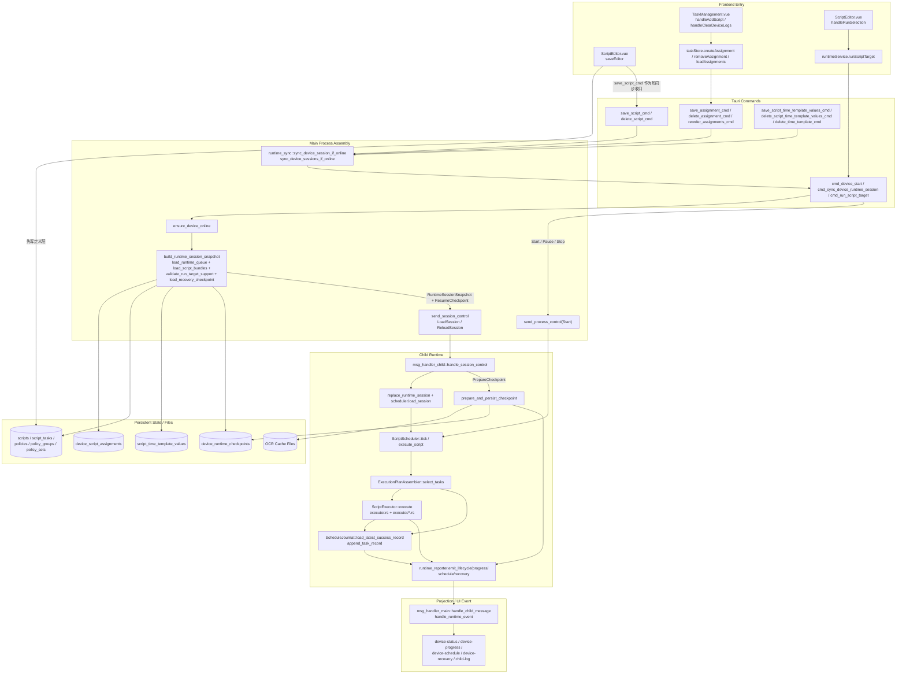
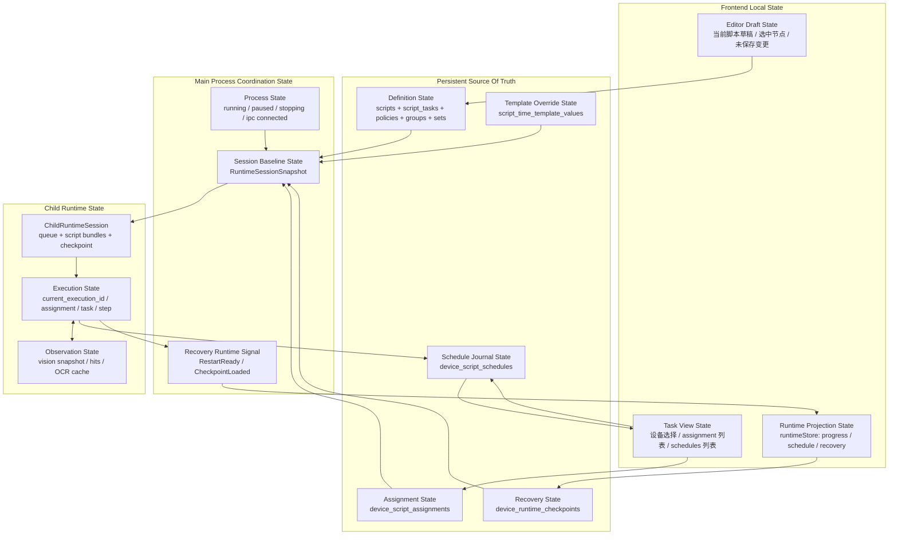
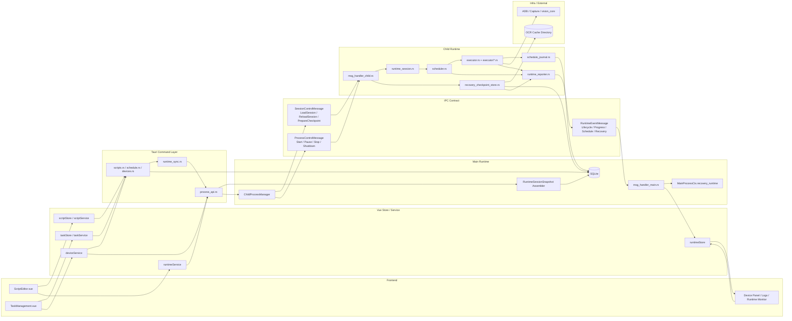

# 脚本执行流架构分析：当前状态图谱

编写日期：2026-04-10

本文只描述“当前代码已经落地的执行流形态”，用于辅助后续脚本执行流程的设计、收口和重构决策，不展开未来理想态改造方案。

## 分析基线

- 前端入口：
  - `src/views/TaskManagement.vue`
  - `src/views/ScriptEditor.vue`
- 前端 service / store：
  - `src/store/task.ts`
  - `src/services/runtimeService.ts`
  - `src/services/deviceService.ts`
- Tauri 命令层：
  - `src-tauri/src/api/domain/schedule.rs`
  - `src-tauri/src/api/domain/scripts.rs`
  - `src-tauri/src/api/infrastructure/process_api.rs`
  - `src-tauri/src/api/infrastructure/runtime_sync.rs`
- child / runtime：
  - `src-tauri/crates/child_support/src/infrastructure/ipc/msg_handler_child.rs`
  - `src-tauri/crates/child_support/src/infrastructure/scripts/scheduler.rs`
  - `src-tauri/crates/child_support/src/infrastructure/scripts/executor.rs`
  - `src-tauri/crates/child_support/src/infrastructure/scripts/executor/*.rs`
  - `src-tauri/crates/child_support/src/infrastructure/ipc/runtime_reporter.rs`
  - `src-tauri/crates/runtime_engine/src/infrastructure/ipc/msg_handler_main.rs`

---

## 图1：当前认知模型图（Current State Model）

本图强调“真实函数链路”和“关键数据对象”。

### 图1解读

- 当前主线已经不是“前端直接向 child 增量塞 queue”，而是“前端改定义或 assignment -> 主进程重装 `RuntimeSessionSnapshot` -> child 整体替换 session”。
- `save_script_cmd` 现在承担了定义层保存后的在线热同步收口职责，避免编辑器并行保存 `tasks / policy / group / set` 时每一步都 reload child。
- `save_script_time_template_values_cmd / delete_script_time_template_values_cmd` 和 `delete_time_template_cmd` 也会触发在线 session 同步，因此模板覆盖值已经进入主链路。
- 运行触发时，主进程的核心边界是 `build_runtime_session_snapshot`；真正向 child 下发的是：
  - `RuntimeSessionSnapshot`
  - 可选 `ResumeCheckpoint`
- child 当前已经能消费 session、上报结构化事件、基于模板覆盖值和最近成功记录跳过 `DeviceQueue` 任务、写调度记录和落最小 checkpoint；但执行器内部仍未完成真正的“完整 step 执行闭环”。
  - 当前更准确的状态是：任务运行主链已接通，编辑器调试运行目标、checkpoint 恢复执行、`PolicyGroup / PolicySet` 运行目标仍未闭环。

---

## 图2：状态模型图（Refactored State Model）

本图只画“当前已经存在并正在工作的状态主体”。

### 图2解读

- 当前真正的持久事实源已经收敛为 5 组：
  - 定义态
  - assignment 态
  - 模板覆盖态
  - 调度记录态
  - checkpoint 态
- 主进程当前最重要的职责不是“保存复杂运行细节”，而是维护：
  - 进程生命周期
  - session 基线
  - recovery 信号
- child 当前同时持有两类状态：
  - `ChildRuntimeSession` 这种会话镜像
  - `RuntimeContext` 里的执行态和观察态
- child 内部已经完成第一轮状态拆分：
  - `Execution State`
  - `Observation State`
- 但执行器主循环还没有围绕这两层状态重新整理，因此这次拆分目前更偏“地基完成”，不是“执行器已经重构完成”。

---

## 图3：架构组织图（Target Architecture）

这里按“当前已落地组织方式”的全局视角绘制，不把未来执行器重写后的理想模块混进来。

### 图3解读

- 当前系统已经形成一个相对明确的分层：
  - UI / Store
  - Tauri Command
  - Main Runtime
  - IPC Contract
  - Child Runtime
  - DB / Cache / Device Adapter
- 当前最值得继续收口的不是主进程外层，而是 child 内层：
  - `scheduler.rs`
  - `executor.rs + executor/*.rs`
  - `RuntimeContext`
- 当前全局视角下，真正的“基线边界”已经比较清楚：
  - DB 中的定义和 assignment 是事实源
  - 主进程负责装配 `RuntimeSessionSnapshot`
  - child 负责消费 session 并产生 runtime event
- 当前全局链路里还没有完成的部分主要集中在执行器内部：
  - checkpoint 驱动的真实恢复执行
  - timeout detector / timeout action
  - `PolicyGroup / PolicySet` 进入真正执行计划
- `DesktopDeviceAdapter` 不在当前版本范围。
  - 当前 desktop 平台仍只用于建模、过滤和分配约束，前后端运行入口继续显式拒绝。

---

## 当前可直接用于决策的结论

- 如果下一步继续做执行流，最稳定的边界仍然是：主进程装配 session，child 只消费 session。
- 如果要继续收定义层热更新，不应再回到旧的增量 queue 命令，而应继续围绕 `sync_device_session_if_online -> cmd_sync_device_runtime_session` 这条链扩展。
- 如果要推进执行闭环，应优先处理 child 内部：
  - `ExecutionPlanAssembler`
  - `ScriptExecutor`
  - `RuntimeContext` 状态分层
- 如果要推进恢复能力，应基于现有 `ResumeCheckpoint + RestartReady + LoadSession(snapshot, checkpoint)` 继续做，不要再重新发明一套恢复协议。
