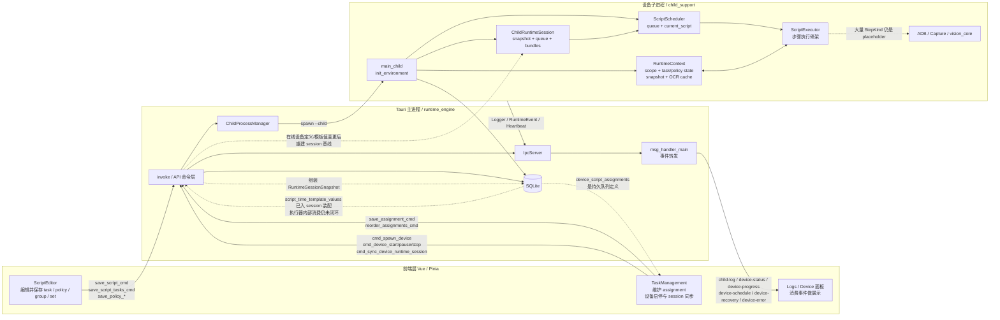
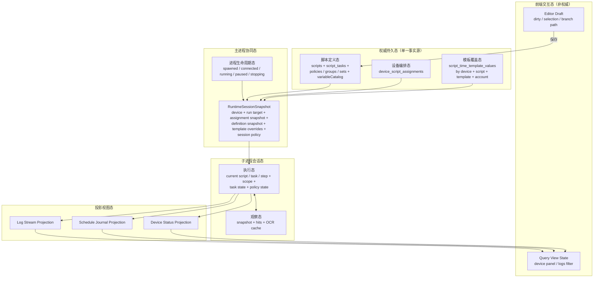
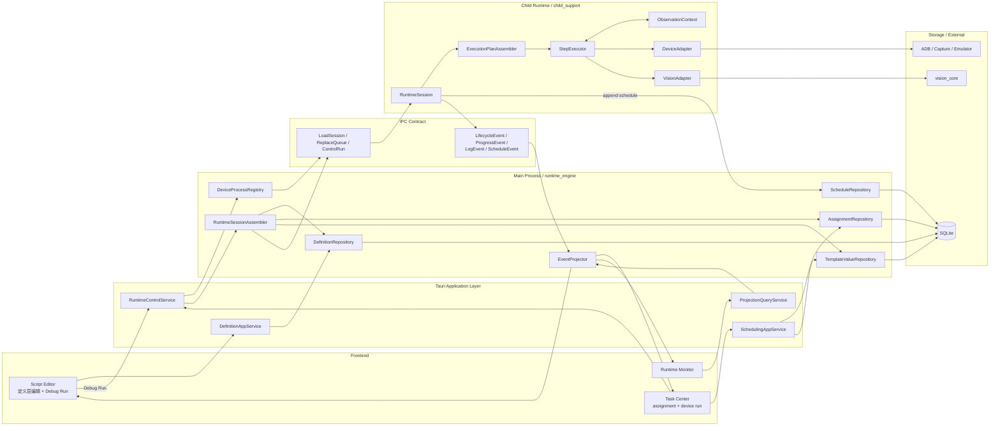

# 脚本执行流架构分析与重构建议

编写日期：2026-04-08

本文面向“脚本执行流程的设计或重构决策”，基于当前仓库里的实际代码和已有文档交叉整理，而不是只沿用旧文档口径。

## 适用范围

- 定义层：`scripts` / `script_tasks` / `policies` / `policy_groups` / `policy_sets`
- 调度层：`device_script_assignments` / `time_templates`
- 运行层：`runtime_engine` / `child_support` / IPC / 子进程
- 观察层：截图、OCR、YOLO、OCR 文字缓存
- 投影层：设备状态、调度记录、日志、前端面板

## 关键判断

- 当前“定义层”已经明显强于旧文档描述。
  - `src/views/ScriptEditor.vue` 已经能编辑并保存 `task / policy / group / set`。
  - 当前“运行所选目标”里，`Task` 已接正式链路，`PolicyGroup / PolicySet` 仍在前后端显式拒绝。
- 当前“执行层”没有真正闭环。
  - `scheduler.execute_script()` 现在已经消费 session bundle 和 schedule journal。
  - 但 `ScriptExecutor` 中大量 `StepKind` 仍是占位逻辑，checkpoint 恢复执行和 timeout detector 也还没进执行循环。
- 当前“会话装配层”已经从旧的增量 queue 同步切到了 session baseline。
  - 主进程会按 `assignment + definitions + template overrides + runtime policy` 装配 `RuntimeSessionSnapshot`。
  - 在线设备的 assignment 变更、执行策略热变更、模板覆盖值保存/删除，已经会走 session reload。
- 当前“定义层热更新”已经有统一收口点，但仍有边界。
  - 编辑器整体验证保存最终会以 `save_script_cmd` 作为在线 session reload 收口点，避免并行保存阶段重复 reload。
  - `delete_script_cmd` 删除脚本时，会依赖数据库级联删除 assignment，再 reload 受影响在线设备的 queue session。
- 当前最主要的结构性问题不是“有没有表”，而是“状态主体没有单一事实源”。
  - `device_script_assignments` 是持久队列定义。
  - 子进程当前执行的是 `ChildRuntimeSession` 镜像。
  - 这两者已经能通过 `cmd_sync_device_runtime_session` 统一重建，但更多定义层变更入口还在继续补齐。
- `script_time_template_values` 已经不再只是空表。
  - 命令层、主进程装配层、设备/账号维度和 legacy fallback 已落地。
  - 当前仍未做完的是：更完整的前端配置入口，以及 child 执行循环里真正消费这些覆盖值。
- `device-status / device-progress / device-schedule / device-recovery` 结构化事件已经形成稳定上报链路。
  - 当前欠缺的不是“有没有状态事件”，而是执行器内部还没把更多真实执行细节稳定映射出来。
- `RuntimeSessionSnapshot` 不应被理解成“全部运行上下文序列化”。
  - 它应该只承载会话基线。
  - 真正的瞬时执行态、视觉快照、scope、task/policy 状态仍应留在 child 内部。
- 断点恢复第一阶段只做“安全点恢复”，不做“精确恢复”。
  - 恢复锚点应以 `assignment/script/task/step` 为主。
  - 删除执行记录时，关联 checkpoint 也应级联删除，避免幽灵恢复。
- 配置需要分三层处理。
  - `BootConfig`：CPU 核心绑定 / ORT 绑核，变更必须重启 child。
  - `SessionPolicy`：OCR 缓存、动作后等待、无有效进展超时、超时行为，跟 session 一起下发。
  - `LiveConfig`：日志级别、ADB 地址等，可单独消息热更新。
- 超时语义不应继续定义成“step timeout”。
  - 对这个项目更实用的模型是“长时间无有效进展超时”。
  - 判定信号应来自页面指纹、操作指纹、OCR 关键文本和任务/步骤游标推进。
- 超时配置应拆成设备级与脚本级两层。
  - 设备级负责：
    - 超时开关
    - 超时时间
    - 通知渠道
    - 超时行为
  - 脚本级只负责：
    - `recovery_task_id`
- `timeout_action` 应作为设备级执行策略，而不是每个脚本单独配置。
- `recovery_task_id` 应作为脚本元数据，由开发者在脚本信息配置里选择。
  - 当前 [ScriptEditor.vue](D:\Database\Project\VisualStudioCode\AutoDaily\src\views\ScriptEditor.vue) 和 [ScriptList.vue](D:\Database\Project\VisualStudioCode\AutoDaily\src\views\ScriptList.vue) 打开的都是同一个 [ScriptInfoDialog.vue](D:\Database\Project\VisualStudioCode\AutoDaily\src\views\script-list\ScriptInfoDialog.vue)。
  - 当前这个共享弹窗已经落了“运行 / 恢复”页签，而不是额外开新入口。
- 这块目前的实际推进顺序已经确定：
  - 先完成 child 执行循环外的合同、配置入口、主进程校验
  - timeout detector 与 timeout action 的真正运行时接入，明确延后到执行器整理之后
  - checkpoint 落库、恢复事件和最小恢复态展示已进入当前代码，不再只是文档设计
- OCR 文字缓存相关能力并不是纯设计项，当前代码已经落地了设置入口和后端配置模型。
  - 前端 `Settings` 与 `settingsStore` 已保存：
    - `ocrTextCacheEnabled`
    - `ocrTextCacheDir`
    - `visionSignatureGridSize`
  - 后端 `VisionTextCacheConfig` / `VisionTextCacheRuntimeConfig` 已支持：
    - 启用开关
    - 缓存目录
    - `signature_grid_size`
  - 当目录留空时，会回退到应用数据目录下的默认 OCR 缓存目录。
- `visionSignatureGridSize` 不只是显示配置。
  - 它已经参与后端视觉签名离散化，用于稳定坐标、布局排序、相对位置判断和重复性签名生成。
  - 这部分是 OCR 缓存命中与“重复页面/重复动作”判定的重要基础，不应在重构中丢失。
- 设备与脚本的“运行平台”约束已进入定义层。
  - `DeviceConfig.platform` 默认 `android`
  - `ScriptInfo.platform` 默认 `android`
  - 任务页追加脚本时，只显示与设备平台匹配的脚本
  - `save_assignment_cmd` 现在也会做最终兜底校验，拒绝跨平台分配
- 当前真正已接适配器的仍只有 Android 执行链。
  - 桌面程序平台字段当前只用于建模、UI 过滤和分配约束
  - 桌面设备适配器仍保留为后续阶段实现

---

## 图1：当前认知模型图（Current State Model）

### 图1解读

- 当前前端到后端的“保存定义层”链路已经可用，且强于旧文档中“编辑器仍是占位页”的说法。
- 当前任务页保存的是 `assignment`，子进程消费的是 `ChildRuntimeSession.queue`；这条链已经改成由主进程统一装配和重建，不再依赖旧的 add/remove 增量命令。
- 当前 child 进程确实已经有完整的启动、IPC、日志、事件和 checkpoint 基础设施，但真正的脚本运行仍停在“会话初始化 + 部分计划执行 + 占位执行器”。
- 当前 `RuntimeContext` 把执行变量、任务状态、策略状态、视觉快照、OCR 缓存都放在一个大上下文里，职责偏宽。
- 当前模板覆盖值、恢复事件和设备级执行策略已经接入主线，但 timeout detector 与 checkpoint 恢复执行仍未进入执行器内部。

---

## 图2：推荐状态模型图（Refactored State Model）

目标不是先改模块名，而是先把“状态主体”划清楚，让每类状态只有一个最合适的归属。

### 推荐划分原则

- 前端只持有交互草稿态和查询视图态，不负责维护子进程真实运行队列。
- SQLite 里的定义态、编排态、模板覆盖态才是权威事实源。
- 主进程不持有复杂执行细节，只负责：
  - 进程生命周期
  - 运行会话快照装配
  - 事件投影
- 主进程还需要负责“是否必须重启 child”的判断。
  - 例如 CPU 核心绑定变化，不走热更新，而是先重启再同步 session。
- 主进程还应主导 checkpoint 重启流程。
  - 先让 child 落最小恢复信息，再关闭并重启 child。
  - 这条链路目前已落到“child 可写 checkpoint、主进程可重新装填 checkpoint”，并且在线设备保存配置时，`cores` 变更已经会先等 `RestartReady` 再重启 child。
  - child 现在也会显式投递 `device-recovery(RestartReady)`，主进程已有统一重启命令。
  - checkpoint 更新时间轮询目前只保留为兜底，不再是主等待路径。
  - 仍未做完的是把这条统一重启编排扩展到更多入口，以及 child 实际按 checkpoint 恢复执行。
- 子进程只持有“单设备、单次会话”的执行态和观察态。
- 视觉缓存属于观察态，不应该继续和脚本定义、任务编排混在一起。

---

## 图3：目标架构组织图（Target Architecture）

推荐采用“主进程装配会话快照，子进程执行会话基线并维护瞬时态”的组织方式。这样可以把 DB 结构变化、UI 编辑变化、运行时执行变化隔离开。

### 目标架构的核心收益

- `assignment` 不再靠 UI 增量命令去“碰运气同步” child queue，而是通过 `RuntimeSessionSnapshot` 统一装载。
- 编辑器调试运行和任务页正式运行在 `Task / FullScript / DeviceQueue` 上已经共用同一条“会话装配 -> 计划生成 -> 执行”主链路。
- `PolicyGroup / PolicySet` 当前仍停在外层显式拒绝，尚未进入真正执行计划。
- child 进程不再直接背负太多“表结构认知”，它主要消费会话快照和执行契约。
- `RuntimeSessionSnapshot` 只负责“基线输入”，不会替代 child 内部的瞬时执行态。
- 设备性能相关配置可以和 child 生命周期对齐：
  - 可热更新的放入 session policy 或 live config
  - 不可热更新的（如绑核）由主进程判定后重启 child
- 事件模型会更稳定：
  - 生命周期事件
  - 进度事件
  - 调度记录事件
  - 日志事件
- 前端看到的是投影态，不再把运行事实判断压在零散的事件监听和本地推断上。

### 超时与恢复策略的高层结论

- timeout 采用“无有效进展”模型，而不是“单步骤执行时长”模型。
- `timeout_action` 是设备级单选策略，建议收敛为：
  - `NotifyOnly`
  - `PauseExecution`
  - `StopExecution`
  - `RestartApp`
  - `RunRecoveryTask`
  - `SkipCurrentTask`
- 通知渠道应支持多选，而不是单选枚举。
  - 至少包括：
    - `SystemNotification`
    - `Email`
- `RunRecoveryTask` 不应要求所有脚本都强制配置恢复任务。
  - 只有当设备策略选择了 `RunRecoveryTask` 时，当前运行脚本才必须已配置 `recovery_task_id`。
- 恢复任务仍然就是普通 `Task`。
  - 真正的“重启应用后启动、登录、回到目标页”流程，仍交给脚本任务编排处理，而不是硬编码进引擎。
- timeout detector 与行为执行应挂在 child 的运行循环里。
  - 它不属于前端，也不应作为每个 step 的独立 DSL 配置。
  - 更准确的落点是 `scheduler / executor / action_wait / observation refresh` 这些执行节点。

---

## 当前建议的剩余重构顺序

1. 继续收尾会话快照链。
   - `RuntimeSessionSnapshot`、编辑器 `Task` 运行入口、assignment/session sync、模板值装配都已经落地。
   - 当前剩余的是更多定义层变更入口的在线 reload 收口，以及更统一的主进程协同服务整理。

2. 把当前 `RuntimeContext` 拆成三块。
   - `ExecutionState`
   - `ObservationContext`
   - `DeviceExecutionContext`

3. 打通真正的执行闭环。
   - `SessionLoader`
   - `ExecutionPlanAssembler`
   - `StepExecutor`
   - `ScheduleJournal`

4. 在执行器整理后，再接 timeout detector 与 checkpoint 恢复执行。
   - timeout/action 当前只完成了合同、配置入口和主进程校验。
   - checkpoint 当前只完成了落库、重启编排和最小恢复态展示。

5. 最后补 `PolicyGroup / PolicySet` 的真正执行计划。
   - 当前这两个目标仍然停在前后端显式拒绝，不要误判成已支持。

---

## 当前最值得优先修复的 5 个点

- `execute_script()` 还没有把 `script_tasks -> execution plan -> executor` 完整串起来。
- timeout detector 与 timeout action 还没有真正接进 child 执行循环。
- checkpoint 还没有驱动真实的 task/step 安全点恢复执行。
- `PolicyGroup / PolicySet` 还没有进入真正执行计划。
- `RuntimeContext` 仍然过宽，后续越写越容易把状态继续堆进去。

## 对设计决策的直接结论

- 如果现在要继续做“脚本执行流程”，优先级不应再放在 UI 微调，而应放在“会话快照 + 状态分层 + 执行闭环”。
- 如果现在要继续做“编辑器运行”，不应直接从编辑器页面临时拼 IPC 命令，而应先把正式运行链路抽成统一服务。
- 如果现在要继续做“任务页状态展示”，不应继续靠前端猜状态，而应先把 child 侧结构化状态上报补齐。
