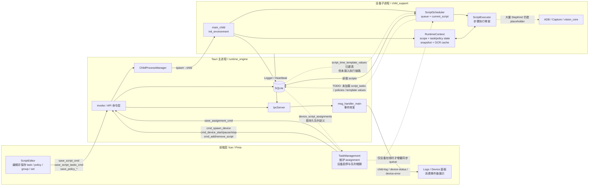
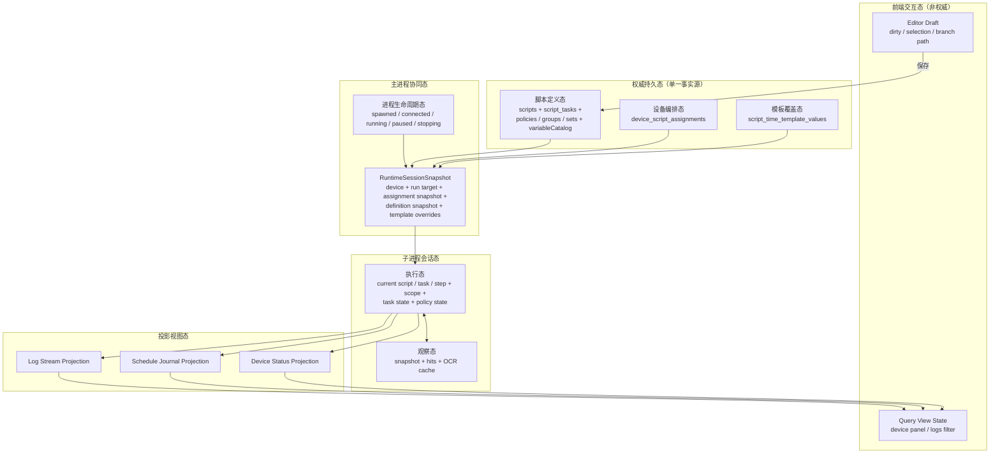
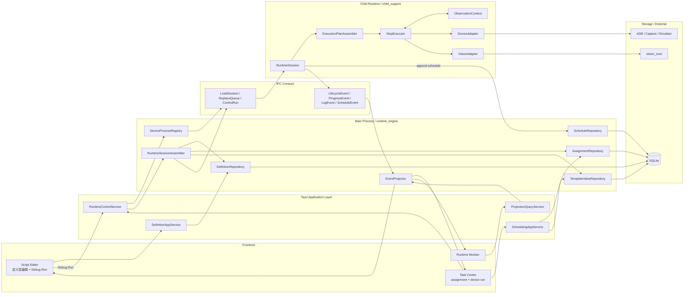

# 脚本执行流架构分析与重构建议

编写日期：2026-04-08

本文面向“脚本执行流程的设计或重构决策”，基于当前仓库里的实际代码和已有文档交叉整理，而不是只沿用旧文档口径。

## 适用范围

- 定义层：`scripts` / `script_tasks` / `policies` / `policy_groups` / `policy_sets`
- 调度层：`device_script_assignments` / `time_templates`
- 运行层：`runtime_engine` / `child_support` / IPC / 子进程
- 观察层：截图、OCR、YOLO、OCR 文字缓存
- 投影层：设备状态、调度记录、日志、前端面板

## 关键判断

- 当前“定义层”已经明显强于旧文档描述。
  - `src/views/ScriptEditor.vue` 已经能编辑并保存 `task / policy / group / set`，只是“运行所选目标”仍是占位入口。
- 当前“执行层”没有真正闭环。
  - `scheduler.execute_script()` 只加载了 `scripts` 基础信息，还没有加载 `script_tasks / policy topology / template values / schedule journal`。
  - `ScriptExecutor` 中大量 `StepKind` 仍是占位逻辑。
- 当前最主要的结构性问题不是“有没有表”，而是“状态主体没有单一事实源”。
  - `device_script_assignments` 是持久队列定义。
  - 子进程 `ScriptScheduler.queue` 是运行时队列镜像。
  - 这两者目前只在“设备已在线时增量 add/remove”场景下局部同步，离线后重启并不会自动重建运行队列。
- `script_time_template_values` 表和领域模型已经存在，但没有命令层、会话装载层、执行层读取路径。
- `StatusReport` 消息模型已经定义，主进程转发逻辑也在，但 child 侧当前没有形成稳定状态上报，因此“设备状态展示”还不是真正的权威运行状态。

---

## 图1：当前认知模型图（Current State Model）

### 图1解读

- 当前前端到后端的“保存定义层”链路已经可用，且强于旧文档中“编辑器仍是占位页”的说法。
- 当前任务页保存的是 `assignment`，但子进程真正执行的是 `ScriptScheduler.queue`，这导致“持久配置”和“运行镜像”分离。
- 当前 child 进程确实已经有完整的启动、IPC、日志、心跳基础设施，但真正的脚本运行只走到了“会话初始化 + 占位执行器”。
- 当前 `RuntimeContext` 把执行变量、任务状态、策略状态、视觉快照、OCR 缓存都放在一个大上下文里，职责偏宽。

---

## 图2：推荐状态模型图（Refactored State Model）

目标不是先改模块名，而是先把“状态主体”划清楚，让每类状态只有一个最合适的归属。

### 推荐划分原则

- 前端只持有交互草稿态和查询视图态，不负责维护子进程真实运行队列。
- SQLite 里的定义态、编排态、模板覆盖态才是权威事实源。
- 主进程不持有复杂执行细节，只负责：
  - 进程生命周期
  - 运行会话快照装配
  - 事件投影
- 子进程只持有“单设备、单次会话”的执行态和观察态。
- 视觉缓存属于观察态，不应该继续和脚本定义、任务编排混在一起。

---

## 图3：目标架构组织图（Target Architecture）

推荐采用“主进程装配会话快照，子进程只执行快照”的组织方式。这样可以把 DB 结构变化、UI 编辑变化、运行时执行变化隔离开。

### 目标架构的核心收益

- `assignment` 不再靠 UI 增量命令去“碰运气同步” child queue，而是通过 `RuntimeSessionSnapshot` 统一装载。
- 编辑器调试运行和任务页正式运行共用同一条“会话装配 -> 计划生成 -> 执行”主链路，不再分成两套逻辑。
- child 进程不再直接背负太多“表结构认知”，它主要消费会话快照和执行契约。
- 事件模型会更稳定：
  - 生命周期事件
  - 进度事件
  - 调度记录事件
  - 日志事件
- 前端看到的是投影态，不再把运行事实判断压在零散的事件监听和本地推断上。

---

## 建议的最小重构顺序

1. 先建立 `RuntimeSessionSnapshot`。
   - 至少包含：`device`、`run target`、`assignment snapshot`、`script definitions`、`template overrides`。
   - 设备启动或 assignment 变化时，都用快照重建 child 侧运行镜像。

2. 把当前 `RuntimeContext` 拆成三块。
   - `ExecutionState`
   - `ObservationContext`
   - `DeviceExecutionContext`

3. 打通真正的执行闭环。
   - `SessionLoader`
   - `ExecutionPlanAssembler`
   - `StepExecutor`
   - `ScheduleJournal`

4. 补齐 child -> main 的结构化事件。
   - 当前日志链路可复用。
   - 需要新增稳定的生命周期 / 进度 / 调度记录事件，替代“只改本地 running status 却不上报”的状态黑箱。

5. 最后再接编辑器运行入口。
   - `ScriptEditor` 顶部“运行”按钮不应单独设计一套运行链路。
   - 它应该只是指定 `RunTarget` 后走同一套 `RuntimeControlService`。

---

## 当前最值得优先修复的 5 个点

- `assignment` 与 child `queue` 没有统一事实源。
- `script_time_template_values` 只有表，没有命令和运行装载路径。
- `StatusReport` 通道有定义但没有稳定发送方。
- `execute_script()` 还没有把 `script_tasks -> execution plan -> executor` 串起来。
- `RuntimeContext` 过宽，后续越写越容易把状态继续堆进去。

## 对设计决策的直接结论

- 如果现在要继续做“脚本执行流程”，优先级不应再放在 UI 微调，而应放在“会话快照 + 状态分层 + 执行闭环”。
- 如果现在要继续做“编辑器运行”，不应直接从编辑器页面临时拼 IPC 命令，而应先把正式运行链路抽成统一服务。
- 如果现在要继续做“任务页状态展示”，不应继续靠前端猜状态，而应先把 child 侧结构化状态上报补齐。
