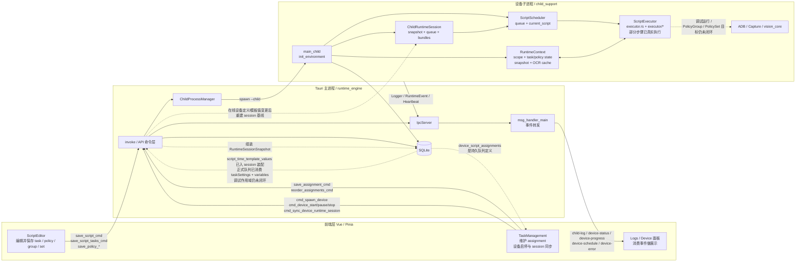
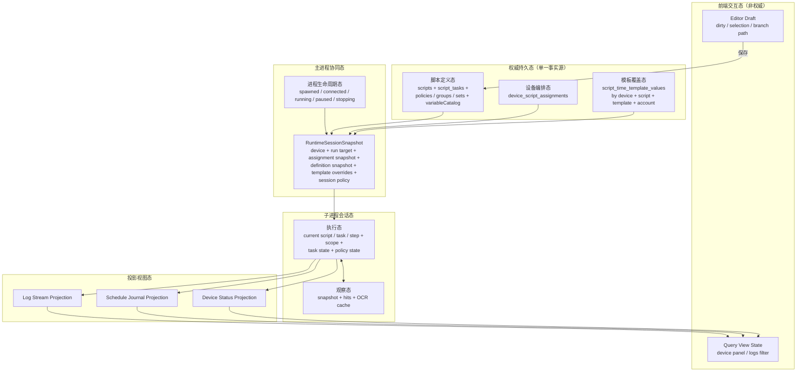
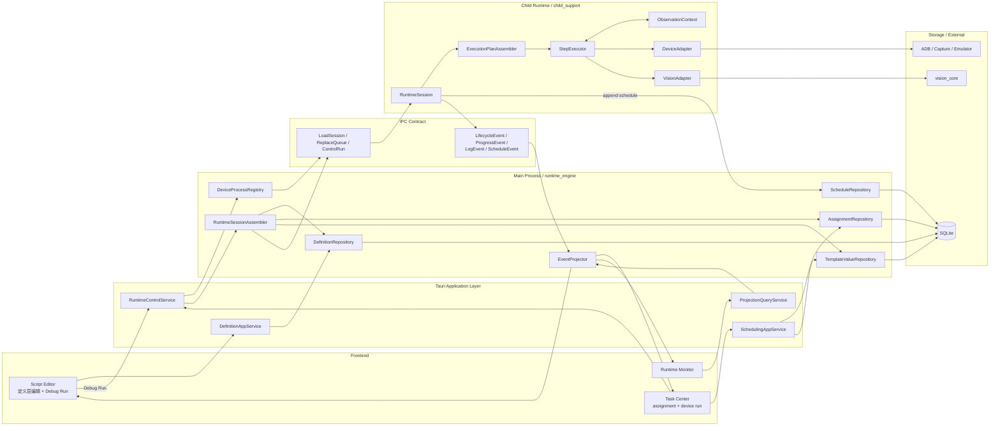

# 脚本执行流架构分析与重构建议

编写日期：2026-04-08

本文面向“脚本执行流程的设计或重构决策”，基于当前仓库里的实际代码和已有文档交叉整理，而不是只沿用旧文档口径。

## 2026-04-17 更新

本轮已确认并落地以下收敛结论：

- 删除“checkpoint / 恢复执行”设计目标
- 删除对应代码链路：
  - `ResumeCheckpoint`
  - `PrepareCheckpoint`
  - `device-recovery`
  - child / main 的 checkpoint 装填与恢复编排
- 临时运行语义改为：
  - 若设备当前正在执行，则先确认并暂停
  - 之后直接切换到临时 `FullScript / Task`
  - 不再等待安全点或恢复点
- “任务中途中断后怎么继续”回到调度记录语义：
  - 没有成功调度记录，就按完整任务重新执行
- 保留 `RunRecoveryTask + recovery_task_id`
  - 它只表示超时动作落到某个普通任务
  - 不再代表通用恢复执行协议

## 适用范围

- 定义层：`scripts` / `script_tasks` / `policies` / `policy_groups` / `policy_sets`
- 调度层：`device_script_assignments` / `time_templates`
- 运行层：`runtime_engine` / `child_support` / IPC / 子进程
- 观察层：截图、OCR、YOLO、OCR 文字缓存
- 投影层：设备状态、调度记录、日志、前端面板

## 关键判断

- 当前“定义层”已经明显强于旧文档描述。
  - `src/views/ScriptEditor.vue` 已经能编辑并保存 `task / policy / group / set`。
  - 当前“运行所选目标”里，`Task / Policy / PolicyGroup / PolicySet` 都已进入调试运行主链。
- 当前“执行层”已经从纯骨架进入半闭环，但还没有真正收口。
  - `scheduler.execute_script()` 现在已经消费 session bundle 和 schedule journal。
  - `ScriptExecutor` 已拆成 `executor.rs` + `executor/action.rs` / `executor/flow.rs` / `executor/policy.rs` / `executor/runtime.rs`，真实动作、部分流程节点和策略执行已接入主链。
- 当前仍未完成的是：完整 timeout / notify 闭环、更完整的前进证据采集，以及更完整的调试 scope 语义。
- 当前“会话装配层”已经从旧的增量 queue 同步切到了 session baseline。
  - 主进程会按 `assignment + definitions + template overrides + runtime policy` 装配 `RuntimeSessionSnapshot`。
  - 在线设备的 assignment 变更、执行策略热变更、模板覆盖值保存/删除，已经会走 session reload。
- 当前“定义层热更新”已经有统一收口点，但仍有边界。
  - 编辑器整体验证保存最终会以 `save_script_cmd` 作为在线 session reload 收口点，避免并行保存阶段重复 reload。
  - `delete_script_cmd` 删除脚本时，会依赖数据库级联删除 assignment，再 reload 受影响在线设备的 queue session。
- 当前最主要的结构性问题不是“有没有表”，而是“状态主体没有单一事实源”。
  - `device_script_assignments` 是持久队列定义。
  - 子进程当前执行的是 `ChildRuntimeSession` 镜像。
  - 这两者已经能通过 `cmd_sync_device_runtime_session` 统一重建，但更多定义层变更入口还在继续补齐。
- `script_time_template_values` 已经不再只是空表。
  - 命令层、主进程装配层、设备/账号维度和 legacy fallback 已落地。
  - `DeviceQueue` 正式运行已经真实消费：
    - `taskSettings.enabled / taskSettings.taskCycle`
    - `variables`
  - 当前仍未做完的是：更完整的前端配置入口，以及调试运行目标的完整模板/账号作用域语义。
- `device-status / device-progress / device-schedule / device-recovery` 结构化事件已经形成稳定上报链路。
  - 当前稳定链路收敛为 `device-status / device-progress / device-schedule`。
  - 当前欠缺的不是“有没有状态事件”，而是执行器内部还没把更多真实执行细节稳定映射出来。
- `RuntimeSessionSnapshot` 不应被理解成“全部运行上下文序列化”。
  - 它应该只承载会话基线。
  - 真正的瞬时执行态、视觉快照、scope、task/policy 状态仍应留在 child 内部。
- 配置需要分三层处理。
  - `BootConfig`：CPU 核心绑定 / ORT 绑核，变更必须重启 child。
  - `SessionPolicy`：OCR 缓存、动作后等待、无有效进展超时、超时行为，跟 session 一起下发。
  - `LiveConfig`：日志级别、ADB 地址等，可单独消息热更新。
- 超时语义不应继续定义成“step timeout”。
  - 对这个项目更实用的模型是“长时间无有效进展超时”。
  - 判定信号应来自页面指纹、操作指纹、OCR 关键文本和任务/步骤游标推进。
- 超时配置应拆成设备级与脚本级两层。
  - 设备级负责：
    - 超时开关
    - 超时时间
    - 通知渠道
    - 超时行为
  - 脚本级只负责：
    - `recovery_task_id`
- `timeout_action` 应作为设备级执行策略，而不是每个脚本单独配置。
- `recovery_task_id` 应作为脚本元数据，由开发者在脚本信息配置里选择。
  - 当前 [ScriptEditor.vue](D:\Database\Project\VisualStudioCode\AutoDaily\src\views\ScriptEditor.vue) 和 [ScriptList.vue](D:\Database\Project\VisualStudioCode\AutoDaily\src\views\ScriptList.vue) 打开的都是同一个 [ScriptInfoDialog.vue](D:\Database\Project\VisualStudioCode\AutoDaily\src\views\script-list\ScriptInfoDialog.vue)。
  - 当前这个共享弹窗已经落了“运行 / 恢复”页签，而不是额外开新入口。
- 这块目前的实际推进顺序已经确定：
  - 先完成 child 执行循环外的合同、配置入口、主进程校验
  - timeout detector 与 timeout action 已在执行器整理后接入 child 主链，当前转入 detector 深化与剩余节点补齐
- OCR 文字缓存相关能力并不是纯设计项，当前代码已经落地了设置入口和后端配置模型。
  - 前端 `Settings` 与 `settingsStore` 已保存：
    - `ocrTextCacheEnabled`
    - `ocrTextCacheDir`
    - `visionSignatureGridSize`
  - 后端 `VisionTextCacheConfig` / `VisionTextCacheRuntimeConfig` 已支持：
    - 启用开关
    - 缓存目录
    - `signature_grid_size`
  - 当目录留空时，会回退到应用数据目录下的默认 OCR 缓存目录。
- `visionSignatureGridSize` 不只是显示配置。
  - 它已经参与后端视觉签名离散化，用于稳定坐标、布局排序、相对位置判断和重复性签名生成。
  - 这部分是 OCR 缓存命中与“重复页面/重复动作”判定的重要基础，不应在重构中丢失。
- 设备与脚本的“运行平台”约束已进入定义层。
  - `DeviceConfig.platform` 默认 `android`
  - `ScriptInfo.platform` 默认 `android`
  - 任务页追加脚本时，只显示与设备平台匹配的脚本
  - `save_assignment_cmd` 现在也会做最终兜底校验，拒绝跨平台分配
- 当前真正已接适配器的仍只有 Android 执行链。
  - 桌面程序平台字段当前只用于建模、UI 过滤和分配约束
  - `DesktopDeviceAdapter` 仅作为后续版本设计记录保留，不纳入当前版本待办
  - 当前版本在前端运行入口和后端运行控制入口都会直接拒绝 desktop 设备启动与调试运行
  - 这样可以避免把“尚未实现的 DesktopAdapter”误暴露成可运行能力

---

## 图1：当前认知模型图（Current State Model）

### 图1解读

- 当前前端到后端的“保存定义层”链路已经可用，且强于旧文档中“编辑器仍是占位页”的说法。
- 当前任务页保存的是 `assignment`，子进程消费的是 `ChildRuntimeSession.queue`；这条链已经改成由主进程统一装配和重建，不再依赖旧的 add/remove 增量命令。
- 当前 child 进程确实已经有完整的启动、IPC、日志、事件基础设施，但真正的脚本运行仍停在“会话初始化 + 部分计划执行 + 半闭环执行器”。
- 当前 `RuntimeContext` 把执行变量、任务状态、策略状态、视觉快照、OCR 缓存都放在一个大上下文里，职责偏宽。
- 当前模板覆盖值和设备级执行策略已经接入主线。
  - timeout detector 与 timeout action 已进入 `ScriptExecutor` 的动作后链路。
  - 当前仍未进入闭环的是：更完整的前进证据采集，以及 timeout 结果投影收口。

---

## 图2：推荐状态模型图（Refactored State Model）

目标不是先改模块名，而是先把“状态主体”划清楚，让每类状态只有一个最合适的归属。

### 推荐划分原则

- 前端只持有交互草稿态和查询视图态，不负责维护子进程真实运行队列。
- SQLite 里的定义态、编排态、模板覆盖态才是权威事实源。
- 主进程不持有复杂执行细节，只负责：
  - 进程生命周期
  - 运行会话快照装配
  - 事件投影
- 主进程还需要负责“是否必须重启 child”的判断。
  - 例如 CPU 核心绑定变化，不走热更新，而是先重启再同步 session。
- 主进程仍应主导 child 重启流程。
  - 但当前已经明确不再走 checkpoint 安全点协议。
  - `cmd_restart_device_runtime` 现在是“停 child -> 拉起 child -> 重新装填 `DeviceQueue` session”的普通重启。
- 子进程只持有“单设备、单次会话”的执行态和观察态。
- 视觉缓存属于观察态，不应该继续和脚本定义、任务编排混在一起。

---

## 图3：目标架构组织图（Target Architecture）

推荐采用“主进程装配会话快照，子进程执行会话基线并维护瞬时态”的组织方式。这样可以把 DB 结构变化、UI 编辑变化、运行时执行变化隔离开。

### 目标架构的核心收益

- `assignment` 不再靠 UI 增量命令去“碰运气同步” child queue，而是通过 `RuntimeSessionSnapshot` 统一装载。
- 编辑器调试运行和任务页正式运行在 `DeviceQueue / FullScript / Task / PolicyGroup / PolicySet / Policy` 上已经共用同一条“会话装配 -> 计划生成 -> 执行”主链路。
- `PolicyGroup / PolicySet / Policy` 当前已进入 child 内的策略调试分支，而不是再停在外层显式拒绝。
- child 进程不再直接背负太多“表结构认知”，它主要消费会话快照和执行契约。
- `RuntimeSessionSnapshot` 只负责“基线输入”，不会替代 child 内部的瞬时执行态。
- 设备性能相关配置可以和 child 生命周期对齐：
  - 可热更新的放入 session policy 或 live config
  - 不可热更新的（如绑核）由主进程判定后重启 child
- 事件模型会更稳定：
  - 生命周期事件
  - 进度事件
  - 调度记录事件
  - 日志事件
- 前端看到的是投影态，不再把运行事实判断压在零散的事件监听和本地推断上。

### 超时与恢复策略的高层结论

- timeout 采用“无有效进展”模型，而不是“单步骤执行时长”模型。
- `timeout_action` 是设备级单选策略，建议收敛为：
  - `NotifyOnly`
  - `PauseExecution`
  - `StopExecution`
  - `RestartApp`
  - `RunRecoveryTask`
  - `SkipCurrentTask`
- 通知渠道应支持多选，而不是单选枚举。
  - 至少包括：
    - `SystemNotification`
    - `Email`
- `RunRecoveryTask` 不应要求所有脚本都强制配置恢复任务。
  - 只有当设备策略选择了 `RunRecoveryTask` 时，当前运行脚本才必须已配置 `recovery_task_id`。
- 恢复任务仍然就是普通 `Task`。
  - 真正的“重启应用后启动、登录、回到目标页”流程，仍交给脚本任务编排处理，而不是硬编码进引擎。
- timeout detector 与行为执行应挂在 child 的运行循环里。
  - 它不属于前端，也不应作为每个 step 的独立 DSL 配置。
  - 更准确的落点是 `scheduler / executor / action_wait / observation refresh` 这些执行节点。

---

## 当前建议的剩余重构顺序

1. 继续收尾会话快照链。
   - `RuntimeSessionSnapshot`、编辑器 `Task` 运行入口、assignment/session sync、模板值装配都已经落地。
   - 当前剩余的是更多定义层变更入口的在线 reload 收口，以及更统一的主进程协同服务整理。

2. 把当前 `RuntimeContext` 拆成三块。
   - `ExecutionState`
   - `ObservationContext`
   - `DeviceExecutionContext`

3. 打通真正的执行闭环。
   - `SessionLoader`
   - `ExecutionPlanAssembler`
   - `StepExecutor`
   - `ScheduleJournal`

4. 在执行器整理后，继续收口 timeout detector。
   - timeout/action 已经接入 child 动作后链路，并扩展到 `WaitMs / While / ForEach / HandlePolicySet / HandlePolicy`。

5. 最后继续补调试目标与正式运行的语义整理。
   - `PolicyGroup / PolicySet / Policy` 已能调试执行，但它们仍不是 `DeviceQueue` 的正式任务计划节点。

## 当前偏离目标的内容

- `ScriptExecutor` 本身已经不再是“明显偏离目标的占位骨架”。
  - 拆分后的 `executor.rs + executor/*` 已经承接真实动作、流程节点、策略执行和 timeout 动作后 hook。
  - 当前真正偏离目标的重点，已经从“执行器是否存在”转移到“执行计划和运行语义是否完整”。
- 主进程只是在语义上形成了“会话装配入口”，还没有真正沉淀成文档目标里的 `RuntimeControlService / Repository / SessionAssembler / EventProjector` 分层。
  - 当前 `process_api.rs` 仍同时承担查库、组装 session、运行目标校验、child 重启编排和 IPC 下发。
- 编辑器调试运行和任务页正式运行已经共用同一条 `LoadSession -> Start -> scheduler.execute_script -> ScriptExecutor` 主链。
  - 当前偏离目标的点不在“有没有真实执行”，而在“调试目标的统一 scope 装配还没补齐”。
  - `DeviceQueue` 正式运行已经会把 queue item 上的 `template_values_json` 用到：
    - `ExecutionPlanAssembler` 的 `taskSettings.enabled / taskSettings.taskCycle`
    - `ScriptExecutor` 的输入变量装配
  - 当前非 `DeviceQueue` 目标装配的是临时 `RuntimeQueueItem`，`time_template_id / account_id / account_data_json` 仍为空；`build_debug_template_values_json()` 当前只注入 `everyRun` 的 task-cycle 覆盖，不等于完整模板/账号作用域。
- `RunTarget` 名义上已经统一，但语义仍分两层：
  - `DeviceQueue` 是正式运行目标；
  - `FullScript / Task / PolicyGroup / PolicySet / Policy` 是调试运行目标。
- `ExecutionPlanAssembler` 已经从“任务过滤器”收口到执行计划装配层，但还不是最终形态的完整运行前决策层。
  - 当前已直接输出：
    - `ExecutionPlan::DeviceQueue(TaskSelection)`
    - `ExecutionPlan::FullScript(TaskSelection)`
    - `ExecutionPlan::Task(TaskSelection)`
    - `ExecutionPlan::PolicyDebug`
  - 当前已在装配期收口：
    - 模板值里的 `taskSettings.enabled / taskSettings.taskCycle`
    - `DeviceQueue` 下基于 `task_cycle + 最近一次 Success 调度记录` 的装配期跳过判定
    - `PlannedTask / SkippedTask.record_schedule`
    - `ExecutionPlanSummary`
  - `scheduler` 已不再单独推导 plan mode，也不再重复计算 `record_schedule`。
  - 当前边界需要明确区分：
    - 装配期跳过：
      - 只由 `ExecutionPlanAssembler` 处理；
      - 只发生在 `DeviceQueue + task.record_schedule = true`；
      - 当前补跑/跳过规则也只等价于“比较 task cycle 和最近一次成功调度记录”。
    - 执行期跳过：
      - 不属于 `ExecutionPlanAssembler`；
      - `SetState(... Skip=true)` 命中时，由运行时 `task_states.skip_flag` 生效；
      - timeout 选择 `SkipCurrentTask` 时，也是在执行期把当前任务标记为 skip。
    - 调试运行 / 临时运行：
      - `FullScript / Task / PolicyGroup / PolicySet / Policy` 都不参与调度记录比对；
      - 非 `DeviceQueue` 目标当前只强制注入 `everyRun` 的 task-cycle 覆盖，不做正式调度跳过判定。
  - `RunRecoveryTask` 也不是 planner 注入行为：
    - 当前仍是 timeout 的运行时控制流分支；
    - 通过脚本级 `recovery_task_id` 落到普通 `Task`，不经 `ExecutionPlanAssembler` 预插入任务。
- `ScriptExecutor` 的几处关键运行语义已经按当前目标收口，不再停留在“兼容空操作”。
  - `AddPolicies` 已落成“运行时策略集合 overlay”：
    - 当前会把 `source` 追加到 `target` 的运行时策略集合关系里；
    - 只影响 child 当前 session 的 `ExecutionState.policy_set_overlays`，不改数据库里的 `policy_set` / `group` 关系。
  - `GetState(step)` 已从步骤执行模型中删除：
    - 状态匹配统一收敛到 `ConditionNode::TaskStatus`；
    - 条件节点复用的载体只保留 `TaskControl::SetState` 的 `target + status` 描述。
  - `ExecNumCompare` 已按当前目标接入：
    - 条件节点已经是 `ExecNumCompare { target, op }`；
    - 当前支持 `Eq / Ne / Lt / Le / Gt / Ge`；
    - 比较对象只保留 `Task / Policy`；
    - 比较值统一定义为“运行时 `exec_cur`”与“定义层 `exec_max`”；
    - `exec_max = 0` 视为无限次。
  - 当前执行次数模型已经完成第一轮收敛：
    - 已去掉 `Step.exec_cur / Step.exec_max`
    - 已去掉 `StepKind::FlowControl` 上的次数字段
    - `StepKind::Action` 只保留定义层 `exec_max`
    - `PolicyInfo` 只保留定义层 `exec_max`
    - `ScriptTaskTable` 已新增 `exec_max`
    - 运行时 `exec_cur` 只保留在：
      - `ExecutionState.action_states`
      - `ExecutionState.task_states`
      - `ExecutionState.policy_states`
    - `Action` 在执行成功且最终返回 `ControlFlow::Next` 时累加运行时 `exec_cur`
    - `Task` 在调度层认定成功且未被 skip 时累加运行时 `exec_cur`
    - `Policy` 在命中成功时累加运行时 `exec_cur`
  - `ColorCompare` 当前还停在条件节点占位，但方向已经明确：
    - 先从条件节点移出，改为数据处理/过滤能力；
    - 需要至少补 `input_var / out_var`；
    - 本轮先不实现颜色采样与比较细节，后续单独设计。
- timeout 现在已经进入执行器动作后 hook，并且会直接触发 `NotifyOnly / SkipCurrentTask / RunRecoveryTask / PauseExecution / StopExecution / RestartApp`。
  - `SystemNotification / Email` 通知链已经接通。
  - 前进证据采集已经扩展到 `WaitMs / While / ForEach / HandlePolicySet / HandlePolicy` 与策略调试候选扫描链路。
  - 当前还没有发展成完整 detector 的部分是：剩余非动作路径的观测链和更完整的前端结果投影。
  - 当前没有充分覆盖的场景包括：
    - 长时间卡在条件求值、数据处理等纯计算节点里，但期间没有新的 action 或已接入的流程节点
    - 卡在动作前准备、恢复装填或首次观测分析阶段
    - `task / step` 进入等非动作型推进信号还没有统一纳入 detector
- 编辑器调试运行现在已经进入正式主链。
  - `cmd_run_script_target` 会走 `LoadSession -> Start -> scheduler.execute_script`
  - `FullScript / Task / PolicyGroup / PolicySet / Policy` 都属于这里的调试运行目标
  - 非 `DeviceQueue` 运行目标会注入 `everyRun` 的 task-cycle 覆盖
  - 非 `DeviceQueue` 运行目标不写调度记录，只保留运行日志与 runtime event
  - `FullScript / Task` 调试运行当前已经会装填输入变量：
    - 优先取 `template_values_json.variables`
    - 否则回退到当前任务的 `task.data.variables`
    - 再否则回退到 `variableCatalog.defaultValue`
  - `Policy / PolicyGroup / PolicySet` 调试运行当前仍不自动装填 task 级 UI 输入值：
    - 这类目标当前调用 `hydrate_input_scope(..., task=None)`
    - `owner_task_id != null` 的 input 变量不会进入调试 scope
    - 取不到值时仅输出 `【调试】未取到目标值`
    - 当前版本保持这条边界，不自动猜测“应绑定哪个 task”
  - `Policy / PolicyGroup / PolicySet` 额外会输出截图后的 DET/OCR 摘要、策略命中结果和 action trace 到控制台日志
- 任务管理页现在开始区分“正式运行”和“临时运行”。
  - `运行队列` 继续走 `cmd_device_start -> DeviceQueue`
  - `临时运行脚本 / 临时运行任务` 走 `cmd_run_script_target -> FullScript / Task`
  - 临时运行不会改数据库里的 assignment 队列定义，只是临时重装当前 runtime session
  - 设备已在运行时，前端会先确认并暂停当前运行，再切换到临时目标
  - 临时运行仍强制 `everyRun`，不写正式调度记录，但保留运行日志与 runtime event
  - 在线定义变更当前统一通过 session reload 生效：
    - 编辑器整体验证保存最终会落到 `save_script_cmd -> sync_device_sessions_if_online -> ReloadSession`
    - `script_time_template_values` 保存/删除也会走同一条在线 session reload
  - 当前 reload 的实际边界是：
    - 已开始执行的当前 task 不会在中途被热替换成新定义；
    - `scheduler.execute_script()` 在开始时已经把当前 script bundle 解析进本地执行上下文，当前 task 会继续按旧 bundle 跑完；
    - reload 主要影响后续 pending queue、下一次 task 选择、下一轮脚本执行，以及之后重新装填的输入变量。
  - 因此，后续把前端 UI 设置值完整收口到 `script_time_template_values.values_json.variables` 时：
    - 在线变更后需要继续走 runtime session reload；
    - 新值至少要作用到后续待执行任务；
    - 不应强行在“当前已经跑到一半的 task”里热改输入值。
- 前端运行态仍偏“粗粒度投影”。
  - 当前仍偏粗的是 timeout 行为结果和更完整的运行结果闭环。

## 当前未完成的工作
- 继续完善编辑器调试运行的作用域装配。
  - 当前 `DeviceQueue` 正式运行已经真实消费 `template_values_json.taskSettings + variables`；
  - 当前调试运行仍只强制注入 `everyRun` 的 task-cycle 覆盖，并禁用调度记录写入；
  - `FullScript / Task` 当前已能回退到 `task.data.variables` 读取开发期 UI 输入值；
  - `Policy / PolicyGroup / PolicySet` 当前仍不自动装填 task 级 UI 输入值，保持“无 task 上下文就不猜测”的边界；
  - 仍未补齐的是 `time_template / account / template_values` 的完整作用域语义。
- 继续补齐前端 UI 设置值到 `script_time_template_values.values_json.variables` 的完整保存链。
  - 当前 `FullScript / Task` 临时运行虽然能回退到 `task.data.variables`；
  - 但正式目标仍应以 `template_values_json.variables` 作为运行时覆盖值来源；
  - 这条保存链补齐后，变量变更也要继续触发在线 runtime session reload。
- 继续深化 `ExecutionPlanAssembler`。
  - 当前基础执行计划变体、摘要和 `record_schedule` 已收口；
  - 剩余工作应改为：
    - 保持“装配期跳过”和“执行期跳过”边界清晰，避免语义继续混写；
    - 如后续确实要扩展补跑规则，再在“task cycle + 调度记录”这层单独设计；
    - 不把 `RunRecoveryTask` 或 timeout 跳过动作错误下沉到 planner。
- 完成 timeout/action 的后续闭环。
  - 包括更稳定的前进证据采集、避免重复通知、动作后的状态投影。
- 补齐 `ScriptExecutor` 里仍未完成的剩余语义。
  - `ColorCompare`：
    - 改为数据处理/过滤能力，补 `input_var / out_var`；
    - 本轮先延后颜色采样与比较细节实现。
  - 执行次数编辑体验：
    - task / policy 的 `exec_max` 已接定义层与运行层；
    - action 的运行时计数已接入，但编辑器里还没有独立配置入口。
- 继续补前端运行态展示。
  - 包括 timeout 动作结果，而不是只停留在粗粒度进度文字。
- 测试与 mock 还没有完全跟上当前执行流改造深度。
  - 当前仍缺少 timeout 行为、`PolicyGroup / PolicySet` 运行目标、session reload 一致性的验证。

## Desktop 适配器后端设计记录（本版本不实现）

这部分只记录设计，不属于当前版本交付范围。

### 当前状态

- 已有 `DeviceAdapter` 平台分发骨架
- `AndroidDeviceAdapter`
  - 已承接当前截图、点击、滑动、启动应用、停止应用、重启设备链路
- `DesktopDeviceAdapter`
  - 当前仅为未实现占位
  - 本版本不纳入实现与排期
  - 运行控制入口会直接拒绝 desktop 设备

### Desktop 真实实现建议范围

- 截图
  - 桌面窗口截图 / 指定句柄截图
- 输入
  - 鼠标点击
  - 鼠标拖拽 / 滑动
  - 键盘文本输入
  - `Back/Home` 类通用导航语义需要重新定义，不直接复用 Android 按键概念
- 应用生命周期
  - 启动程序
  - 停止程序
  - 可选的前台激活 / 聚焦窗口

### 建议接口方向

- 保持 `ScriptExecutor -> DeviceCtx -> DeviceAdapter` 这一层不变
- 不让执行器感知：
  - ADB 命令
  - Windows API
  - 具体窗口句柄细节
- Desktop 适配器内部再拆：
  - `DesktopCaptureAdapter`
  - `DesktopInputAdapter`
  - `DesktopAppLifecycleAdapter`

### 建议落地前提

- 先补完整 Android 适配层动作面，确认 `DeviceAdapter` 接口稳定
- 再补 desktop 运行控制、截图、输入与窗口焦点语义
- 最后再放开 desktop 设备的运行入口校验

---

## 当前最值得优先修复的 5 个点

- 编辑器调试运行已经进入真实执行主链，但运行作用域仍弱于 `DeviceQueue` 正式运行。
- timeout detector 与 timeout action 已经接进 child 主链，但 detector 深化、通知渠道和结果投影还没有收口。
- `PolicyGroup / PolicySet` 不再推进进入真正执行计划；当前设计边界是“只做调试运行目标”。
- 主进程运行控制仍然过于集中在命令层，后续继续接恢复/超时会持续放大耦合。

## 对设计决策的直接结论

- 如果现在要继续做“脚本执行流程”，优先级不应再放在 UI 微调，而应放在“会话快照 + 状态分层 + 执行闭环”。
- 如果现在要继续做“编辑器运行”，不应直接从编辑器页面临时拼 IPC 命令，而应先把正式运行链路抽成统一服务。
- 如果现在要继续做“任务页状态展示”，不应继续靠前端猜状态，而应先把 child 侧结构化状态上报补齐。
